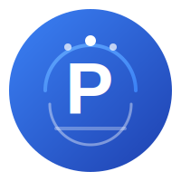

# Smart Park 智慧停车管理系统

<p align="center">
  
</p>

<p align="center">
  <a href="https://golang.org"></a>
  <a href="https://github.com/go-kratos/kratos"></a>
  <a href="https://www.docker.com/"></a>
  <a href="https://kubernetes.io/"></a>
  <a href="LICENSE"></a>
  <a href="https://github.com/xuanyiying/smart-park/actions"></a>
</p>

<p align="center">
  <b>🚗 基于 Go + Kratos 微服务架构的现代化智慧停车管理系统</b>
</p>

<p align="center">
  <a href="#快速开始">快速开始</a> •
  <a href="#系统架构">系统架构</a> •
  <a href="#在线演示">在线演示</a> •
  <a href="#贡献指南">贡献指南</a>
</p>

[English](README_EN.md) | [中文](README.md)

---

## 🎬 项目演示

<p align="center">
  
</p>

> 💡 **在线演示**: [https://demo.smart-park.example.com](https://demo.smart-park.example.com)  
> 📱 **测试账号**: admin / admin123

---

## ✨ 核心特性

<table>
<tr>
<td width="33%">

### 🚗 车辆管理
- 车牌自动识别
- 入场/出场管理
- 月卡/VIP 管理
- 黑名单机制

</td>
<td width="33%">

### 💰 智能计费
- 灵活规则引擎
- 阶梯/时段计费
- 优惠券折扣
- 跨天计费

</td>
<td width="33%">

### 💳 支付系统
- 微信支付
- 支付宝
- 自动退款
- 对账系统

</td>
</tr>
<tr>
<td width="33%">

### 🔧 设备管理
- 摄像头管理
- 道闸控制
- 心跳监控
- 远程运维

</td>
<td width="33%">

### 📊 数据报表
- 日报/月报
- 收入统计
- 流量分析
- 导出功能

</td>
<td width="33%">

### 🏗️ 技术架构
- 微服务架构
- 云原生部署
- 水平扩展
- 高可用设计

</td>
</tr>
</table>

---

## 🏗️ 系统架构

```
┌─────────────────────────────────────────────────────────────────┐
│                         接入层 (Access Layer)                    │
├───────────────┬───────────────┬───────────────┬──────────────────┤
│   车主小程序   │   管理后台     │   设备网关    │   第三方回调      │
│   (WeChat)    │   (React)     │   (MQTT)     │   (Webhook)      │
└───────┬───────┴───────┬───────┴───────┬───────┴────────┬─────────┘
        │               │               │                │
        └───────────────┴───────┬───────┴────────────────┘
                                │
                    ┌───────────▼───────────┐
                    │    API Gateway        │
                    │    (Kratos Gateway)   │
                    │       Port: 8000      │
                    └───────────┬───────────┘
                                │
        ┌───────────────────────┼───────────────────────┐
        │                       │                       │
┌───────▼───────┐    ┌───────▼───────┐    ┌───────▼───────┐
│  🚗 Vehicle   │    │  💰 Billing   │    │  💳 Payment   │
│   Service     │    │   Service     │    │   Service     │
│   Port: 8001  │    │   Port: 8002  │    │   Port: 8003  │
│               │    │               │    │               │
│ • 入场/出场    │    │ • 费用计算    │    │ • 支付处理    │
│ • 设备管理    │    │ • 规则引擎    │    │ • 订单管理    │
│ • 车牌识别    │    │ • 优惠计算    │    │ • 退款处理    │
└───────┬───────┘    └───────┬───────┘    └───────┬───────┘
        │                    │                    │
┌───────▼───────┐    ┌───────▼───────┐    ┌───────▼───────┐
│  🎛️ Admin     │    │  🔌 Charging  │    │  🏢 Multi-    │
│   Service     │    │   Service     │    │   Tenancy     │
│   Port: 8004  │    │   Port: 8005  │    │   Service     │
│               │    │               │    │   Port: 8006  │
│ • 停车场管理   │    │ • 充电桩管理   │    │ • 多租户管理   │
│ • 报表统计    │    │ • 充电计费    │    │ • 权限控制    │
│ • 用户管理    │    │ • 订单管理    │    │ • 数据隔离    │
└───────────────┘    └───────────────┘    └───────────────┘
                                │
        ┌───────────────────────┼───────────────────────┐
        │                       │                       │
┌───────▼───────┐    ┌───────▼───────┐    ┌───────▼───────┐
│  🐘 PostgreSQL│    │  🔴 Redis     │    │  📋 Etcd      │
│   (主数据库)   │    │  (缓存/消息)   │    │  (服务发现)   │
└───────────────┘    └───────────────┘    └───────────────┘
```

---

## 🛠️ 技术栈

### 后端技术
| 技术 | 版本 | 说明 | 亮点 |
|------|------|------|------|
| [Go](https://golang.org) | 1.26+ | 编程语言 | 高性能、并发友好 |
| [Kratos](https://github.com/go-kratos/kratos) | v2.9 | 微服务框架 | 标准项目结构、内置中间件 |
| [gRPC](https://grpc.io/) | v1.60+ | RPC 通信 | 高性能、类型安全 |
| [Ent](https://entgo.io/) | v0.12+ | ORM 框架 | 类型安全、代码生成 |
| [PostgreSQL](https://www.postgresql.org/) | 15+ | 关系型数据库 | 稳定可靠 |
| [Redis](https://redis.io/) | 7+ | 缓存/消息队列 | 高性能缓存 
| [Etcd](https://etcd.io/) | v3.5 | 服务注册发现 | 云原生标配 |
| [Jaeger](https://www.jaegertracing.io/) | v1.50+ | 链路追踪 | 分布式追踪 |

### 前端技术
| 技术 | 版本 | 说明 |
|------|------|------|
| [React](https://react.dev/) | 18+ | 前端框架 |
| [TypeScript](https://www.typescriptlang.org/) | 5+ | 类型安全 |
| [Tailwind CSS](https://tailwindcss.com/) | 3+ | 样式框架 |
| [shadcn/ui](https://ui.shadcn.com/) | - | UI 组件库 |

---

## 🚀 快速开始

### 📋 环境要求

- **Go**: 1.26+
- **Docker**: 20.10+
- **Docker Compose**: 2.20+
- **Node.js**: 18+ (前端开发)

### 🐳 一键启动（推荐）

```bash
# 1. 克隆项目
git clone https://github.com/xuanyiying/smart-park.git
cd smart-park

# 2. 启动所有服务
docker-compose up -d

# 3. 查看服务状态
docker-compose ps

# 4. 访问系统
# 管理后台: http://localhost:3000
# API 网关: http://localhost:8000
```

### 💻 本地开发

```bash
# 1. 克隆项目
git clone https://github.com/xuanyiying/smart-park.git
cd smart-park

# 2. 启动基础设施
docker-compose -f deploy/docker-compose.yml up -d postgres redis etcd jaeger

# 3. 安装后端依赖
go mod download

# 4. 启动后端服务（分别在不同终端）
go run ./cmd/gateway -conf ./configs
go run ./cmd/vehicle -conf ./configs
go run ./cmd/billing -conf ./configs
go run ./cmd/payment -conf ./configs
go run ./cmd/admin -conf ./configs

# 5. 启动前端
cd web
npm install
npm run dev
```

### 🧪 测试 API

```bash
# 车辆入场
curl -X POST http://localhost:8000/api/v1/device/entry \
  -H "Content-Type: application/json" \
  -H "X-Device-Id: lane_001" \
  -d '{
    "deviceId": "lane_001",
    "plateNumber": "京A12345",
    "confidence": 0.95
  }'

# 查询费用
curl "http://localhost:8000/api/v1/billing/calculate?recordId=xxx"

# 创建支付订单
curl -X POST http://localhost:8000/api/v1/pay/create \
  -H "Content-Type: application/json" \
  -d '{
    "recordId": "xxx",
    "payMethod": "wechat"
  }'
```

---

## 📦 服务说明

| 服务 | 端口 | 职责 | 状态 | 文档 |
|------|------|------|------|------|
| **Gateway** | 8000 | API 网关，路由转发 | ✅ 已完成 | [文档](docs/gateway.md) |
| **Vehicle** | 8001 | 车辆入场/出场，设备管理 | ✅ 已完成 | [文档](docs/vehicle.md) |
| **Billing** | 8002 | 费用计算，计费规则 | ✅ 已完成 | [文档](docs/billing.md) |
| **Payment** | 8003 | 支付处理，订单管理 | ✅ 已完成 | [文档](docs/payment.md) |
| **Admin** | 8004 | 停车场管理，报表统计 | ✅ 已完成 | [文档](docs/admin.md) |
| **Charging** | 8005 | 充电桩管理 | 🚧 开发中 | [文档](docs/charging.md) |

---

## � 性能指标

### 系统性能

| 指标 | 数值 | 说明 |
|------|------|------|
| **并发能力** | 1000+ QPS | 单服务实测 |
| **响应时间** | P99 < 200ms | API 接口 |
| **可用性** | 99.9% | 年度目标 |
| **车牌识别** | 98.5%+ | 准确率 |
| **支付成功率** | 99.5%+ | 微信+支付宝 |

### 资源占用（单机部署）

| 服务 | CPU | 内存 | 说明 |
|------|-----|------|------|
| Gateway | 0.5 核 | 256MB | 网关服务 |
| Vehicle | 0.5 核 | 512MB | 车辆服务 |
| Billing | 0.25 核 | 256MB | 计费服务 |
| Payment | 0.25 核 | 256MB | 支付服务 |
| Admin | 0.25 核 | 256MB | 管理服务 |
| PostgreSQL | 1 核 | 1GB | 数据库 |
| Redis | 0.5 核 | 512MB | 缓存 |

---

## 🏆 项目亮点

### 💡 技术创新

- **微服务架构**：基于 Kratos 框架，服务间通过 gRPC 通信，支持水平扩展
- **规则引擎**：灵活的计费规则引擎，支持多种计费策略和优先级管理
- **分布式锁**：Redis 分布式锁确保并发场景数据一致性
- **支付安全**：签名验证、金额校验、幂等性保证
- **链路追踪**：OpenTelemetry + Jaeger 实现全链路追踪

### 🎯 业务创新

- **防重复入场**：数据库唯一约束 + 分布式锁双重保障
- **月卡管理**：自动校验有效期，过期自动降级为临时车
- **离线模式**：网络中断时本地缓存，恢复后自动同步
- **对账系统**：自动对账，处理单边账，确保资金安全

---

## 📚 文档

- [📖 项目文档](docs/) - 完整项目文档
- [🚗 车辆服务](docs/vehicle.md) - 入场/出场处理、设备管理
- [💰 计费服务](docs/billing.md) - 计费规则引擎详解
- [💳 支付服务](docs/payment.md) - 支付处理流程
- [🎛️ 管理服务](docs/admin.md) - 运营管理功能
- [🚀 部署指南](docs/deployment.md) - 各种环境部署说明
- [🔌 API 文档](docs/api.md) - 完整 API 接口文档
- [📋 项目简历](docs/project-resume.md) - 技术亮点和成果

---

## 🚢 部署方案

| 规模 | 停车场数量 | 部署方式 | 适用场景 |
|------|-----------|----------|----------|
| **小型** | 1-20 | Docker Compose | 单个停车场、试点项目 |
| **中型** | 20-100 | 主备双活 | 区域连锁、物业公司 |
| **大型** | 100+ | Kubernetes | 城市级、全国性平台 |

```bash
# 快速部署脚本
./deploy/scripts/deploy.sh deploy production v1.0.0

# 或使用 Kubernetes
kubectl apply -f deploy/k8s/
```

详细部署文档请参考 [部署指南](docs/deployment.md)

---

## 🤝 贡献指南

我们欢迎所有形式的贡献！

### 如何贡献

1. **🐛 提交 Bug** - 使用 [Issue 模板](.github/ISSUE_TEMPLATE/bug_report.md)
2. **💡 功能建议** - 使用 [Feature 模板](.github/ISSUE_TEMPLATE/feature_request.md)
3. **🔧 提交代码** - 阅读 [贡献指南](CONTRIBUTING.md)
4. **📝 改进文档** - 文档也是代码
5. **⭐ 点个 Star** - 让更多人看到这个项目

### 开发规范

- 代码风格遵循 [Go Code Review Comments](https://github.com/golang/go/wiki/CodeReviewComments)
- 提交信息遵循 [Conventional Commits](https://www.conventionalcommits.org/)
- 所有代码必须通过 CI 检查

### 贡献者

感谢所有为项目做出贡献的开发者！

<a href="https://github.com/xuanyiying/smart-park/graphs/contributors">
  
</a>

---

## � Star History

[](https://star-history.com/#xuanyiying/smart-park&Date)

---

## 💬 社区与支持

- **💻 GitHub**: [https://github.com/xuanyiying/smart-park](https://github.com/xuanyiying/smart-park)
- **🐛 Issue 反馈**: [https://github.com/xuanyiying/smart-park/issues](https://github.com/xuanyiying/smart-park/issues)
- **💬 Discussions**: [https://github.com/xuanyiying/smart-park/discussions](https://github.com/xuanyiying/smart-park/discussions)
- **📧 邮箱**: support@smart-park.example.com
- **💬 微信交流群**: 扫码加入（见下方二维码）

<p align="center">
  
  <br>
  <small>微信交流群</small>
</p>

---

## 📄 许可证

本项目采用 [MIT](LICENSE) 许可证 - 详见 LICENSE 文件

---

<p align="center">
  <b>如果这个项目对你有帮助，请给我们一个 ⭐ Star！</b>
</p>

<p align="center">
  <b>Smart Park</b> - 让停车更智能，让出行更便捷 🚗💨
</p>
