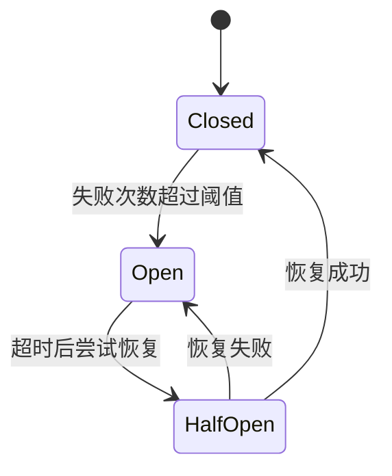

# API 网关设计:Kratos Gateway 实践

## 1. 引言

在微服务架构中,API 网关扮演着至关重要的角色。它作为系统的统一入口,负责请求路由、认证鉴权、限流熔断、链路追踪等核心功能,是保障系统稳定性和安全性的第一道防线。随着业务规模的扩大,一个设计良好的 API 网关能够显著降低系统复杂度,提升开发效率和运维质量。

Smart Park 智能停车系统采用 Go 语言和 Kratos 框架构建微服务架构,包含车辆服务、计费服务、支付服务、管理服务等多个业务服务。为了统一管理这些服务的访问入口,我们基于 Kratos 框架实现了一个功能完善的 API 网关。本文将深入探讨该网关的设计思路和实现细节,分享在实际项目中遇到的挑战和解决方案。

本文的目标读者是具有一定 Go 语言和微服务开发经验的后端开发者。通过阅读本文,你将了解到如何基于 Kratos 框架设计和实现一个生产级的 API 网关,包括路由配置、服务发现、认证鉴权、限流熔断、链路追踪等核心功能的实现方案。

文章结构如下:第二部分介绍网关路由配置和动态发现机制;第三部分讲解认证鉴权中间件设计;第四部分探讨限流熔断机制;第五部分介绍链路追踪集成;第六部分分享最佳实践;最后进行总结和展望。

## 2. 网关路由配置和动态发现

### 2.1 路由规则设计

API 网关的核心功能之一是将请求路由到正确的后端服务。我们采用前缀匹配的方式设计路由规则,通过配置文件定义路径前缀与目标服务的映射关系。

```yaml
server:
  port: 8000
  timeout: 60

routes:
  - path: /api/v1/device
    target: localhost:8001
  - path: /api/v1/billing
    target: localhost:8002
  - path: /api/v1/pay
    target: localhost:8003
  - path: /api/v1/admin/billing
    target: localhost:8002
  - path: /api/v1/admin
    target: localhost:8004
  - path: /api/v1/user
    target: localhost:8005
```

这种设计具有以下优点:

1. **简洁直观**:通过路径前缀即可识别目标服务,易于理解和维护
2. **灵活配置**:支持多个前缀指向同一服务,如 `/api/v1/billing` 和 `/api/v1/admin/billing` 都指向计费服务
3. **易于扩展**:新增服务只需添加路由配置,无需修改代码

路由匹配的核心实现如下:

```go
type RouteConfig struct {
    Path   string
    Target string
}

type RouterUseCase struct {
    discovery ServiceDiscovery
    etcdReg   *EtcdRegistry
    routes    []*RouteConfig
    log       *log.Helper
    useEtcd   bool
}

func (uc *RouterUseCase) MatchRoute(path string) *RouteConfig {
    for _, route := range uc.routes {
        if strings.HasPrefix(path, route.Path) {
            return route
        }
    }
    return nil
}

func (uc *RouterUseCase) GetServiceTarget(ctx context.Context, path string) (string, error) {
    route := uc.MatchRoute(path)
    if route == nil {
        return "", ErrRouteNotFound
    }

    if uc.useEtcd && uc.etcdReg != nil {
        serviceName := strings.Split(route.Target, ":")[0]
        instances, err := uc.etcdReg.GetService(ctx, serviceName)
        if err == nil && len(instances) > 0 {
            return instances[0].Endpoints[0], nil
        }
    }

    return route.Target, nil
}
```

### 2.2 服务发现机制

在微服务架构中,服务实例的地址可能动态变化,因此需要服务发现机制来动态获取可用的服务实例。我们实现了两种服务发现策略:静态配置和 Etcd 动态发现。

#### 静态服务发现

静态服务发现适用于开发环境和小规模部署场景。服务实例地址直接从配置文件加载,运行时不会变化。

```go
type StaticDiscovery struct {
    instances map[string][]*ServiceInstance
    mu        sync.RWMutex
}

func NewStaticDiscovery(routes []*RouteConfig) *StaticDiscovery {
    instances := make(map[string][]*ServiceInstance)
    for _, route := range routes {
        parts := strings.Split(route.Target, ":")
        if len(parts) != 2 {
            continue
        }
        serviceName := parts[0]
        instances[serviceName] = []*ServiceInstance{
            {
                ID:      serviceName + "-1",
                Name:    serviceName,
                Address: serviceName,
                Port:    mustParseInt(parts[1]),
            },
        }
    }
    return &StaticDiscovery{instances: instances}
}

func (d *StaticDiscovery) Discover(ctx context.Context, serviceName string) ([]*ServiceInstance, error) {
    d.mu.RLock()
    defer d.mu.RUnlock()
    instances, ok := d.instances[serviceName]
    if !ok {
        return nil, nil
    }
    return instances, nil
}
```

#### Etcd 动态服务发现

Etcd 是一个高可用的键值存储系统,常用于服务注册与发现。我们基于 Etcd 实现了动态服务发现,支持服务实例的自动注册、发现和监听。

```go
type EtcdDiscovery struct {
    client     *EtcdClient
    instances  map[string][]*ServiceInstance
    mu         sync.RWMutex
    logger     *log.Helper
    watchChans map[string]chan []*ServiceInstance
}

func (d *EtcdDiscovery) Discover(ctx context.Context, serviceName string) ([]*ServiceInstance, error) {
    key := fmt.Sprintf("/services/%s", serviceName)
    
    resp, err := d.client.Get(ctx, key)
    if err != nil {
        d.logger.WithContext(ctx).Warnf("failed to discover service %s: %v", serviceName, err)
        return nil, err
    }
    
    var instances []*ServiceInstance
    for _, kv := range resp.Kvs {
        var inst ServiceInstance
        if err := kv.Unmarshal(&inst); err != nil {
            continue
        }
        instances = append(instances, &inst)
    }
    
    d.mu.Lock()
    d.instances[serviceName] = instances
    d.mu.Unlock()
    
    return instances, nil
}

func (d *EtcdDiscovery) Watch(ctx context.Context, serviceName string) (<-chan []*ServiceInstance, error) {
    ch := make(chan []*ServiceInstance, 10)
    
    go func() {
        defer close(ch)
        
        key := fmt.Sprintf("/services/%s", serviceName)
        watchCh := d.client.Watch(ctx, key)
        
        for {
            select {
            case <-ctx.Done():
                return
            case resp, ok := <-watchCh:
                if !ok {
                    return
                }
                var instances []*ServiceInstance
                for _, ev := range resp.Events {
                    if ev.Type == EventTypePut {
                        var inst ServiceInstance
                        if err := ev.Kv.Unmarshal(&inst); err != nil {
                            continue
                        }
                        instances = append(instances, &inst)
                    }
                }
                if instances != nil {
                    ch <- instances
                }
            }
        }
    }()
    
    return ch, nil
}
```

### 2.3 动态路由更新

通过 Watch 机制,网关可以实时监听服务实例的变化,动态更新路由表。当服务实例上线、下线或地址变更时,网关能够自动感知并调整路由策略,无需重启服务。

```go
func (r *EtcdRegistry) Watch(ctx context.Context, name string) (<-chan []*registry.ServiceInstance, error) {
    ch := make(chan []*registry.ServiceInstance, 10)
    
    go func() {
        defer close(ch)
        
        watchCh, err := r.discovery.Watch(ctx, name)
        if err != nil {
            return
        }
        
        for {
            select {
            case <-ctx.Done():
                return
            case instances, ok := <-watchCh:
                if !ok {
                    return
                }
                var result []*registry.ServiceInstance
                for _, inst := range instances {
                    result = append(result, &registry.ServiceInstance{
                        ID:       inst.ID,
                        Name:     inst.Name,
                        Version:  "",
                        Metadata: inst.Metadata,
                        Endpoints: []string{
                            fmt.Sprintf("tcp://%s:%d", inst.Address, inst.Port),
                        },
                    })
                }
                ch <- result
            }
        }
    }()
    
    return ch, nil
}
```

### 2.4 反向代理实现

网关通过反向代理将请求转发到后端服务。我们使用 Go 标准库的 `httputil.ReverseProxy` 实现,并进行了定制化扩展。

```go
type GatewayService struct {
    router *biz.RouterUseCase
    log    *log.Helper
}

func (s *GatewayService) ServeHTTP(w http.ResponseWriter, r *http.Request) {
    ctx := r.Context()
    
    target, err := s.router.GetServiceTarget(ctx, r.URL.Path)
    if err != nil {
        s.log.Errorf("route not found: %s", r.URL.Path)
        http.Error(w, "Not Found", http.StatusNotFound)
        return
    }
    
    proxy, err := s.createProxy(target)
    if err != nil {
        s.log.Errorf("failed to create proxy for target %s: %v", target, err)
        http.Error(w, "Bad Gateway", http.StatusBadGateway)
        return
    }
    
    startTime := time.Now()
    s.log.Infof("proxying request: %s %s -> %s", r.Method, r.URL.Path, target)
    
    r.Header.Set("X-Forwarded-For", getClientIP(r))
    r.Header.Set("X-Forwarded-Proto", "http")
    r.Header.Set("X-Real-IP", getClientIP(r))
    
    proxy.ServeHTTP(w, r)
    
    duration := time.Since(startTime)
    s.log.Infof("request completed: %s %s, duration: %v", r.Method, r.URL.Path, duration)
}

func (s *GatewayService) createProxy(target string) (*httputil.ReverseProxy, error) {
    targetURL, err := url.Parse(fmt.Sprintf("http://%s", target))
    if err != nil {
        return nil, err
    }
    
    proxy := httputil.NewSingleHostReverseProxy(targetURL)
    
    proxy.ErrorHandler = func(w http.ResponseWriter, r *http.Request, err error) {
        s.log.Errorf("proxy error: %v, path: %s", err, r.URL.Path)
        http.Error(w, "Bad Gateway", http.StatusBadGateway)
    }
    
    proxy.Director = func(req *http.Request) {
        req.URL.Scheme = targetURL.Scheme
        req.URL.Host = targetURL.Host
        req.Host = targetURL.Host
    }
    
    return proxy, nil
}
```

## 3. 认证鉴权中间件设计

### 3.1 JWT 认证实现

JWT(JSON Web Token)是一种常用的身份认证方案。我们采用 RS256 非对称加密算法,使用私钥签名、公钥验证,确保 Token 的安全性和不可篡改性。

```go
type Claims struct {
    UserID string `json:"user_id"`
    OpenID string `json:"open_id"`
    jwt.RegisteredClaims
}

type JWTManager struct {
    config     *JWTConfig
    publicKey  *rsa.PublicKey
    privateKey *rsa.PrivateKey
}

func (m *JWTManager) GenerateToken(userID, openID string) (string, error) {
    if m.privateKey == nil {
        return "", errors.New("private key not configured")
    }
    
    claims := &Claims{
        UserID: userID,
        OpenID: openID,
        RegisteredClaims: jwt.RegisteredClaims{
            ExpiresAt: jwt.NewNumericDate(time.Now().Add(m.config.TokenDuration)),
            IssuedAt:  jwt.NewNumericDate(time.Now()),
            Issuer:    "smart-park",
        },
    }
    
    token := jwt.NewWithClaims(jwt.SigningMethodRS256, claims)
    return token.SignedString(m.privateKey)
}

func (m *JWTManager) ParseToken(tokenString string) (*Claims, error) {
    if m.publicKey == nil {
        return nil, errors.New("public key not configured")
    }
    
    token, err := jwt.ParseWithClaims(tokenString, &Claims{}, func(token *jwt.Token) (interface{}, error) {
        if _, ok := token.Method.(*jwt.SigningMethodRSA); !ok {
            return nil, fmt.Errorf("unexpected signing method: %v", token.Header["alg"])
        }
        return m.publicKey, nil
    })
    
    if err != nil {
        return nil, err
    }
    
    if claims, ok := token.Claims.(*Claims); ok && token.Valid {
        return claims, nil
    }
    
    return nil, errors.New("invalid token")
}
```

### 3.2 认证中间件

我们将 JWT 认证封装为 Kratos 中间件,在请求处理前验证 Token 并提取用户信息。

```go
const (
    UserIDKey = "user_id"
    OpenIDKey = "open_id"
)

func JWTAuth(jwtManager *auth.JWTManager) middleware.Middleware {
    return func(handler middleware.Handler) middleware.Handler {
        return func(ctx context.Context, req interface{}) (interface{}, error) {
            if tr, ok := transport.FromServerContext(ctx); ok {
                token := tr.RequestHeader().Get("Authorization")
                if token == "" {
                    return nil, errors.Unauthorized("UNAUTHORIZED", "missing authorization header")
                }
                
                if after, ok0 := strings.CutPrefix(token, "Bearer "); ok0 {
                    token = after
                }
                
                claims, err := jwtManager.ParseToken(token)
                if err != nil {
                    return nil, errors.Unauthorized("UNAUTHORIZED", "invalid token")
                }
                
                ctx = context.WithValue(ctx, UserIDKey, claims.UserID)
                ctx = context.WithValue(ctx, OpenIDKey, claims.OpenID)
            }
            
            return handler(ctx, req)
        }
    }
}

func GetUserIDFromContext(ctx context.Context) string {
    if userID, ok := ctx.Value(UserIDKey).(string); ok {
        return userID
    }
    return ""
}
```

### 3.3 HMAC 设备认证

对于设备端的 API 调用,我们采用 HMAC(Hash-based Message Authentication Code)签名认证,确保请求的完整性和真实性。

设备认证流程:

1. 设备使用密钥对请求参数进行 HMAC-SHA256 签名
2. 网关验证签名是否正确
3. 检查时间戳防止重放攻击

### 3.4 权限控制策略

我们采用 RBAC(Role-Based Access Control)模型进行权限控制。用户角色分为管理员、操作员、普通用户等,不同角色具有不同的权限。

权限检查流程:

1. 认证中间件提取用户 ID 和角色信息
2. 权限中间件检查用户是否有权限访问目标资源
3. 无权限则返回 403 Forbidden

## 4. 限流熔断机制

### 4.1 限流算法选择

限流是保护系统免受流量冲击的重要手段。常见的限流算法包括:

1. **令牌桶算法**:以固定速率生成令牌,请求需要获取令牌才能执行,支持突发流量
2. **漏桶算法**:以固定速率处理请求,平滑流量,不支持突发流量
3. **滑动窗口算法**:统计时间窗口内的请求数量,精确控制流量

我们采用令牌桶算法实现限流,因为它既能限制平均速率,又能允许一定程度的突发流量,适合 API 网关场景。

### 4.2 熔断器实现

熔断器用于防止故障蔓延,当下游服务出现故障时,熔断器会快速失败,避免浪费资源等待超时。

熔断器状态机:



熔断器实现示例:

```go
type CircuitBreaker struct {
    maxFailures   int
    timeout       time.Duration
    state         State
    failureCount  int
    lastFailTime  time.Time
    mu            sync.RWMutex
}

type State int

const (
    StateClosed State = iota
    StateOpen
    StateHalfOpen
)

func (cb *CircuitBreaker) Call(ctx context.Context, fn func() error) error {
    if !cb.allowRequest() {
        return ErrOpenState
    }
    
    err := fn()
    
    cb.mu.Lock()
    defer cb.mu.Unlock()
    
    if err != nil {
        cb.failureCount++
        cb.lastFailTime = time.Now()
        
        if cb.failureCount >= cb.maxFailures {
            cb.state = StateOpen
        }
        return err
    }
    
    cb.failureCount = 0
    cb.state = StateClosed
    return nil
}

func (cb *CircuitBreaker) allowRequest() bool {
    cb.mu.RLock()
    defer cb.mu.RUnlock()
    
    switch cb.state {
    case StateClosed:
        return true
    case StateOpen:
        if time.Since(cb.lastFailTime) > cb.timeout {
            cb.state = StateHalfOpen
            return true
        }
        return false
    case StateHalfOpen:
        return true
    default:
        return false
    }
}
```

### 4.3 降级策略

当服务不可用时,需要有降级策略保证系统基本可用。常见的降级策略包括:

1. **返回默认值**:如计费服务不可用时,返回默认费率
2. **返回缓存数据**:如查询服务不可用时,返回缓存的历史数据
3. **拒绝服务**:如支付服务不可用时,提示用户稍后重试

降级实现示例:

```go
func (uc *EntryExitUseCase) Exit(ctx context.Context, req *v1.ExitRequest) (*v1.ExitData, error) {
    fee, err := uc.billingClient.CalculateFeeWithCircuitBreaker(ctx, ...)
    if err == circuitbreaker.ErrOpenState {
        fee = uc.calculateDefaultFee(record)
        uc.log.Warnf("billing service unavailable, use default fee: %f", fee.FinalAmount)
    }
    
    return uc.processExit(ctx, record, fee)
}
```

## 5. 链路追踪集成

### 5.1 OpenTelemetry 集成

链路追踪是微服务架构中排查问题的重要手段。我们采用 OpenTelemetry 标准,集成 Jaeger 作为链路追踪后端。

```go
type Config struct {
    Enabled     bool
    ServiceName string
    Endpoint    string
    SampleRate  float64
}

type TracerProvider struct {
    provider *sdktrace.TracerProvider
    tracer   trace.Tracer
}

func NewTracerProvider(cfg *Config) (*TracerProvider, error) {
    if !cfg.Enabled {
        return &TracerProvider{}, nil
    }
    
    var exporter sdktrace.SpanExporter
    var err error
    
    if cfg.Endpoint == "" {
        exporter, err = stdouttrace.New(stdouttrace.WithPrettyPrint())
    } else if cfg.Endpoint == "jaeger" {
        exporter, err = jaeger.New(jaeger.WithAgentEndpoint())
    } else {
        exporter, err = otlptracegrpc.New(context.Background(),
            otlptracegrpc.WithEndpoint(cfg.Endpoint),
            otlptracegrpc.WithInsecure(),
        )
    }
    
    if err != nil {
        return nil, fmt.Errorf("failed to create exporter: %w", err)
    }
    
    sampleRate := cfg.SampleRate
    if sampleRate <= 0 || sampleRate > 1 {
        sampleRate = 1.0
    }
    
    res, err := resource.New(context.Background(),
        resource.WithAttributes(
            semconv.ServiceName(cfg.ServiceName),
            semconv.ServiceVersion("v1.0.0"),
        ),
    )
    if err != nil {
        return nil, fmt.Errorf("failed to create resource: %w", err)
    }
    
    tp := sdktrace.NewTracerProvider(
        sdktrace.WithBatcher(exporter),
        sdktrace.WithResource(res),
        sdktrace.WithSampler(sdktrace.ParentBased(sdktrace.TraceIDRatioBased(sampleRate))),
    )
    
    otel.SetTracerProvider(tp)
    otel.SetTextMapPropagator(propagation.NewCompositeTextMapPropagator(
        propagation.TraceContext{},
        propagation.Baggage{},
    ))
    
    return &TracerProvider{
        provider: tp,
        tracer:   tp.Tracer(cfg.ServiceName),
    }, nil
}
```

### 5.2 Trace ID 传递

Trace ID 需要在整个调用链中传递,才能实现完整的链路追踪。OpenTelemetry 通过 Context 和 HTTP Headers 自动传递 Trace ID。

```go
func StartSpan(ctx context.Context, name string, opts ...trace.SpanStartOption) (context.Context, trace.Span) {
    return otel.Tracer("").Start(ctx, name, opts...)
}

func AddSpanAttributes(ctx context.Context, attrs ...attribute.KeyValue) {
    span := trace.SpanFromContext(ctx)
    span.SetAttributes(attrs...)
}

func RecordError(ctx context.Context, err error) {
    span := trace.SpanFromContext(ctx)
    span.RecordError(err)
}

func GetTraceID(ctx context.Context) TraceID {
    span := trace.SpanFromContext(ctx)
    if span.SpanContext().HasTraceID() {
        return TraceID(span.SpanContext().TraceID().String())
    }
    return ""
}
```

### 5.3 链路可视化

Jaeger 提供了强大的链路可视化功能,可以查看请求的完整调用链、耗时分布、错误信息等。

部署 Jaeger:

```yaml
jaeger:
  image: jaegertracing/all-in-one:1.52
  container_name: smart-park-jaeger
  environment:
    COLLECTOR_OTLP_ENABLED: true
  ports:
    - "16686:16686"
    - "4317:4317"
    - "4318:4318"
```

通过 Jaeger UI 可以:

1. 查看请求的完整调用链路
2. 分析每个服务的耗时占比
3. 快速定位性能瓶颈和错误节点
4. 追踪分布式事务的执行过程

## 6. 最佳实践

### 6.1 网关性能优化

**1. 连接池复用**

网关与后端服务之间使用连接池复用 HTTP 连接,减少连接建立的开销。

```go
var transport = &http.Transport{
    MaxIdleConns:        100,
    MaxIdleConnsPerHost: 10,
    IdleConnTimeout:     90 * time.Second,
}

var client = &http.Client{
    Transport: transport,
    Timeout:   30 * time.Second,
}
```

**2. 异步日志**

使用异步日志减少日志写入对请求处理的影响。Kratos 框架默认使用 zap 日志库,支持异步写入。

**3. 缓存路由表**

路由表在内存中缓存,避免每次请求都进行路由匹配计算。

**4. 健康检查优化**

网关提供健康检查接口,支持 Kubernetes 的存活探针和就绪探针。

```go
func (s *GatewayService) ReadinessProbe(w http.ResponseWriter, r *http.Request) {
    health, err := s.HealthCheck(r.Context())
    if err != nil {
        http.Error(w, "Service Unavailable", http.StatusServiceUnavailable)
        return
    }
    
    for path, ok := range health {
        if !ok {
            s.log.Errorf("service unhealthy: %s", path)
            http.Error(w, "Service Unavailable", http.StatusServiceUnavailable)
            return
        }
    }
    
    w.WriteHeader(http.StatusOK)
    io.WriteString(w, "OK")
}

func (s *GatewayService) LivenessProbe(w http.ResponseWriter, r *http.Request) {
    w.WriteHeader(http.StatusOK)
    io.WriteString(w, "OK")
}
```

### 6.2 常见问题和解决方案

**问题 1:路由匹配冲突**

当多个路由前缀匹配同一请求时,可能出现路由冲突。

解决方案:按照路由长度降序排列,优先匹配更具体的路由。

**问题 2:服务发现延迟**

服务实例上线后,网关可能无法立即感知。

解决方案:使用 Etcd Watch 机制实时监听服务变化,或定期轮询服务列表。

**问题 3:熔断器误判**

偶发的网络抖动可能导致熔断器误判服务不可用。

解决方案:设置合理的失败阈值和超时时间,避免过于敏感的熔断策略。

**问题 4:Trace ID 丢失**

在异步处理或跨服务调用时,Trace ID 可能丢失。

解决方案:确保所有异步任务和跨服务调用都正确传递 Context。

### 6.3 安全加固建议

**1. HTTPS 加密**

生产环境必须使用 HTTPS 加密传输,防止中间人攻击。

**2. 请求签名验证**

对关键接口实施请求签名验证,防止请求篡改和重放攻击。

**3. IP 白名单**

对管理接口实施 IP 白名单限制,只允许特定 IP 访问。

**4. 敏感信息脱敏**

日志中脱敏敏感信息,如 Token、密码、身份证号等。

**5. 定期密钥轮换**

定期轮换 JWT 密钥和签名密钥,降低密钥泄露风险。

## 7. 总结

本文详细介绍了基于 Kratos 框架的 API 网关设计与实现,涵盖了路由配置、服务发现、认证鉴权、限流熔断、链路追踪等核心功能。通过实际项目代码,展示了如何在 Go 语言中实现一个生产级的 API 网关。

核心要点回顾:

1. **路由配置**:采用前缀匹配设计路由规则,支持静态配置和 Etcd 动态发现两种服务发现机制
2. **认证鉴权**:实现 JWT 认证和 HMAC 设备认证,支持 RBAC 权限控制
3. **限流熔断**:采用令牌桶算法限流,熔断器防止故障蔓延,降级策略保证基本可用
4. **链路追踪**:集成 OpenTelemetry 和 Jaeger,实现全链路追踪和可视化

未来展望:

1. **动态配置**:支持运行时动态修改路由规则和限流策略,无需重启服务
2. **灰度发布**:支持基于权重的流量分流,实现灰度发布和 A/B 测试
3. **服务网格**:与 Istio 等服务网格集成,实现更强大的流量管理和安全策略
4. **AI 辅助**:利用 AI 技术进行智能限流和异常检测,提升系统自愈能力

API 网关是微服务架构的核心组件,设计良好的网关能够显著提升系统的稳定性、安全性和可维护性。希望本文的实践经验能够为读者在设计和实现 API 网关时提供参考和启发。

## 参考资料

1. Kratos 框架官方文档:https://go-kratos.dev/
2. OpenTelemetry 官方文档:https://opentelemetry.io/
3. Jaeger 分布式追踪系统:https://www.jaegertracing.io/
4. Etcd 官方文档:https://etcd.io/
5. JWT(JSON Web Token):https://jwt.io/
6. 《微服务设计》- Sam Newman
7. 《构建高性能 Web 服务》- Kevin Yang
