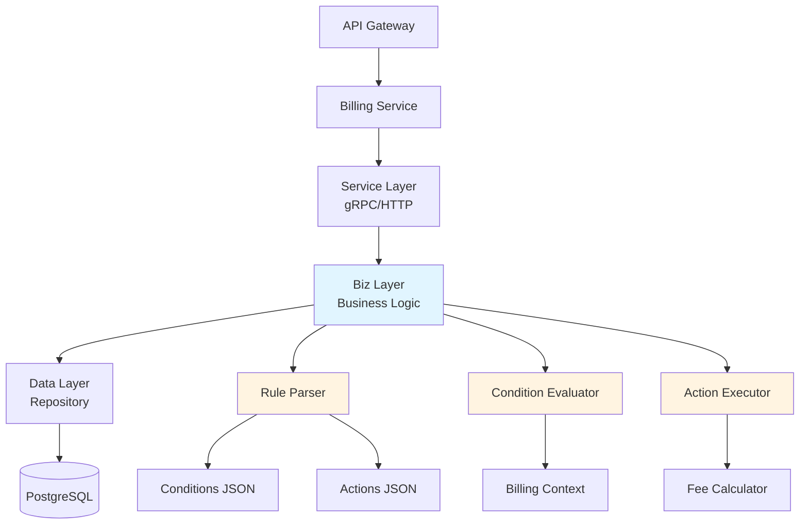
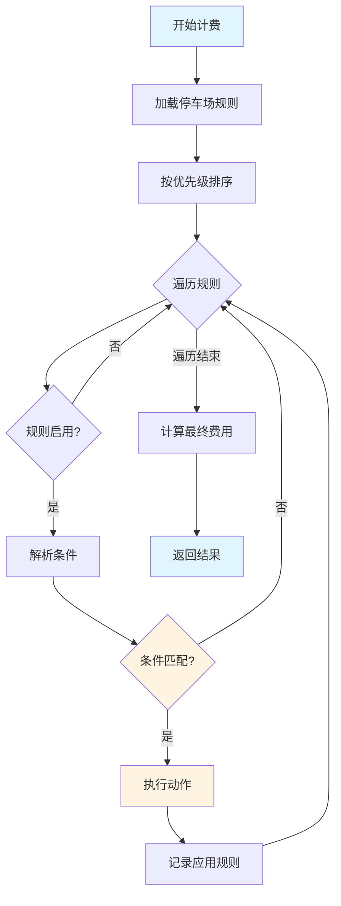
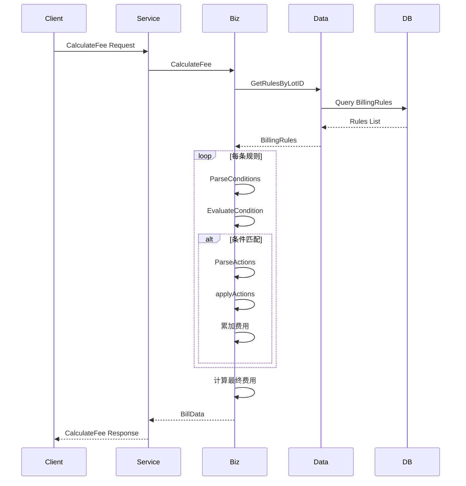

# 智能计费引擎：规则引擎的设计与实现

## 引言

在现代停车场管理系统中，计费是最核心也是最复杂的业务逻辑之一。一个停车场可能同时存在多种计费规则：按小时计费、按天封顶、夜间优惠、节假日折扣、月卡用户免费、VIP 用户折扣、电动车减免等。这些规则之间存在优先级关系，可能相互叠加或互斥，如何优雅地管理和执行这些复杂的计费规则，成为系统设计的关键挑战。

传统的硬编码方式将计费逻辑写死在代码中，每次新增或修改规则都需要修改代码、重新部署，不仅维护成本高，而且容易引入 Bug。规则引擎作为一种灵活的解决方案，将业务规则从代码中分离出来，通过配置化的方式管理规则，使得业务人员可以独立调整计费策略，而无需开发人员介入。

本文将深入探讨停车场计费规则引擎的设计与实现，基于 Smart Park 项目的实际代码，详细介绍规则引擎的架构设计、规则模型、计费策略实现以及性能优化等关键技术点。文章面向后端开发者，假设读者具备 Go 语言基础和微服务架构经验。

## 核心内容

### 规则引擎架构设计

#### 整体架构

Smart Park 的计费规则引擎采用分层架构设计，遵循 DDD（领域驱动设计）思想，将系统分为 Service 层、Biz 层和 Data 层，每层职责清晰，便于维护和测试。



**Service 层**负责处理 gRPC 和 HTTP 请求，进行参数校验和响应封装。这一层定义了五个核心接口：

- `CalculateFee`：计算停车费用
- `CreateBillingRule`：创建计费规则
- `UpdateBillingRule`：更新计费规则
- `DeleteBillingRule`：删除计费规则
- `GetBillingRules`：查询计费规则列表

**Biz 层**是规则引擎的核心，包含三个关键组件：

1. **Rule Parser（规则解析器）**：将 JSON 格式的规则配置解析为内存中的结构体
2. **Condition Evaluator（条件评估器）**：根据计费上下文评估规则条件是否满足
3. **Action Executor（动作执行器）**：执行计费动作，计算最终费用

**Data 层**负责数据的持久化存储，使用 Ent ORM 框架操作 PostgreSQL 数据库，提供规则的 CRUD 操作。

#### 规则模型设计

规则模型是规则引擎的基础，良好的模型设计能够支持灵活的规则配置。Smart Park 定义了三个核心数据结构：

**BillingRule 实体**：表示一条完整的计费规则

```go
type BillingRule struct {
    ID         uuid.UUID              // 规则唯一标识
    LotID      uuid.UUID              // 所属停车场 ID
    RuleName   string                 // 规则名称
    RuleType   string                 // 规则类型：time/period/monthly/coupon/vip
    Conditions string                 // 条件配置 JSON
    Actions    string                 // 动作配置 JSON
    RuleConfig map[string]interface{} // 扩展配置
    Priority   int                    // 优先级（数字越大优先级越高）
    IsActive   bool                   // 是否启用
    CreatedAt  time.Time              // 创建时间
    UpdatedAt  time.Time              // 更新时间
}
```

**Condition 结构**：表示规则的条件逻辑

```go
type Condition struct {
    Type       string       `json:"type"`                 // 条件类型
    Field      string       `json:"field,omitempty"`      // 字段名
    Operator   string       `json:"operator,omitempty"`   // 操作符
    Value      interface{}  `json:"value,omitempty"`      // 值
    And        []*Condition `json:"and,omitempty"`        // AND 逻辑组合
    Or         []*Condition `json:"or,omitempty"`         // OR 逻辑组合
    Conditions []*Condition `json:"conditions,omitempty"` // 子条件列表
}
```

**Action 结构**：表示计费动作

```go
type Action struct {
    Type    string  `json:"type"`              // 动作类型
    Amount  float64 `json:"amount,omitempty"`  // 金额
    Percent float64 `json:"percent,omitempty"` // 百分比
    Unit    string  `json:"unit,omitempty"`    // 单位
    Ceil    float64 `json:"ceil,omitempty"`    // 向上取整
    Cap     float64 `json:"cap,omitempty"`     // 封顶金额
    Value   float64 `json:"value,omitempty"`   // 其他值
}
```

这种设计允许通过 JSON 配置复杂的规则逻辑，例如：

```json
{
  "type": "and",
  "conditions": [
    {
      "type": "vehicle_type",
      "value": "small"
    },
    {
      "type": "or",
      "conditions": [
        {
          "type": "time_range",
          "value": {"start": 22.0, "end": 8.0}
        },
        {
          "type": "holiday"
        }
      ]
    }
  ]
}
```

这个条件表示：小型车辆 AND（夜间时段 OR 节假日）。

#### 规则存储和加载

规则存储在 PostgreSQL 数据库中，使用 Ent ORM 进行数据访问。数据库表结构如下：

```go
func (BillingRule) Fields() []ent.Field {
    return []ent.Field{
        field.UUID("id", uuid.UUID{}).
            Default(uuid.New).
            StorageKey("id"),
        field.UUID("lot_id", uuid.UUID{}).
            Comment("停车场ID"),
        field.String("rule_name").
            MaxLen(100).
            NotEmpty().
            Comment("规则名称"),
        field.Enum("rule_type").
            Values("time", "period", "monthly", "coupon", "vip").
            Comment("规则类型"),
        field.Text("conditions_json").
            Optional().
            Comment("条件配置JSON"),
        field.Text("actions_json").
            Optional().
            Comment("动作配置JSON"),
        field.Int("priority").
            Default(0).
            Min(0).
            Comment("优先级(数字越大优先级越高)"),
        field.Bool("is_active").
            Default(true).
            Comment("是否启用"),
    }
}
```

为了提高查询性能，我们在 `lot_id` 和 `priority` 字段上创建了复合索引：

```go
func (BillingRule) Indexes() []ent.Index {
    return []ent.Index{
        index.Fields("lot_id", "priority").StorageKey("idx_billing_rules_lot_priority"),
        index.Fields("lot_id", "is_active"),
    }
}
```

规则加载时，系统按优先级降序排列，确保高优先级规则优先匹配：

```go
func (r *billingRuleRepo) GetRulesByLotID(ctx context.Context, lotID uuid.UUID) ([]*biz.BillingRule, error) {
    rules, err := r.data.db.BillingRule.Query().
        Where(billingrule.LotID(lotID)).
        Order(ent.Desc(billingrule.FieldPriority)).
        All(ctx)
    if err != nil {
        return nil, err
    }

    var result []*biz.BillingRule
    for _, rule := range rules {
        result = append(result, toBizBillingRule(rule))
    }

    return result, nil
}
```

### 规则配置和优先级管理

#### 规则类型

Smart Park 支持五种规则类型，每种类型对应不同的计费场景：

| 规则类型 | 说明 | 应用场景 |
|---------|------|---------|
| time | 时间计费规则 | 基础计费，按小时或按天收费 |
| period | 时段优惠规则 | 夜间优惠、节假日优惠等 |
| monthly | 月卡规则 | 月卡用户免费或折扣 |
| coupon | 优惠券规则 | 优惠券抵扣 |
| vip | VIP 规则 | VIP 用户专属折扣 |

在实际应用中，一个停车场通常会配置多条不同类型的规则，例如：

**基础计费规则**：

```json
{
  "rule_name": "基础计费-小型车",
  "rule_type": "time",
  "conditions_json": "{\"vehicle_type\": \"small\"}",
  "actions_json": "[{\"type\": \"per_hour\", \"amount\": 2.0}, {\"type\": \"cap\", \"cap\": 50.0}]",
  "priority": 1
}
```

**夜间优惠规则**：

```json
{
  "rule_name": "夜间优惠",
  "rule_type": "period",
  "conditions_json": "{\"type\": \"time_range\", \"value\": {\"start\": 22.0, \"end\": 8.0}}",
  "actions_json": "[{\"type\": \"percentage\", \"percent\": 50.0}]",
  "priority": 2
}
```

**月卡用户规则**：

```json
{
  "rule_name": "月卡免费",
  "rule_type": "monthly",
  "conditions_json": "{\"vehicle_type\": \"monthly\"}",
  "actions_json": "[{\"type\": \"percentage\", \"percent\": 100.0}]",
  "priority": 10
}
```

#### 规则优先级排序

规则优先级决定了规则的执行顺序。在 Smart Park 中，优先级采用数字表示，数字越大优先级越高。系统按优先级降序执行规则，高优先级规则的结果可能覆盖低优先级规则。

优先级设计原则：

1. **基础规则优先级最低**：基础计费规则作为兜底，优先级设为 1
2. **优惠规则优先级中等**：时段优惠、节假日优惠等优先级设为 2-5
3. **特殊规则优先级最高**：月卡、VIP、优惠券等优先级设为 10 以上

这种设计确保了特殊规则能够覆盖基础规则，例如月卡用户即使停了一整天，也不会产生费用。

#### 规则匹配策略

规则匹配是规则引擎的核心逻辑，分为三个步骤：

1. **规则过滤**：只处理启用状态（is_active=true）的规则
2. **条件评估**：评估规则条件是否满足当前计费上下文
3. **动作执行**：执行匹配规则的计费动作



条件评估的核心代码：

```go
func EvaluateCondition(cond *Condition, ctx *BillingContext) bool {
    if cond == nil {
        return true
    }

    switch cond.Type {
    case "and":
        for _, c := range cond.Conditions {
            if !EvaluateCondition(c, ctx) {
                return false
            }
        }
        return true

    case "or":
        for _, c := range cond.Conditions {
            if EvaluateCondition(c, ctx) {
                return true
            }
        }
        return false

    case "vehicle_type":
        return ctx.VehicleType == cond.Value

    case "duration_min":
        minutes := ctx.Duration.Minutes()
        switch cond.Operator {
        case "gte":
            return minutes >= cond.Value.(float64)
        case "lte":
            return minutes <= cond.Value.(float64)
        case "gt":
            return minutes > cond.Value.(float64)
        case "lt":
            return minutes < cond.Value.(float64)
        case "eq":
            return minutes == cond.Value.(float64)
        }
        return false

    case "time_range":
        hour := float64(ctx.ExitTime.Hour()) + float64(ctx.ExitTime.Minute())/60.0
        start := cond.Value.(map[string]interface{})["start"].(float64)
        end := cond.Value.(map[string]interface{})["end"].(float64)
        return hour >= start && hour <= end

    case "day_of_week":
        weekday := int(ctx.ExitTime.Weekday())
        for _, day := range cond.Value.([]interface{}) {
            if int(day.(float64)) == weekday {
                return true
            }
        }
        return false

    case "holiday":
        return ctx.IsHoliday

    default:
        return false
    }
}
```

### 多种计费策略实现

#### 时间计费

时间计费是最基础的计费方式，支持按小时、按分钟、固定费用等多种模式。

**按小时计费**：

```go
case "per_hour":
    amount += hours * a.Amount
```

例如，每小时收费 2 元，停车 3.5 小时，费用为 7 元。

**按分钟计费**：

```go
case "per_minute":
    amount += minutes * a.Amount
```

适用于精确计费场景，例如每分钟 0.05 元。

**固定费用**：

```go
case "fixed":
    amount += a.Amount
```

适用于每次停车固定收费的场景，例如每次 5 元。

**首小时免费**：

```go
case "first_hour_free":
    if hours <= 1 {
        amount = 0
    }
```

#### 时段优惠

时段优惠规则根据停车时间给予折扣，常见的有夜间优惠、节假日优惠等。

**夜间优惠**：

```go
case "night_discount":
    hour := exitTime.Hour()
    if hour >= 22 || hour < 8 {
        amount = amount * (1 - a.Amount/100)
    }
```

例如，夜间（22:00-08:00）停车享受 50% 折扣。

**节假日优惠**：

节假日优惠通过条件评估实现：

```json
{
  "type": "holiday",
  "value": true
}
```

当 `IsHoliday` 为 true 时，规则匹配，执行相应的优惠动作。

#### 月卡计费

月卡用户享受免费停车或折扣优惠。月卡规则优先级最高，确保月卡用户的权益。

```go
case "monthly":
    if req.VehicleType == "monthly" {
        discountAmount = baseAmount
    }
```

月卡规则直接将基础费用作为折扣金额，最终费用为 0。

#### VIP 计费

VIP 用户享受专属折扣，通常为固定百分比折扣。

```json
{
  "rule_name": "VIP 8折优惠",
  "rule_type": "vip",
  "conditions_json": "{\"vehicle_type\": \"vip\"}",
  "actions_json": "[{\"type\": \"percentage\", \"percent\": 20.0}]",
  "priority": 15
}
```

百分比折扣的实现：

```go
case "percentage":
    amount -= amount * (a.Percent / 100)
```

#### 优惠券叠加

优惠券规则支持与基础规则叠加使用。优惠券通常有使用条件，例如满 10 元可用。

```json
{
  "rule_name": "满10减5优惠券",
  "rule_type": "coupon",
  "conditions_json": "{\"type\": \"duration_min\", \"operator\": \"gte\", \"value\": 60}",
  "actions_json": "[{\"type\": \"fixed\", \"amount\": -5.0}]",
  "priority": 20
}
```

优惠券规则通过负数金额实现抵扣：

```go
case "fixed":
    amount += a.Amount  // Amount 为负数时实现抵扣
```

### 费用封顶和优惠叠加逻辑

#### 每日封顶机制

每日封顶是停车场常见的计费策略，防止用户长时间停车产生过高费用。

```go
case "max_daily":
    days := int(math.Ceil(hours / 24))
    if days < 1 {
        days = 1
    }
    maxAmount := a.Amount * float64(days)
    if amount > maxAmount {
        amount = maxAmount
    }
```

例如，每日封顶 50 元，停车 30 小时（跨 2 天），最高收费 100 元。

#### 优惠叠加规则

优惠叠加是规则引擎的难点，需要处理多种优惠的组合情况。Smart Park 采用顺序叠加的方式：

1. **基础费用计算**：应用基础计费规则，计算初始费用
2. **优惠叠加**：按优先级顺序应用优惠规则，折扣金额累加
3. **最终费用计算**：基础费用减去折扣金额，确保不为负数

```go
var baseAmount float64
var discountAmount float64

for _, rule := range rules {
    if !rule.IsActive {
        continue
    }

    cond, err := ParseConditions(rule.Conditions)
    if err != nil {
        continue
    }

    if !EvaluateCondition(cond, billingCtx) {
        continue
    }

    actions, err := ParseActions(rule.Actions)
    if err != nil {
        continue
    }

    ruleAmount := applyActions(actions, duration, exitTime)
    
    switch rule.RuleType {
    case "base", "time":
        if baseAmount == 0 || ruleAmount < baseAmount {
            baseAmount = ruleAmount
        }
    case "discount", "exemption":
        discountAmount += ruleAmount
    case "monthly":
        if req.VehicleType == "monthly" {
            discountAmount = baseAmount
        }
    }
}

if baseAmount == 0 {
    hours := duration.Hours()
    baseAmount = calculateDefaultFee(hours)
}

finalAmount := baseAmount - discountAmount
if finalAmount < 0 {
    finalAmount = 0
}
```

#### 费用计算流程

完整的费用计算流程如下：



**计费上下文**包含计算所需的所有信息：

```go
type BillingContext struct {
    VehicleType string        // 车辆类型：small/large/monthly/vip
    Duration    time.Duration // 停车时长
    EntryTime   time.Time     // 入场时间
    ExitTime    time.Time     // 出场时间
    IsHoliday   bool          // 是否节假日
}
```

**费用计算示例**：

假设一辆小型车，停车 3 小时，出场时间为晚上 23:00，配置了以下规则：

1. 基础计费：每小时 2 元，每日封顶 50 元
2. 夜间优惠：22:00-08:00 享受 50% 折扣
3. VIP 用户：享受 20% 折扣

计算过程：

1. 基础费用：3 小时 × 2 元/小时 = 6 元
2. 夜间优惠：6 元 × 50% = 3 元折扣
3. VIP 折扣：（6 - 3）× 20% = 0.6 元折扣
4. 最终费用：6 - 3 - 0.6 = 2.4 元

## 最佳实践

### 规则引擎性能优化

**规则缓存**：频繁查询数据库会影响性能，建议引入缓存层（Redis）缓存规则配置。规则变更时主动失效缓存。

```go
func (uc *BillingUseCase) GetRulesByLotID(ctx context.Context, lotID uuid.UUID) ([]*biz.BillingRule, error) {
    cacheKey := fmt.Sprintf("billing_rules:%s", lotID)
    
    // 尝试从缓存获取
    cached, err := uc.cache.Get(ctx, cacheKey)
    if err == nil {
        return cached.([]*biz.BillingRule), nil
    }
    
    // 从数据库加载
    rules, err := uc.repo.GetRulesByLotID(ctx, lotID)
    if err != nil {
        return nil, err
    }
    
    // 写入缓存
    uc.cache.Set(ctx, cacheKey, rules, 5*time.Minute)
    
    return rules, nil
}
```

**规则预编译**：将 JSON 格式的规则解析为内存结构体后缓存，避免每次计费都重新解析。

**并行评估**：对于大量规则，可以使用 goroutine 并行评估条件，提高性能。

```go
func (uc *BillingUseCase) evaluateRulesConcurrently(rules []*BillingRule, ctx *BillingContext) []*BillingRule {
    var wg sync.WaitGroup
    matchedRules := make([]*BillingRule, 0)
    matchedChan := make(chan *BillingRule, len(rules))

    for _, rule := range rules {
        wg.Add(1)
        go func(r *BillingRule) {
            defer wg.Done()
            cond, _ := ParseConditions(r.Conditions)
            if EvaluateCondition(cond, ctx) {
                matchedChan <- r
            }
        }(rule)
    }

    go func() {
        wg.Wait()
        close(matchedChan)
    }()

    for rule := range matchedChan {
        matchedRules = append(matchedRules, rule)
    }

    return matchedRules
}
```

### 常见问题和解决方案

**问题 1：规则冲突**

当多条规则同时匹配时，可能产生冲突。解决方案：

- 明确定义规则优先级
- 使用规则类型区分规则作用范围
- 记录应用的规则列表，便于审计和调试

**问题 2：规则配置错误**

JSON 配置格式错误会导致规则解析失败。解决方案：

- 提供规则配置校验接口
- 记录解析失败的规则，不影响其他规则执行
- 提供规则配置示例和文档

```go
func ValidateRule(rule *BillingRule) error {
    if rule.RuleName == "" {
        return errors.New("rule name is required")
    }
    
    if _, err := ParseConditions(rule.Conditions); err != nil {
        return fmt.Errorf("invalid conditions: %w", err)
    }
    
    if _, err := ParseActions(rule.Actions); err != nil {
        return fmt.Errorf("invalid actions: %w", err)
    }
    
    return nil
}
```

**问题 3：费用计算精度**

浮点数计算可能产生精度问题。解决方案：

- 使用整数表示金额（单位：分）
- 使用 decimal 库进行精确计算
- 对最终结果进行四舍五入

```go
func ceilToDecimal(amount float64, decimals int) float64 {
    m := 1
    for i := 0; i < decimals; i++ {
        m *= 10
    }
    return float64(int(amount*float64(m)+0.999999)) / float64(m)
}
```

### 单元测试策略

规则引擎的单元测试至关重要，需要覆盖各种场景。

**测试条件评估**：

```go
func TestEvaluateCondition(t *testing.T) {
    billingCtx := &BillingContext{
        VehicleType: "monthly",
        Duration:    90 * time.Minute,
        ExitTime:    time.Date(2026, 3, 26, 10, 30, 0, 0, time.UTC),
        IsHoliday:   false,
    }

    tests := []struct {
        name   string
        cond   *Condition
        ctx    *BillingContext
        expect bool
    }{
        {
            name: "vehicle_type match",
            cond: &Condition{
                Type:  "vehicle_type",
                Value: "monthly",
            },
            ctx:    billingCtx,
            expect: true,
        },
        {
            name: "duration_min gte true",
            cond: &Condition{
                Type:     "duration_min",
                Operator: "gte",
                Value:    60.0,
            },
            ctx:    billingCtx,
            expect: true,
        },
        {
            name: "time_range within range",
            cond: &Condition{
                Type: "time_range",
                Value: map[string]interface{}{
                    "start": 9.0,
                    "end":   18.0,
                },
            },
            ctx:    billingCtx,
            expect: true,
        },
    }

    for _, tt := range tests {
        t.Run(tt.name, func(t *testing.T) {
            got := EvaluateCondition(tt.cond, tt.ctx)
            if got != tt.expect {
                t.Errorf("EvaluateCondition() = %v, want %v", got, tt.expect)
            }
        })
    }
}
```

**测试动作执行**：

```go
func TestApplyActions(t *testing.T) {
    duration := 120 * time.Minute // 2 hours
    exitTime := time.Date(2026, 3, 26, 10, 30, 0, 0, time.UTC)

    tests := []struct {
        name     string
        actions  []*Action
        duration time.Duration
        exitTime time.Time
        expected float64
    }{
        {
            name:     "per_hour",
            actions:  []*Action{{Type: "per_hour", Amount: 5.0}},
            duration: duration,
            exitTime: exitTime,
            expected: 10.0, // 2 hours * 5 = 10
        },
        {
            name:     "percentage discount",
            actions:  []*Action{{Type: "fixed", Amount: 100.0}, {Type: "percentage", Percent: 20.0}},
            duration: duration,
            exitTime: exitTime,
            expected: 80.0, // 100 - 20%
        },
        {
            name:     "cap applied",
            actions:  []*Action{{Type: "per_hour", Amount: 50.0}, {Type: "cap", Cap: 80.0}},
            duration: duration,
            exitTime: exitTime,
            expected: 80.0, // 2 * 50 = 100, capped to 80
        },
    }

    for _, tt := range tests {
        t.Run(tt.name, func(t *testing.T) {
            got := applyActions(tt.actions, tt.duration, tt.exitTime)
            if got != tt.expected {
                t.Errorf("applyActions() = %v, want %v", got, tt.expected)
            }
        })
    }
}
```

**集成测试**：

使用内存数据库进行集成测试，验证完整的计费流程：

```go
func TestCalculateFee(t *testing.T) {
    // Setup
    client := enttest.Open(t, "sqlite3", "file:ent?mode=memory&cache=shared&_fk=1")
    defer client.Close()
    
    repo := NewBillingRuleRepo(client)
    uc := NewBillingUseCase(repo, log.DefaultLogger)
    
    // Seed test data
    lotID := uuid.New()
    repo.CreateBillingRule(context.Background(), &BillingRule{
        ID:         uuid.New(),
        LotID:      lotID,
        RuleName:   "基础计费",
        RuleType:   "time",
        Conditions: "",
        Actions:    `[{"type": "per_hour", "amount": 2.0}]`,
        Priority:   1,
        IsActive:   true,
    })
    
    // Test
    req := &v1.CalculateFeeRequest{
        LotId:       lotID.String(),
        EntryTime:   time.Now().Add(-2 * time.Hour).Unix(),
        ExitTime:    time.Now().Unix(),
        VehicleType: "small",
    }
    
    result, err := uc.CalculateFee(context.Background(), req)
    assert.NoError(t, err)
    assert.Equal(t, 4.0, result.BaseAmount) // 2 hours * 2 = 4
}
```

## 总结

本文深入探讨了停车场计费规则引擎的设计与实现，从架构设计、规则模型、计费策略到性能优化，全面介绍了规则引擎的核心技术点。

**核心要点回顾**：

1. **分层架构设计**：采用 Service-Biz-Data 三层架构，职责清晰，便于维护和测试
2. **灵活的规则模型**：通过 JSON 配置条件和动作，支持复杂的规则逻辑
3. **多种计费策略**：支持时间计费、时段优惠、月卡、VIP、优惠券等多种计费方式
4. **优先级管理**：通过优先级排序，确保高优先级规则优先执行
5. **优惠叠加机制**：支持多种优惠叠加使用，确保费用计算准确
6. **性能优化**：通过缓存、预编译、并行评估等手段提高性能

**未来展望**：

1. **规则可视化配置**：开发可视化规则配置界面，降低配置门槛
2. **规则版本管理**：支持规则版本控制和回滚
3. **规则测试沙盒**：提供规则测试环境，验证规则配置正确性
4. **智能规则推荐**：基于历史数据，智能推荐最优计费规则
5. **多租户支持**：支持多租户规则隔离和独立配置

规则引擎是停车场管理系统的核心组件，良好的设计能够显著提升系统的灵活性和可维护性。希望本文能够为读者在规则引擎设计和实现方面提供有价值的参考。

**参考资料**：

- [Go 语言设计模式](https://refactoring.guru/design-patterns/go)
- [领域驱动设计（DDD）](https://www.domainlanguage.com/)
- [Ent ORM 文档](https://entgo.io/docs/getting-started)
- [Kratos 微服务框架](https://go-kratos.dev/docs/getting-started/start)
