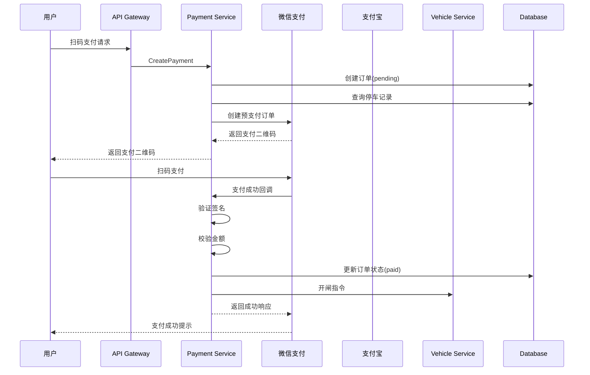

# 支付系统集成：微信支付和支付宝接入实战

## 引言

在停车场管理系统中，支付环节是用户体验的关键节点。用户完成停车后，期望能够快速、便捷地完成支付并离场。移动支付已成为主流支付方式，微信支付和支付宝占据了国内移动支付市场的主导地位。对于后端开发者而言，如何安全、稳定地接入这两个支付平台，处理复杂的支付流程、回调通知、退款操作，并确保资金安全，是一项具有挑战性的任务。

支付系统的设计需要考虑多个维度：业务流程的完整性、支付渠道的多样性、资金安全的保障、异常情况的处理以及系统的可扩展性。一个设计不当的支付系统可能导致资金损失、用户投诉甚至法律风险。因此，深入理解支付系统的设计原理和实现细节，对于构建可靠的商业系统至关重要。

本文将基于 Smart Park 停车场管理系统的实际代码，详细介绍微信支付和支付宝的接入实现。文章将涵盖支付流程设计、SDK 集成、签名验证、回调处理、安全防护等核心内容，并提供完整的 Go 语言代码示例。通过本文，读者将掌握构建企业级支付系统的关键技术和最佳实践。

## 核心内容

### 支付流程设计

#### 整体支付流程

停车场支付系统的核心流程包括创建订单、发起支付、支付回调、订单查询和退款等环节。Smart Park 采用微服务架构，支付服务作为独立服务运行，通过 gRPC 与其他服务通信。



**创建订单流程**

创建订单是支付流程的起点。系统需要根据停车记录生成支付订单，并调用支付渠道创建预支付订单。Smart Park 的实现遵循以下步骤：

1. **参数校验**：验证请求参数的合法性，包括停车记录 ID、支付金额、支付方式等
2. **幂等性检查**：检查是否已存在已支付的订单，避免重复支付
3. **订单创建**：生成订单号，创建订单记录，初始状态为 `pending`
4. **支付渠道调用**：根据支付方式调用微信或支付宝接口，生成支付二维码或支付链接
5. **返回支付信息**：将支付二维码、订单号、过期时间等信息返回给前端

以下是创建订单的核心代码实现：

```go
func (uc *PaymentUseCase) CreatePayment(ctx context.Context, req *v1.CreatePaymentRequest) (*v1.PaymentData, error) {
    if err := uc.validateCreatePaymentRequest(req); err != nil {
        return nil, err
    }

    recordID, err := uuid.Parse(req.RecordId)
    if err != nil {
        return nil, fmt.Errorf("invalid record ID: %w", err)
    }

    if existingOrder, _ := uc.orderRepo.GetOrderByRecordID(ctx, recordID); existingOrder != nil {
        if existingOrder.Status == string(StatusPaid) {
            return uc.buildExistingPaymentResponse(existingOrder), nil
        }
    }

    order, err := uc.createOrder(ctx, recordID, req.Amount)
    if err != nil {
        return nil, err
    }

    payURL, qrCode, err := uc.generatePaymentURL(ctx, order, req)
    if err != nil {
        return nil, err
    }

    return &v1.PaymentData{
        OrderId:    order.ID.String(),
        Amount:     order.FinalAmount,
        PayUrl:     payURL,
        QrCode:     qrCode,
        ExpireTime: time.Now().Add(uc.bizConfig.OrderExpiration).Format(time.RFC3339),
    }, nil
}
```

**支付回调处理**

支付回调是支付流程中最关键的环节，也是安全风险最高的环节。支付平台会通过回调通知商户支付结果，系统需要验证回调的真实性，更新订单状态，并触发后续业务逻辑。

回调处理的核心要点：

1. **签名验证**：验证回调请求是否来自支付平台，防止伪造请求
2. **订单查询**：根据商户订单号查询订单信息
3. **状态校验**：检查订单当前状态，避免重复处理
4. **金额校验**：验证支付金额与订单金额是否一致，防止金额篡改
5. **订单更新**：更新订单状态、支付时间、交易号等信息
6. **业务触发**：触发后续业务逻辑，如开闸、发送通知等

```go
func (uc *PaymentUseCase) HandleWechatCallback(ctx context.Context, req *v1.WechatCallbackRequest) (*v1.WechatCallbackResponse, error) {
    if req.ReturnCode != string(WechatStatusSuccess) {
        uc.log.WithContext(ctx).Warnf("WeChat callback failed: %s - %s", req.ReturnCode, req.ReturnMsg)
        return uc.buildWechatErrorResponse(req.ReturnMsg), nil
    }

    if err := uc.verifyWechatSign(req); err != nil {
        uc.log.WithContext(ctx).Errorf("WeChat signature verification failed: %v", err)
        return uc.buildWechatErrorResponse("Signature verification failed"), nil
    }

    if err := uc.processWechatPayment(ctx, req); err != nil {
        return uc.buildWechatErrorResponse(err.Error()), nil
    }

    return &v1.WechatCallbackResponse{
        ReturnCode: string(WechatStatusSuccess),
        ReturnMsg:  "OK",
    }, nil
}
```

**退款流程设计**

退款流程相对简单，但同样需要保证安全性。系统需要验证退款请求的合法性，调用支付平台退款接口，并更新订单状态。

```go
func (uc *PaymentUseCase) Refund(ctx context.Context, orderID, reason string) (*v1.RefundData, error) {
    id, err := uuid.Parse(orderID)
    if err != nil {
        return nil, fmt.Errorf("invalid order ID: %w", err)
    }

    order, err := uc.orderRepo.GetOrder(ctx, id)
    if err != nil {
        return nil, fmt.Errorf("failed to get order: %w", err)
    }

    if order.Status != string(StatusPaid) {
        return &v1.RefundData{
            RefundId: "",
            Status:   "failed",
        }, nil
    }

    refundID := uuid.New().String()
    uc.processRefund(ctx, order, refundID)

    if err := uc.orderRepo.UpdateOrder(ctx, order); err != nil {
        uc.log.WithContext(ctx).Errorf("failed to update order for refund: %v", err)
        return nil, fmt.Errorf("failed to update order: %w", err)
    }

    return &v1.RefundData{
        RefundId: refundID,
        Status:   "success",
    }, nil
}
```

**对账系统设计**

对账是保证资金安全的重要手段。系统需要定期与支付平台对账，确保订单状态与实际支付状态一致。对账系统通常包括：

1. **日终对账**：每天凌晨下载支付平台的对账单，与本地订单进行比对
2. **差异处理**：发现差异订单后，主动查询支付平台确认状态
3. **异常告警**：对无法自动处理的差异订单，发送告警通知人工处理
4. **数据归档**：定期归档历史订单数据，保持数据库性能

### 微信支付 SDK 集成

#### 微信支付 API V3 接入

微信支付 API V3 是微信支付推出的新一代接口，采用 RESTful 风格，支持 JSON 格式的请求和响应，相比 V2 版本更加规范和安全。Smart Park 使用官方提供的 Go SDK `wechatpay-go` 进行集成。

**配置初始化**

微信支付 API V3 使用 RSA 非对称加密进行签名和验签，需要配置商户私钥、商户证书序列号、APIv3 密钥等信息。

```go
type Config struct {
    AppID          string
    MchID          string
    APIKey         string
    CertSerialNo   string
    PrivateKeyPath string
    APIv3Key       string
    NotifyURL      string
}

func NewClient(cfg *Config) (*Client, error) {
    privateKey, err := loadPrivateKey(cfg.PrivateKeyPath)
    if err != nil {
        return nil, fmt.Errorf("failed to load private key: %w", err)
    }

    ctx := context.Background()

    client, err := core.NewClient(
        ctx,
        option.WithWechatPayAutoAuthCipher(
            cfg.MchID,
            cfg.CertSerialNo,
            privateKey,
            cfg.APIv3Key,
        ),
    )
    if err != nil {
        return nil, fmt.Errorf("failed to create wechat pay client: %w", err)
    }

    return &Client{
        client:     client,
        config:     cfg,
        privateKey: privateKey,
    }, nil
}

func loadPrivateKey(path string) (*rsa.PrivateKey, error) {
    data, err := os.ReadFile(path)
    if err != nil {
        return nil, err
    }

    block, _ := pem.Decode(data)
    if block == nil {
        return nil, fmt.Errorf("failed to decode PEM block")
    }

    key, err := x509.ParsePKCS8PrivateKey(block.Bytes)
    if err != nil {
        return nil, err
    }

    rsaKey, ok := key.(*rsa.PrivateKey)
    if !ok {
        return nil, fmt.Errorf("not an RSA private key")
    }

    return rsaKey, nil
}
```

**Native 支付实现**

Native 支付是停车场场景最常用的支付方式，用户扫描二维码完成支付。实现步骤包括创建预支付订单、获取支付二维码、用户扫码支付、接收支付回调。

```go
func (c *Client) CreateNativePay(ctx context.Context, orderID string, amount int64, description string) (string, error) {
    svc := native.NativeApiService{Client: c.client}

    resp, _, err := svc.Prepay(ctx, native.PrepayRequest{
        Appid:       core.String(c.config.AppID),
        Mchid:       core.String(c.config.MchID),
        Description: core.String(description),
        OutTradeNo:  core.String(orderID),
        NotifyUrl:   core.String(c.config.NotifyURL),
        Amount: &native.Amount{
            Total: core.Int64(amount),
        },
    })

    if err != nil {
        return "", fmt.Errorf("failed to create native pay order: %w", err)
    }

    return *resp.CodeUrl, nil
}
```

**JSAPI 支付实现**

JSAPI 支付用于微信内网页支付，需要获取用户的 OpenID。支付成功后，前端需要调用微信 JS-SDK 完成支付。

```go
func (c *Client) CreateJSAPIPay(ctx context.Context, orderID string, amount int64, openID string, description string) (map[string]interface{}, error) {
    svc := jsapi.JsapiApiService{Client: c.client}

    resp, _, err := svc.Prepay(ctx, jsapi.PrepayRequest{
        Appid:       core.String(c.config.AppID),
        Mchid:       core.String(c.config.MchID),
        Description: core.String(description),
        OutTradeNo:  core.String(orderID),
        NotifyUrl:   core.String(c.config.NotifyURL),
        Amount: &jsapi.Amount{
            Total: core.Int64(amount),
        },
        Payer: &jsapi.Payer{
            Openid: core.String(openID),
        },
    })

    if err != nil {
        return nil, fmt.Errorf("failed to create jsapi pay order: %w", err)
    }

    timeStamp := fmt.Sprintf("%d", time.Now().Unix())
    nonceStr := generateNonceStr()
    packageStr := "prepay_id=" + *resp.PrepayId

    sign, err := c.signJSAPI(timeStamp, nonceStr, packageStr)
    if err != nil {
        return nil, fmt.Errorf("failed to sign: %w", err)
    }

    return map[string]interface{}{
        "appId":     c.config.AppID,
        "timeStamp": timeStamp,
        "nonceStr":  nonceStr,
        "package":   packageStr,
        "signType":  "RSA",
        "paySign":   sign,
    }, nil
}

func (c *Client) signJSAPI(timeStamp, nonceStr, packageStr string) (string, error) {
    message := fmt.Sprintf("%s\n%s\n%s\n%s\n", c.config.AppID, timeStamp, nonceStr, packageStr)

    hashed := sha256.Sum256([]byte(message))
    signature, err := rsa.SignPKCS1v15(rand.Reader, c.privateKey, crypto.SHA256, hashed[:])
    if err != nil {
        return "", err
    }

    return base64.StdEncoding.EncodeToString(signature), nil
}
```

**签名验证机制**

微信支付 API V3 的回调通知使用平台证书进行签名验证。SDK 提供了自动验签功能，开发者只需配置正确的平台证书即可。

签名验证的核心流程：

1. 从回调请求头中获取签名信息（`Wechatpay-Signature`、`Wechatpay-Timestamp`、`Wechatpay-Nonce`）
2. 构造验签字符串：`时间戳\n随机串\n请求体\n`
3. 使用微信支付平台证书的公钥验证签名
4. 验证时间戳，防止重放攻击

**回调通知处理**

微信支付回调通知采用 JSON 格式，包含支付结果、交易号、支付时间等信息。系统需要解析回调数据，验证签名，更新订单状态。

```go
func (uc *PaymentUseCase) processWechatPayment(ctx context.Context, req *v1.WechatCallbackRequest) error {
    orderID, err := uuid.Parse(req.OutTradeNo)
    if err != nil {
        return fmt.Errorf("invalid out_trade_no: %w", err)
    }
    order, err := uc.orderRepo.GetOrder(ctx, orderID)
    if err != nil || order == nil {
        return fmt.Errorf("order not found: %s", req.OutTradeNo)
    }

    if order.Status != string(StatusPending) {
        uc.logSecurityEvent(ctx, SecurityEventInvalidStatus, order.ID.String(), 0, 0, req.TransactionId)
        return nil
    }

    paidAmount := parseAmount(req.TotalFee)
    if err := uc.validateAmount(order, paidAmount); err != nil {
        uc.logSecurityEvent(ctx, SecurityEventAmountMismatch, order.ID.String(), order.FinalAmount, paidAmount, req.TransactionId)
        return err
    }

    if err := uc.updateOrderAsPaid(order, MethodWechat, req.TransactionId, paidAmount); err != nil {
        uc.log.WithContext(ctx).Errorf("failed to update order: %v", err)
        return fmt.Errorf("update failed")
    }

    if err := uc.orderRepo.UpdateOrder(ctx, order); err != nil {
        uc.log.WithContext(ctx).Errorf("failed to update order: %v", err)
        return fmt.Errorf("update failed")
    }

    if err := uc.triggerAutoGateOpen(ctx, order); err != nil {
        uc.log.WithContext(ctx).Warnf("auto gate open failed: %v, owner can manually scan again", err)
    }

    return nil
}
```

**订单查询和关闭**

在某些场景下，系统需要主动查询订单状态或关闭未支付的订单。微信支付提供了相应的接口。

```go
func (c *Client) QueryOrder(ctx context.Context, orderID string) (map[string]interface{}, error) {
    svc := native.NativeApiService{Client: c.client}

    order, _, err := svc.QueryOrderByOutTradeNo(ctx, native.QueryOrderByOutTradeNoRequest{
        OutTradeNo: core.String(orderID),
        Mchid:      core.String(c.config.MchID),
    })

    if err != nil {
        return nil, fmt.Errorf("failed to query order: %w", err)
    }

    return map[string]interface{}{
        "out_trade_no": *order.OutTradeNo,
        "trade_state":  *order.TradeState,
    }, nil
}

func (c *Client) CloseOrder(ctx context.Context, orderID string) error {
    svc := native.NativeApiService{Client: c.client}

    _, err := svc.CloseOrder(ctx, native.CloseOrderRequest{
        OutTradeNo: core.String(orderID),
        Mchid:      core.String(c.config.MchID),
    })

    if err != nil {
        return fmt.Errorf("failed to close order: %w", err)
    }

    return nil
}
```

### 支付宝 SDK 集成

#### 支付宝开放平台接入

支付宝开放平台提供了多种支付产品，包括当面付、手机网站支付、电脑网站支付等。Smart Park 使用 `alipay-sdk` 第三方库进行集成，支持当面付和手机网站支付两种方式。

**配置初始化**

支付宝使用 RSA2（SHA256WithRSA）签名算法，需要配置应用私钥和支付宝公钥。

```go
type Config struct {
    AppID           string
    PrivateKey      string
    AlipayPublicKey string
    NotifyURL       string
    IsProduction    bool
}

type Client struct {
    client *alipay.Client
    config *Config
}

func NewClient(cfg *Config) (*Client, error) {
    var client *alipay.Client
    var err error

    if cfg.IsProduction {
        client, err = alipay.New(cfg.AppID, cfg.PrivateKey, true)
    } else {
        client, err = alipay.New(cfg.AppID, cfg.PrivateKey, false)
    }

    if err != nil {
        return nil, fmt.Errorf("failed to create alipay client: %w", err)
    }

    if err := client.LoadAliPayPublicKey(cfg.AlipayPublicKey); err != nil {
        return nil, fmt.Errorf("failed to load alipay public key: %w", err)
    }

    return &Client{
        client: client,
        config: cfg,
    }, nil
}
```

**当面付实现**

当面付分为扫码支付（商家扫用户）和付款码支付（用户扫商家）两种模式。停车场场景通常使用扫码支付，用户扫描二维码完成支付。

```go
func (c *Client) CreateTradePreCreate(ctx context.Context, orderID string, amount float64, subject string) (string, error) {
    p := alipay.TradePreCreate{}
    p.NotifyURL = c.config.NotifyURL
    p.Subject = subject
    p.OutTradeNo = orderID
    p.TotalAmount = fmt.Sprintf("%.2f", amount)

    rsp, err := c.client.TradePreCreate(ctx, p)
    if err != nil {
        return "", fmt.Errorf("failed to create trade precreate: %w", err)
    }

    if rsp.Code != "10000" {
        return "", fmt.Errorf("alipay error: %s - %s", rsp.Code, rsp.Msg)
    }

    return rsp.QRCode, nil
}
```

**手机网站支付实现**

手机网站支付适用于移动端浏览器，用户在支付宝页面完成支付后跳转回商户页面。

```go
func (c *Client) CreateTradeWapPay(ctx context.Context, orderID string, amount float64, subject string) (string, error) {
    p := alipay.TradeWapPay{}
    p.NotifyURL = c.config.NotifyURL
    p.ReturnURL = ""
    p.Subject = subject
    p.OutTradeNo = orderID
    p.TotalAmount = fmt.Sprintf("%.2f", amount)
    p.ProductCode = "QUICK_WAP_WAY"

    url, err := c.client.TradeWapPay(p)
    if err != nil {
        return "", fmt.Errorf("failed to create trade wap pay: %w", err)
    }

    return url.String(), nil
}
```

**RSA2 签名验证**

支付宝回调通知使用 RSA2 签名算法，系统需要使用支付宝公钥验证签名的真实性。

```go
func (uc *PaymentUseCase) verifyAlipaySign(req *v1.AlipayCallbackRequest) error {
    if uc.config == nil || uc.config.AlipayPublicKey == "" {
        return fmt.Errorf("alipay public key not configured")
    }

    signData := buildAlipaySignString(req)

    pubKey, err := uc.parseAlipayPublicKey()
    if err != nil {
        return err
    }

    signBytes, err := base64.StdEncoding.DecodeString(req.Sign)
    if err != nil {
        return fmt.Errorf("failed to decode sign: %w", err)
    }

    hash := uc.getAlipayHashAlgorithm()

    if err := rsa.VerifyPKCS1v15(pubKey, hash, hashData(hash, signData), signBytes); err != nil {
        return fmt.Errorf("signature verification failed: %w", err)
    }

    return nil
}

func (uc *PaymentUseCase) parseAlipayPublicKey() (*rsa.PublicKey, error) {
    block, _ := pem.Decode([]byte(uc.config.AlipayPublicKey))
    if block == nil {
        return nil, fmt.Errorf("failed to decode PEM block containing public key")
    }

    pubInterface, err := x509.ParsePKIXPublicKey(block.Bytes)
    if err != nil {
        return nil, fmt.Errorf("failed to parse public key: %w", err)
    }

    pubKey, ok := pubInterface.(*rsa.PublicKey)
    if !ok {
        return nil, fmt.Errorf("not an RSA public key")
    }

    return pubKey, nil
}

func (uc *PaymentUseCase) getAlipayHashAlgorithm() crypto.Hash {
    if strings.Contains(uc.config.AlipayPublicKey, "RSA2") {
        return crypto.SHA256
    }
    return crypto.SHA1
}
```

**异步通知处理**

支付宝异步通知采用 Form 表单格式，包含交易状态、交易号、支付金额等信息。系统需要解析表单数据，验证签名，更新订单状态。

```go
func (uc *PaymentUseCase) HandleAlipayCallback(ctx context.Context, req *v1.AlipayCallbackRequest) (*v1.AlipayCallbackResponse, error) {
    if !uc.isAlipaySuccessStatus(req.TradeStatus) {
        uc.log.WithContext(ctx).Warnf("Alipay callback failed: %s", req.TradeStatus)
        return uc.buildAlipayErrorResponse(req.TradeStatus), nil
    }

    if err := uc.verifyAlipaySign(req); err != nil {
        uc.log.WithContext(ctx).Errorf("Alipay signature verification failed: %v", err)
        return uc.buildAlipayErrorResponse("Signature verification failed"), nil
    }

    if err := uc.processAlipayPayment(ctx, req); err != nil {
        return uc.buildAlipayErrorResponse(err.Error()), nil
    }

    return &v1.AlipayCallbackResponse{
        Code: "success",
        Msg:  "OK",
    }, nil
}

func (uc *PaymentUseCase) processAlipayPayment(ctx context.Context, req *v1.AlipayCallbackRequest) error {
    orderID, err := uuid.Parse(req.OutTradeNo)
    if err != nil {
        return fmt.Errorf("invalid out_trade_no: %w", err)
    }
    order, err := uc.orderRepo.GetOrder(ctx, orderID)
    if err != nil || order == nil {
        return fmt.Errorf("order not found: %s", req.OutTradeNo)
    }

    if order.Status != string(StatusPending) {
        uc.logSecurityEvent(ctx, SecurityEventInvalidStatus, order.ID.String(), 0, 0, req.TradeNo)
        return nil
    }

    paidAmount := parseAmountFloat(req.TotalAmount)
    if err := uc.validateAmount(order, paidAmount); err != nil {
        uc.logSecurityEvent(ctx, SecurityEventAmountMismatch, order.ID.String(), order.FinalAmount, paidAmount, req.TradeNo)
        return err
    }

    if err := uc.updateOrderAsPaid(order, MethodAlipay, req.TradeNo, paidAmount); err != nil {
        uc.log.WithContext(ctx).Errorf("failed to update order: %v", err)
        return fmt.Errorf("update failed")
    }

    if err := uc.orderRepo.UpdateOrder(ctx, order); err != nil {
        uc.log.WithContext(ctx).Errorf("failed to update order: %v", err)
        return fmt.Errorf("update failed")
    }

    if err := uc.triggerAutoGateOpen(ctx, order); err != nil {
        uc.log.WithContext(ctx).Warnf("auto gate open failed: %v, owner can manually scan again", err)
    }

    return nil
}
```

**交易查询和退款**

支付宝提供了交易查询和退款接口，用于主动查询订单状态或处理退款请求。

```go
func (c *Client) QueryOrder(ctx context.Context, orderID string) (*alipay.TradeQueryRsp, error) {
    p := alipay.TradeQuery{}
    p.OutTradeNo = orderID

    rsp, err := c.client.TradeQuery(ctx, p)
    if err != nil {
        return nil, fmt.Errorf("failed to query order: %w", err)
    }

    return rsp, nil
}

func (c *Client) CloseOrder(ctx context.Context, orderID string) error {
    p := alipay.TradeClose{}
    p.OutTradeNo = orderID

    _, err := c.client.TradeClose(ctx, p)
    if err != nil {
        return fmt.Errorf("failed to close order: %w", err)
    }

    return nil
}
```

### 支付安全

支付系统涉及资金流转，安全性至关重要。Smart Park 从多个维度构建了完善的安全防护体系，包括签名验证、金额校验、幂等性保证和防重放攻击等。

#### 签名验证实现

签名验证是防止伪造请求的第一道防线。微信支付和支付宝都采用非对称加密算法进行签名，系统需要使用平台公钥验证签名的真实性。

**微信支付签名验证**

微信支付 API V3 使用 RSA 签名算法，SDK 提供了自动验签功能。对于 V2 版本接口，系统需要手动验证签名。

```go
func (uc *PaymentUseCase) verifyWechatSign(req *v1.WechatCallbackRequest) error {
    if uc.config == nil || uc.config.WechatKey == "" {
        return fmt.Errorf("wechat key not configured")
    }

    signData := buildWechatSignString(req)
    expectedSign := calculateMD5(signData + "&key=" + uc.config.WechatKey)

    if !strings.EqualFold(req.Sign, expectedSign) {
        return fmt.Errorf("signature mismatch: expected %s, got %s", expectedSign, req.Sign)
    }

    return nil
}

func buildWechatSignString(req *v1.WechatCallbackRequest) string {
    fields := map[string]string{
        "return_code":    req.ReturnCode,
        "return_msg":     req.ReturnMsg,
        "result_code":    req.ResultCode,
        "transaction_id": req.TransactionId,
        "out_trade_no":   req.OutTradeNo,
        "total_fee":      req.TotalFee,
        "time_end":       req.TimeEnd,
    }

    return buildSignString(fields, "sign")
}

func buildSignString(fields map[string]string, excludeKey string) string {
    var keys []string
    for k := range fields {
        if k != excludeKey && fields[k] != "" {
            keys = append(keys, k)
        }
    }
    sort.Strings(keys)

    var sb strings.Builder
    for i, k := range keys {
        if i > 0 {
            sb.WriteString("&")
        }
        sb.WriteString(k)
        sb.WriteString("=")
        sb.WriteString(fields[k])
    }
    return sb.String()
}

func calculateMD5(input string) string {
    h := md5.New()
    h.Write([]byte(input))
    return strings.ToUpper(hex.EncodeToString(h.Sum(nil)))
}
```

**支付宝签名验证**

支付宝使用 RSA2 签名算法，系统需要使用支付宝公钥验证签名。

```go
func hashData(h crypto.Hash, data string) []byte {
    hh := h.New()
    hh.Write([]byte(data))
    return hh.Sum(nil)
}
```

#### 金额校验机制

金额校验是防止金额篡改的关键措施。系统需要验证回调通知中的支付金额与订单金额是否一致，允许的误差范围通常为 0.01 元。

```go
func (uc *PaymentUseCase) validateAmount(order *Order, paidAmount float64) error {
    diff := math.Abs(paidAmount - order.FinalAmount)
    if diff > 0.01 {
        return fmt.Errorf("amount mismatch: expected %.2f, received %.2f", order.FinalAmount, paidAmount)
    }
    return nil
}
```

当金额不匹配时，系统会记录安全事件，便于后续审计和调查。

```go
func (uc *PaymentUseCase) logSecurityEvent(ctx context.Context, eventType, orderID string, expected, received float64, transactionID string) {
    event := &SecurityEvent{
        Type:        eventType,
        OrderID:     orderID,
        Expected:    expected,
        Received:    received,
        Transaction: transactionID,
    }
    uc.log.WithContext(ctx).Errorf("security event: %+v", event)
}
```

#### 幂等性保证

支付回调可能被重复发送，系统需要保证幂等性，避免重复处理。Smart Park 通过订单状态检查实现幂等性。

```go
if order.Status != string(StatusPending) {
    uc.logSecurityEvent(ctx, SecurityEventInvalidStatus, order.ID.String(), 0, 0, req.TransactionId)
    return nil
}
```

对于创建订单接口，系统会检查是否已存在已支付的订单，避免重复创建。

```go
if existingOrder, _ := uc.orderRepo.GetOrderByRecordID(ctx, recordID); existingOrder != nil {
    if existingOrder.Status == string(StatusPaid) {
        return uc.buildExistingPaymentResponse(existingOrder), nil
    }
}
```

#### 防重放攻击

重放攻击是指攻击者截获合法请求后重复发送，可能导致重复支付或其他安全问题。防重放攻击的措施包括：

1. **时间戳验证**：验证请求时间戳，拒绝过期请求
2. **随机数验证**：验证请求中的随机数，确保请求唯一性
3. **订单状态检查**：检查订单当前状态，避免重复处理

微信支付 SDK 内置了时间戳验证功能，开发者无需额外处理。对于自定义接口，可以在中间件中添加时间戳验证逻辑。

```go
func TimestampMiddleware() gin.HandlerFunc {
    return func(c *gin.Context) {
        timestamp := c.GetHeader("X-Timestamp")
        if timestamp == "" {
            c.JSON(400, gin.H{"error": "missing timestamp"})
            c.Abort()
            return
        }

        ts, err := strconv.ParseInt(timestamp, 10, 64)
        if err != nil {
            c.JSON(400, gin.H{"error": "invalid timestamp"})
            c.Abort()
            return
        }

        now := time.Now().Unix()
        if math.Abs(float64(now-ts)) > 300 {
            c.JSON(400, gin.H{"error": "timestamp expired"})
            c.Abort()
            return
        }

        c.Next()
    }
}
```

## 最佳实践

### 支付异常处理

支付过程中可能出现各种异常情况，系统需要妥善处理，保证用户体验和资金安全。

**网络超时处理**

支付平台接口调用可能因网络问题超时，系统应实现重试机制，但需注意重试次数和间隔，避免对支付平台造成压力。

```go
func (c *Client) callWithRetry(ctx context.Context, fn func() error) error {
    maxRetries := 3
    retryInterval := time.Second

    for i := 0; i < maxRetries; i++ {
        err := fn()
        if err == nil {
            return nil
        }

        if !isRetryableError(err) {
            return err
        }

        if i < maxRetries-1 {
            time.Sleep(retryInterval)
            retryInterval *= 2
        }
    }

    return fmt.Errorf("max retries exceeded")
}

func isRetryableError(err error) bool {
    if strings.Contains(err.Error(), "timeout") ||
       strings.Contains(err.Error(), "connection refused") {
        return true
    }
    return false
}
```

**支付状态不一致处理**

支付成功但订单状态未更新，或订单状态已更新但支付失败，都是需要处理的异常情况。系统应实现主动查询机制，定期检查未完成订单的状态。

```go
func (uc *PaymentUseCase) SyncPendingOrders(ctx context.Context) error {
    orders, err := uc.orderRepo.ListPendingOrders(ctx, time.Now().Add(-30*time.Minute))
    if err != nil {
        return err
    }

    for _, order := range orders {
        status, err := uc.queryPaymentStatus(ctx, order)
        if err != nil {
            uc.log.Errorf("failed to query order %s: %v", order.ID, err)
            continue
        }

        if status == "paid" {
            uc.updateOrderAsPaid(order, order.PayMethod, order.TransactionID, order.FinalAmount)
            uc.orderRepo.UpdateOrder(ctx, order)
        }
    }

    return nil
}
```

**退款失败处理**

退款可能因余额不足、账户异常等原因失败，系统需要记录失败原因，并提供人工处理入口。

```go
func (uc *PaymentUseCase) HandleRefundFailure(ctx context.Context, orderID string, reason string) error {
    order, err := uc.orderRepo.GetOrder(ctx, uuid.MustParse(orderID))
    if err != nil {
        return err
    }

    order.Status = string(StatusRefundFailed)
    order.RefundReason = reason
    uc.orderRepo.UpdateOrder(ctx, order)

    uc.notifyAdmin(ctx, fmt.Sprintf("退款失败: 订单 %s, 原因: %s", orderID, reason))

    return nil
}
```

### 常见问题和解决方案

**问题 1：回调通知未收到**

可能原因：
- 回调地址配置错误
- 服务器防火墙拦截
- 域名解析问题

解决方案：
- 检查回调地址是否可访问
- 配置服务器白名单
- 实现主动查询机制作为兜底

**问题 2：签名验证失败**

可能原因：
- 密钥配置错误
- 编码格式不一致
- 参数顺序错误

解决方案：
- 使用支付平台提供的签名验证工具
- 统一使用 UTF-8 编码
- 按字典序排序参数

**问题 3：订单状态不一致**

可能原因：
- 回调处理失败
- 数据库事务失败
- 并发处理问题

解决方案：
- 实现主动查询机制
- 使用分布式锁保证并发安全
- 记录详细日志便于排查

### 性能优化建议

**数据库优化**

- 为订单表添加合适的索引，如 `record_id`、`transaction_id`、`status` 等
- 定期归档历史订单数据，保持主表性能
- 使用读写分离，将查询操作分流到从库

**缓存优化**

- 缓存支付配置信息，减少数据库查询
- 使用 Redis 存储支付二维码，提高访问速度
- 缓存用户支付方式偏好，优化用户体验

**并发优化**

- 使用连接池管理数据库连接
- 使用协程池处理并发请求
- 限制并发回调处理数量，避免资源耗尽

```go
type PaymentService struct {
    orderRepo    OrderRepo
    semaphore    chan struct{}
}

func NewPaymentService(orderRepo OrderRepo, maxConcurrent int) *PaymentService {
    return &PaymentService{
        orderRepo: orderRepo,
        semaphore: make(chan struct{}, maxConcurrent),
    }
}

func (s *PaymentService) HandleCallback(ctx context.Context, req *CallbackRequest) error {
    select {
    case s.semaphore <- struct{}{}:
        defer func() { <-s.semaphore }()
        return s.processCallback(ctx, req)
    default:
        return fmt.Errorf("too many concurrent requests")
    }
}
```

**监控和告警**

- 监控支付成功率、失败率、平均耗时等指标
- 设置异常告警，如签名验证失败率过高、支付超时率过高等
- 定期生成对账报告，及时发现异常

## 总结

本文深入探讨了停车场支付系统的设计与实现，基于 Smart Park 项目的实际代码，详细介绍了微信支付和支付宝的接入过程。文章涵盖了支付流程设计、SDK 集成、签名验证、回调处理、安全防护等核心内容，并提供了完整的 Go 语言代码示例。

支付系统的设计需要平衡安全性、可靠性和用户体验。通过合理的架构设计、严格的安全措施、完善的异常处理，可以构建一个稳定可靠的支付系统。签名验证、金额校验、幂等性保证、防重放攻击等安全措施是支付系统的基石，必须严格实现。

随着移动支付技术的不断发展，新的支付方式如刷脸支付、数字人民币等正在兴起。支付系统需要保持架构的灵活性，能够快速接入新的支付渠道。同时，支付安全面临的挑战也在不断升级，需要持续关注安全动态，及时更新防护措施。

未来，支付系统将更加智能化和个性化。通过大数据分析，系统可以推荐最适合用户的支付方式；通过人工智能，系统可以实时识别欺诈行为；通过区块链技术，支付过程将更加透明和可信。作为开发者，我们需要不断学习和实践，掌握最新的支付技术，为用户提供更好的支付体验。

## 参考资料

- [微信支付开发文档](https://pay.weixin.qq.com/wiki/doc/apiv3/index.shtml)
- [支付宝开放平台文档](https://opendocs.alipay.com/)
- [wechatpay-go SDK](https://github.com/wechatpay-apiv3/wechatpay-go)
- [alipay-sdk](https://github.com/smartwalle/alipay)
- [Smart Park 项目源码](https://github.com/xuanyiying/smart-park)
