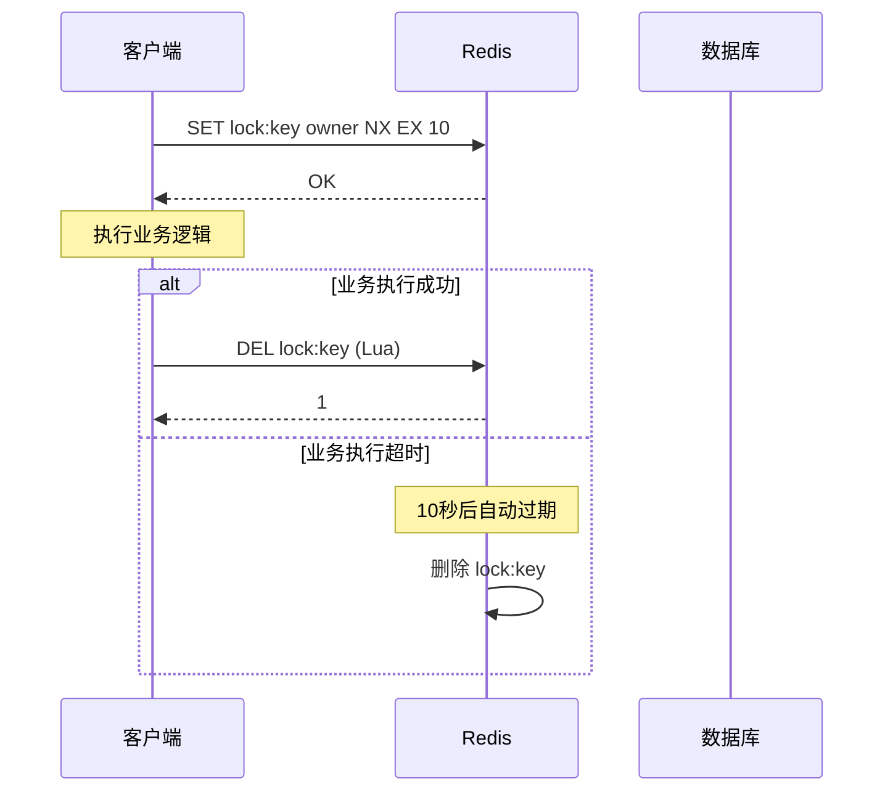
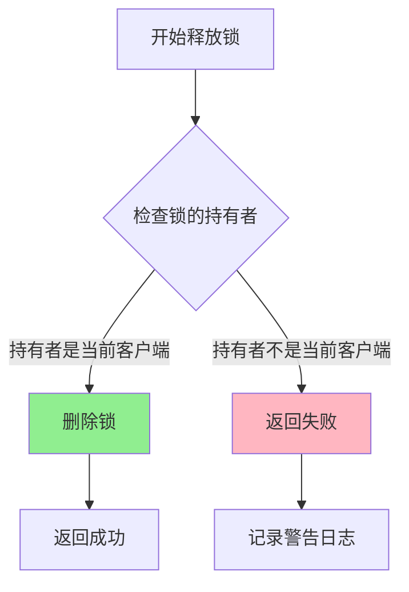

# 分布式锁实践：Redis 分布式锁在停车系统中的应用

## 1. 引言

在微服务架构中，多个服务实例可能同时访问共享资源，这会导致数据竞争和不一致性问题。Smart Park 停车管理系统作为典型的分布式系统，在车辆入场、出场计费、支付回调等核心业务场景中面临着严峻的并发挑战。例如，当同一车辆在短时间内被多个摄像头识别并触发入场请求时，如果不加以控制，可能导致重复入场记录、计费错误等严重问题。

分布式锁是解决此类并发问题的核心技术之一。它能够确保在分布式环境下，同一时刻只有一个服务实例能够执行关键业务逻辑，从而保证数据的一致性和正确性。本文将以 Smart Park 停车系统为实践案例，深入探讨 Redis 分布式锁的实现原理、使用场景和最佳实践。

本文的目标读者是具有一定后端开发经验的工程师，特别是正在构建或维护分布式系统的开发者。文章将结合实际代码，从理论到实践，全面解析分布式锁在停车系统中的应用。

文章结构如下：第二章介绍分布式锁在停车系统中的具体使用场景；第三章详细讲解 Redis 分布式锁的实现原理；第四章探讨锁的过期和续期策略；第五章分析死锁预防和处理机制；第六章总结最佳实践；最后对全文进行总结和展望。

## 2. 分布式锁的使用场景

### 2.1 防重复入场

在停车系统中，防重复入场是最典型的分布式锁应用场景。当车辆驶入停车场时，入口处的摄像头会识别车牌号并触发入场请求。在高并发场景下，可能出现以下问题：

1. **多摄像头并发识别**：大型停车场可能有多个入口，同一车辆可能被不同摄像头同时识别
2. **网络重试**：网络不稳定导致请求重试，可能产生重复入场
3. **设备故障重发**：摄像头设备故障可能发送重复请求

如果不加控制，这些情况会导致数据库中出现多条入场记录，造成计费混乱。Smart Park 通过分布式锁解决了这个问题：

```go
func (uc *EntryExitUseCase) Entry(ctx context.Context, req *v1.EntryRequest) (*v1.EntryData, error) {
    if req.PlateNumber == "" {
        return nil, fmt.Errorf("plate number is required")
    }

    var result *v1.EntryData
    lockKey := lock.GenerateLockKey(LockTypeEntry, req.PlateNumber)

    if err := uc.withDistributedLock(ctx, lockKey, func() error {
        return uc.vehicleRepo.WithTx(ctx, func(ctx context.Context) error {
            var err error
            result, err = uc.processEntryTransaction(ctx, req)
            return err
        })
    }); err != nil {
        return nil, err
    }

    return result, nil
}
```

锁的键名格式为 `entry:车牌号`，确保同一车牌号的入场请求串行执行。在锁的保护下，系统会先检查是否已存在未完成的入场记录，如果存在则拒绝重复入场。

### 2.2 出场计费并发控制

车辆出场时的计费逻辑比入场更加复杂，涉及多个步骤：

1. 查询入场记录
2. 计算停车时长
3. 调用计费服务计算费用
4. 更新出场记录
5. 判断是否放行

这些步骤必须作为一个原子操作执行，否则可能出现以下问题：

- **费用计算错误**：并发更新可能导致计费逻辑执行多次
- **状态不一致**：记录状态与实际业务状态不符
- **重复放行**：道闸可能被多次触发

Smart Park 的出场处理同样使用分布式锁保护：

```go
func (uc *EntryExitUseCase) Exit(ctx context.Context, req *v1.ExitRequest) (*v1.ExitData, error) {
    if req.PlateNumber == "" {
        return nil, fmt.Errorf("plate number is required")
    }

    var result *v1.ExitData
    lockKey := lock.GenerateLockKey(LockTypeExit, req.PlateNumber)

    if err := uc.withDistributedLock(ctx, lockKey, func() error {
        return uc.vehicleRepo.WithTx(ctx, func(ctx context.Context) error {
            var err error
            result, err = uc.processExitTransaction(ctx, req)
            return err
        })
    }); err != nil {
        return nil, err
    }

    return result, nil
}
```

出场锁的键名格式为 `exit:车牌号`，与入场锁分离，避免相互阻塞。

### 2.3 支付回调幂等性

支付回调是另一个需要严格并发控制的场景。第三方支付平台（微信支付、支付宝）可能会多次发送支付成功回调，系统必须保证：

1. **幂等性**：同一笔订单的多次回调只处理一次
2. **状态一致性**：订单状态与支付状态保持一致
3. **金额校验**：防止金额篡改

Smart Park 通过订单状态检查实现幂等性：

```go
func (uc *PaymentUseCase) processWechatPayment(ctx context.Context, req *v1.WechatCallbackRequest) error {
    orderID, err := uuid.Parse(req.OutTradeNo)
    if err != nil {
        return fmt.Errorf("invalid out_trade_no: %w", err)
    }
    
    order, err := uc.orderRepo.GetOrder(ctx, orderID)
    if err != nil || order == nil {
        return fmt.Errorf("order not found: %s", req.OutTradeNo)
    }

    if order.Status != string(StatusPending) {
        uc.logSecurityEvent(ctx, SecurityEventInvalidStatus, order.ID.String(), 0, 0, req.TransactionId)
        return nil
    }

    paidAmount := parseAmount(req.TotalFee)
    if err := uc.validateAmount(order, paidAmount); err != nil {
        uc.logSecurityEvent(ctx, SecurityEventAmountMismatch, order.ID.String(), order.FinalAmount, paidAmount, req.TransactionId)
        return err
    }

    if err := uc.updateOrderAsPaid(order, MethodWechat, req.TransactionId, paidAmount); err != nil {
        return fmt.Errorf("update failed")
    }

    return nil
}
```

在实际生产环境中，建议为支付回调也添加分布式锁，以订单ID为锁键，确保同一订单的回调串行处理。

### 2.4 设备状态更新

停车场设备（摄像头、道闸、显示屏）的状态更新也需要并发控制。设备可能同时向多个服务实例发送心跳或状态变更请求，如果不加控制，可能导致：

- 状态显示错误
- 设备在线/离线状态不一致
- 告警误报或漏报

Smart Park 通过设备ID作为锁键，确保同一设备的状态更新串行执行。

## 3. Redis 分布式锁实现

### 3.1 SET NX EX 命令

Redis 分布式锁的核心是 `SET` 命令的 `NX` 和 `EX` 选项：

- **NX**：只在键不存在时设置，实现互斥
- **EX**：设置过期时间（秒），防止死锁

Smart Park 使用 `SetNX` 方法实现锁获取：

```go
func (r *RedisLockRepo) AcquireLock(ctx context.Context, lockKey string, owner string, ttl time.Duration) (bool, error) {
    key := r.formatKey(lockKey)

    success, err := r.client.SetNX(ctx, key, owner, ttl).Result()
    if err != nil {
        r.log.WithContext(ctx).Errorf("failed to acquire lock %s: %v", key, err)
        return false, fmt.Errorf("failed to acquire lock: %w", err)
    }

    if success {
        r.log.WithContext(ctx).Debugf("lock acquired - Key: %s, Owner: %s, TTL: %v", key, owner, ttl)
    } else {
        r.log.WithContext(ctx).Debugf("lock not available - Key: %s, Owner: %s", key, owner)
    }

    return success, nil
}
```

这个实现有以下特点：

1. **原子性**：`SetNX` 是原子操作，不存在竞态条件
2. **可追溯**：owner 参数标识锁的持有者，便于调试和监控
3. **自动过期**：TTL 确保即使客户端崩溃，锁也会自动释放

### 3.2 锁的获取和释放

锁的释放必须保证原子性，否则可能出现以下问题：

1. 客户端 A 获取锁
2. 客户端 A 执行业务逻辑超时，锁自动过期
3. 客户端 B 获取锁
4. 客户端 A 执行 DEL 命令，释放了客户端 B 的锁

Smart Park 使用 Lua 脚本保证释放操作的原子性：

```go
var releaseLockScript = redis.NewScript(`
    if redis.call("GET", KEYS[1]) == ARGV[1] then
        return redis.call("DEL", KEYS[1])
    else
        return 0
    end
`)

func (r *RedisLockRepo) ReleaseLock(ctx context.Context, lockKey string, owner string) error {
    key := r.formatKey(lockKey)

    result, err := releaseLockScript.Run(ctx, r.client, []string{key}, owner).Int64()
    if err != nil {
        if err == redis.Nil {
            r.log.WithContext(ctx).Warnf("lock already expired or not exists - Key: %s", key)
            return nil
        }
        r.log.WithContext(ctx).Errorf("failed to release lock - Key: %s: %v", key, err)
        return fmt.Errorf("failed to release lock: %w", err)
    }

    if result == 0 {
        r.log.WithContext(ctx).Warnf("cannot release lock - not owner - Key: %s, Owner: %s", key, owner)
        return fmt.Errorf("cannot release lock: not the owner")
    }

    r.log.WithContext(ctx).Debugf("lock released - Key: %s, Owner: %s", key, owner)
    return nil
}
```

Lua 脚本在 Redis 中原子执行，确保只有锁的持有者才能释放锁。

### 3.3 锁的超时机制

锁的超时机制是防止死锁的关键。Smart Park 在配置中定义了默认的锁 TTL：

```go
func DefaultConfig() *Config {
    return &Config{
        LockTTL:               10 * time.Second,
        DeviceOnlineThreshold: 5 * time.Minute,
        Messages: MessagesConfig{
            Welcome:        "欢迎光临",
            MonthlyWelcome: "月卡车，欢迎光临",
            VIPWelcome:     "VIP 车辆，欢迎光临",
            DuplicateEntry: "车辆已在场内，请勿重复入场",
            NoEntryRecord:  "未找到入场记录",
            PleasePay:      "请缴费",
            FreePass:       "免费放行",
        },
    }
}
```

10 秒的 TTL 是一个合理的默认值，既能保证业务逻辑有足够时间执行，又能在异常情况下快速释放锁。

### 3.4 锁的续期策略

对于执行时间较长的业务逻辑，可能需要在业务执行过程中续期锁。Smart Park 提供了锁续期功能：

```go
var extendLockScript = redis.NewScript(`
    if redis.call("GET", KEYS[1]) == ARGV[1] then
        return redis.call("PEXPIRE", KEYS[1], ARGV[2])
    else
        return 0
    end
`)

func (r *RedisLockRepo) ExtendLock(ctx context.Context, lockKey string, owner string, ttl time.Duration) error {
    key := r.formatKey(lockKey)

    result, err := extendLockScript.Run(ctx, r.client, []string{key}, owner, int64(ttl/time.Millisecond)).Int64()
    if err != nil {
        if err == redis.Nil {
            return fmt.Errorf("lock does not exist or has expired")
        }
        return fmt.Errorf("failed to extend lock: %w", err)
    }

    if result == 0 {
        return fmt.Errorf("cannot extend lock: not the owner")
    }

    r.log.WithContext(ctx).Debugf("lock extended - Key: %s, Owner: %s, NewTTL: %v", key, owner, ttl)
    return nil
}
```

续期同样使用 Lua 脚本保证原子性，只有锁的持有者才能续期。

## 4. 锁的过期和续期策略

### 4.1 自动过期机制

自动过期是 Redis 分布式锁的核心特性之一。通过设置 TTL，即使客户端崩溃或网络中断，锁也会在指定时间后自动释放，避免死锁。



### 4.2 看门狗续期

对于执行时间不确定的业务，可以采用"看门狗"机制自动续期。看门狗是一个后台 goroutine，定期检查业务是否还在执行，如果是则续期锁。

Smart Park 提供了 `WithLock` 方法，封装了锁的获取、续期和释放：

```go
type DistributedLock struct {
    repo   LockRepo
    lockID string
    owner  string
    ttl    time.Duration
    log    *log.Helper
}

func (dl *DistributedLock) WithLock(ctx context.Context, fn func() error) error {
    acquired, err := dl.repo.AcquireLock(ctx, dl.lockID, dl.owner, dl.ttl)
    if err != nil {
        return fmt.Errorf("failed to acquire lock: %w", err)
    }
    if !acquired {
        return fmt.Errorf("failed to acquire lock: lock is held by another process")
    }

    defer func() {
        if err := dl.repo.ReleaseLock(ctx, dl.lockID, dl.owner); err != nil {
            if dl.log != nil {
                dl.log.WithContext(ctx).Warnf("warning: failed to release lock: %v", err)
            }
        }
    }()

    return fn()
}
```

在实际应用中，可以扩展这个方法，添加看门狗续期逻辑：

```go
func (dl *DistributedLock) WithLockAndWatchdog(ctx context.Context, fn func() error) error {
    acquired, err := dl.repo.AcquireLock(ctx, dl.lockID, dl.owner, dl.ttl)
    if err != nil || !acquired {
        return fmt.Errorf("failed to acquire lock")
    }

    stopWatchdog := make(chan struct{})
    done := make(chan struct{})

    go func() {
        ticker := time.NewTicker(dl.ttl / 3)
        defer ticker.Stop()

        for {
            select {
            case <-stopWatchdog:
                return
            case <-ticker.C:
                if err := dl.repo.ExtendLock(ctx, dl.lockID, dl.owner, dl.ttl); err != nil {
                    dl.log.Warnf("failed to extend lock: %v", err)
                    return
                }
            }
        }
    }()

    defer func() {
        close(stopWatchdog)
        dl.repo.ReleaseLock(ctx, dl.lockID, dl.owner)
    }()

    return fn()
}
```

### 4.3 业务超时处理

业务逻辑执行时间可能超过锁的 TTL，需要合理处理：

1. **预估业务执行时间**：根据业务复杂度设置合理的 TTL
2. **监控告警**：当业务执行时间接近 TTL 时发出告警
3. **优雅降级**：超时后返回错误，而不是继续执行

Smart Park 在出场处理中，通过事务和锁的组合确保业务完整性：

```go
func (uc *EntryExitUseCase) withDistributedLock(ctx context.Context, lockKey string, fn func() error) error {
    owner := lock.GenerateUniqueOwner()
    uc.log.WithContext(ctx).Debugf("[LOCK] Acquiring lock - Key: %s, Owner: %s", lockKey, owner)

    acquired, err := uc.lockRepo.AcquireLock(ctx, lockKey, owner, uc.config.LockTTL)
    if err != nil {
        uc.log.WithContext(ctx).Errorf("[LOCK] Failed to acquire lock: %v", err)
        return fmt.Errorf("failed to acquire lock: %w", err)
    }
    if !acquired {
        uc.log.WithContext(ctx).Warnf("[LOCK] Lock held by another process - Key: %s", lockKey)
        return fmt.Errorf("duplicate request in progress")
    }

    defer func() {
        if err := uc.lockRepo.ReleaseLock(ctx, lockKey, owner); err != nil {
            uc.log.WithContext(ctx).Warnf("[LOCK] Failed to release lock: %v", err)
        }
    }()

    return fn()
}
```

### 4.4 锁释放的原子性

锁释放必须保证原子性，这是通过 Lua 脚本实现的。Lua 脚本在 Redis 中原子执行，不会被其他命令打断。



## 5. 死锁预防和处理

### 5.1 死锁产生原因

在分布式系统中，死锁可能由以下原因产生：

1. **客户端崩溃**：获取锁后客户端崩溃，未释放锁
2. **网络分区**：客户端与 Redis 网络中断，无法释放锁
3. **业务异常**：业务逻辑抛出异常，未执行释放锁代码
4. **锁粒度过大**：锁的范围过大，持有时间过长

Smart Park 通过以下机制预防死锁：

### 5.2 死锁预防策略

**策略一：自动过期**

所有锁都设置 TTL，确保即使客户端崩溃，锁也会自动释放：

```go
LockTTL: 10 * time.Second
```

**策略二：唯一持有者标识**

每个锁请求都生成唯一的 owner 标识：

```go
func GenerateUniqueOwner() string {
    return uuid.New().String()
}
```

这样可以追踪锁的持有者，便于调试和监控。

**策略三：defer 释放**

使用 defer 确保锁一定会被释放：

```go
defer func() {
    if err := uc.lockRepo.ReleaseLock(ctx, lockKey, owner); err != nil {
        uc.log.WithContext(ctx).Warnf("[LOCK] Failed to release lock: %v", err)
    }
}()
```

**策略四：重试机制**

Smart Park 提供了带重试的锁获取方法：

```go
func (r *RedisLockRepo) TryLockWithRetry(ctx context.Context, lockKey string, owner string, ttl time.Duration,
    maxRetries int, retryInterval time.Duration) (bool, error) {

    var lastErr error

    for i := 0; i < maxRetries; i++ {
        success, err := r.AcquireLock(ctx, lockKey, owner, ttl)
        if err != nil {
            return false, err
        }

        if success {
            return true, nil
        }

        lastErr = fmt.Errorf("lock is held by another process")

        select {
        case <-ctx.Done():
            return false, ctx.Err()
        case <-time.After(retryInterval):
            continue
        }
    }

    return false, lastErr
}
```

### 5.3 死锁检测和恢复

Smart Park 提供了锁状态查询接口，便于监控和排查问题：

```go
func (r *RedisLockRepo) GetLockOwner(ctx context.Context, lockKey string) (string, error) {
    key := r.formatKey(lockKey)

    owner, err := r.client.Get(ctx, key).Result()
    if err != nil {
        if err == redis.Nil {
            return "", nil
        }
        return "", err
    }

    return owner, nil
}

func (r *RedisLockRepo) IsLocked(ctx context.Context, lockKey string) (bool, error) {
    key := r.formatKey(lockKey)

    exists, err := r.client.Exists(ctx, key).Result()
    if err != nil {
        return false, err
    }

    return exists > 0, nil
}
```

### 5.4 最佳实践建议

1. **合理设置 TTL**：根据业务执行时间设置，建议为预期时间的 2-3 倍
2. **监控锁持有时间**：记录锁的获取和释放时间，发现异常及时告警
3. **避免嵌套锁**：不要在一个锁的保护下获取另一个锁
4. **锁粒度适中**：锁的范围要足够小，避免不必要的阻塞
5. **异常处理完善**：确保所有异常路径都能释放锁

## 6. 最佳实践

### 6.1 分布式锁性能优化

**优化一：锁键设计**

锁键的设计直接影响性能和正确性：

```go
func GenerateLockKey(operation, resource string) string {
    return operation + ":" + resource
}
```

- 使用业务前缀区分不同类型的锁
- 资源标识要唯一且稳定
- 避免使用过长的键名

**优化二：锁粒度选择**

Smart Park 使用车牌号作为锁的资源标识，而不是停车场ID：

```go
lockKey := lock.GenerateLockKey(LockTypeEntry, req.PlateNumber)
```

这样不同车辆的入场可以并行处理，提高系统吞吐量。

**优化三：本地缓存**

对于频繁查询的数据，可以在锁保护下使用本地缓存：

```go
var localCache = make(map[string]*Vehicle)

func (uc *EntryExitUseCase) getVehicleWithCache(ctx context.Context, plateNumber string) (*Vehicle, error) {
    if v, ok := localCache[plateNumber]; ok {
        return v, nil
    }

    vehicle, err := uc.vehicleRepo.GetVehicleByPlate(ctx, plateNumber)
    if err != nil {
        return nil, err
    }

    localCache[plateNumber] = vehicle
    return vehicle, nil
}
```

### 6.2 常见问题和解决方案

**问题一：锁误删**

场景：客户端 A 的锁过期后被客户端 B 获取，客户端 A 执行 DEL 释放了客户端 B 的锁。

解决方案：使用 Lua 脚本，只有持有者才能释放锁。

**问题二：锁续期失败**

场景：看门狗续期时，锁已被其他客户端获取。

解决方案：续期失败时立即停止业务执行，返回错误。

**问题三：Redis 故障**

场景：Redis 宕机导致锁服务不可用。

解决方案：
1. 使用 Redis Sentinel 或 Cluster 实现高可用
2. 降级策略：Redis 不可用时，使用数据库行锁或直接拒绝请求

### 6.3 锁粒度选择建议

| 业务场景 | 锁粒度 | 锁键示例 | 说明 |
|---------|--------|---------|------|
| 车辆入场 | 车牌号 | `entry:京A12345` | 同一车牌串行，不同车牌并行 |
| 车辆出场 | 车牌号 | `exit:京A12345` | 同一车牌串行，不同车牌并行 |
| 支付回调 | 订单ID | `payment:order-123` | 同一订单串行，不同订单并行 |
| 设备状态 | 设备ID | `device:cam-001` | 同一设备串行，不同设备并行 |
| 停车场配置 | 停车场ID | `lot:parking-001` | 同一停车场串行，不同停车场并行 |

## 7. 总结

本文以 Smart Park 停车系统为实践案例，深入探讨了 Redis 分布式锁的实现原理和应用场景。通过分析防重复入场、出场计费并发控制、支付回调幂等性等典型场景，展示了分布式锁在保证数据一致性方面的重要作用。

核心要点回顾：

1. **原子性保证**：使用 `SET NX EX` 命令和 Lua 脚本确保锁操作的原子性
2. **死锁预防**：通过 TTL 自动过期、唯一持有者标识、defer 释放等机制预防死锁
3. **锁续期策略**：看门狗机制确保长时间业务不会因锁过期而失败
4. **性能优化**：合理的锁粒度设计和键命名规范提高系统吞吐量

未来展望：

1. **Redlock 算法**：在更高可靠性要求的场景下，可以考虑实现 Redlock 算法，在多个 Redis 实例上获取锁
2. **可重入锁**：支持同一客户端多次获取同一把锁，简化递归调用场景
3. **读写锁**：对于读多写少的场景，实现读写锁提高并发性能
4. **监控告警**：建立完善的锁监控体系，及时发现和处理异常

分布式锁是构建可靠分布式系统的重要基础设施，合理使用分布式锁能够有效解决并发问题，但也需要注意锁的粒度和性能影响。希望本文的实践经验能够为读者在类似场景下提供参考和启发。

## 参考资料

1. Redis官方文档 - SET命令: https://redis.io/commands/set
2. Redis分布式锁实现: https://redis.io/topics/distlock
3. Martin Kleppmann - How to do distributed locking: https://martin.kleppmann.com/2016/02/08/how-to-do-distributed-locking.html
4. Kratos微服务框架: https://github.com/go-kratos/kratos
5. Smart Park项目源码: https://github.com/xuanyiying/smart-park
