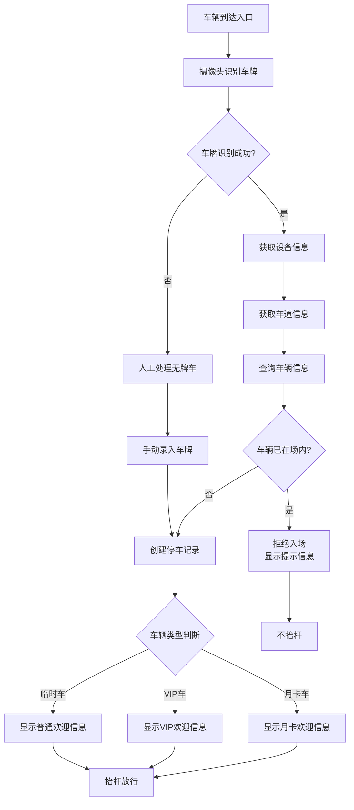
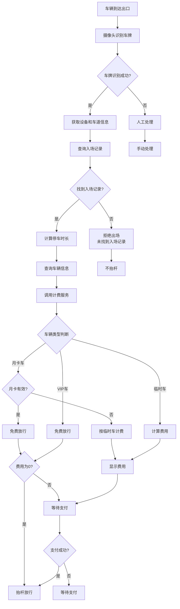
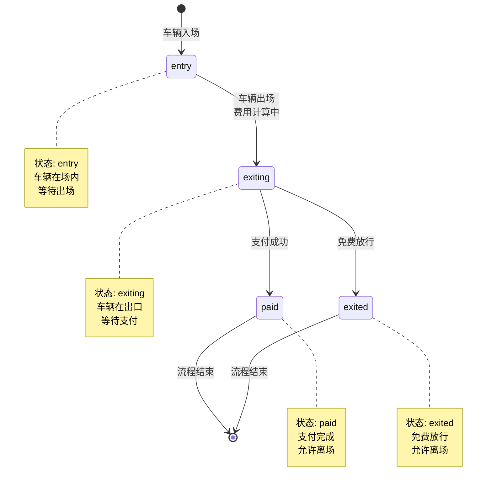

# 车辆入场/出场流程：业务逻辑的完整实现

## 引言

停车场管理系统的核心价值在于高效、准确地处理车辆的入场和出场流程。作为整个系统最关键的业务环节，入场/出场流程不仅涉及车牌识别、费用计算、支付处理等多个技术模块，还需要处理各种异常情况，如无牌车、月卡过期、逃费检测等复杂场景。一个设计良好的入场/出场流程，能够显著提升停车场运营效率，减少人工干预，为车主提供流畅的停车体验。

本文将深入剖析 Smart Park 停车场管理系统的车辆入场/出场流程实现，从业务逻辑设计、状态机管理、异常处理到性能优化，全方位展示如何构建一个健壮、可扩展的停车业务系统。文章基于实际项目代码，结合 Kratos 微服务框架和 Ent ORM，为后端开发者提供可直接参考的实践方案。

文章结构安排如下：首先介绍入场流程的完整实现，包括车牌识别、防重复入场、记录创建等核心逻辑；然后详细讲解出场流程，涵盖费用计算、月卡验证、支付处理等关键环节；接着探讨异常处理机制和状态机设计；最后分享最佳实践和性能优化建议。

## 核心内容

### 入场流程

车辆入场是停车业务的起点，其核心目标是快速、准确地记录车辆信息并放行。入场流程需要处理多种车辆类型（临时车、月卡车、VIP车），同时要防止重复入场等异常情况。

#### 业务流程概览



#### 车牌识别和验证

入场流程的第一步是车牌识别。系统接收来自摄像头设备的识别结果，包括车牌号、识别置信度、车牌图片等信息。以下是入场请求的数据结构定义：

```protobuf
message EntryRequest {
  string deviceId      = 1;  // 设备ID
  string plateNumber   = 2;  // 车牌号
  string plateImageUrl = 3;  // 车牌图片URL
  double confidence    = 4;  // 识别置信度
  string vehicleType   = 5;  // 车辆类型
  string timestamp     = 6;  // 时间戳
}
```

在业务层，我们首先对请求进行基本验证，确保车牌号不为空：

```go
func (uc *EntryExitUseCase) Entry(ctx context.Context, req *v1.EntryRequest) (*v1.EntryData, error) {
    uc.logEntryStart(req.DeviceId, req.PlateNumber, req.Confidence)

    if req.PlateNumber == "" {
        return nil, fmt.Errorf("plate number is required")
    }

    var result *v1.EntryData
    lockKey := lock.GenerateLockKey(LockTypeEntry, req.PlateNumber)

    if err := uc.withDistributedLock(ctx, lockKey, func() error {
        return uc.vehicleRepo.WithTx(ctx, func(ctx context.Context) error {
            var err error
            result, err = uc.processEntryTransaction(ctx, req)
            return err
        })
    }); err != nil {
        return nil, err
    }

    return result, nil
}
```

这段代码展示了两个重要的设计模式：**分布式锁**和**数据库事务**。分布式锁确保同一车牌号不会并发处理多个入场请求，避免重复记录；数据库事务保证数据一致性，所有操作要么全部成功，要么全部回滚。

**分布式锁的实现细节**

分布式锁是保证并发安全的关键机制。在入场/出场流程中，我们使用 Redis 实现分布式锁，确保同一车牌号的请求串行处理：

```go
func (uc *EntryExitUseCase) withDistributedLock(ctx context.Context, lockKey string, fn func() error) error {
    owner := lock.GenerateUniqueOwner()
    uc.log.WithContext(ctx).Debugf("[LOCK] Acquiring lock - Key: %s, Owner: %s", lockKey, owner)

    acquired, err := uc.lockRepo.AcquireLock(ctx, lockKey, owner, uc.config.LockTTL)
    if err != nil {
        uc.log.WithContext(ctx).Errorf("[LOCK] Failed to acquire lock: %v", err)
        return fmt.Errorf("failed to acquire lock: %w", err)
    }
    if !acquired {
        uc.log.WithContext(ctx).Warnf("[LOCK] Lock held by another process - Key: %s", lockKey)
        return fmt.Errorf("duplicate request in progress")
    }

    defer func() {
        if err := uc.lockRepo.ReleaseLock(ctx, lockKey, owner); err != nil {
            uc.log.WithContext(ctx).Warnf("[LOCK] Failed to release lock: %v", err)
        }
    }()

    return fn()
}
```

分布式锁的关键设计要点：
1. **锁的唯一性**: 使用 `lock.GenerateUniqueOwner()` 生成唯一标识符，确保锁的归属清晰
2. **锁的过期时间**: 设置 TTL（默认 10 秒），防止死锁
3. **锁的释放**: 使用 defer 确保锁一定会被释放，即使业务逻辑出现异常
4. **锁的重入**: 如果锁已被占用，立即返回错误，避免重复处理

**数据库事务的必要性**

为什么需要数据库事务？考虑以下场景：
- 创建停车记录成功，但更新设备状态失败
- 费用计算成功，但记录更新失败
- 支付成功，但状态更新失败

这些情况都会导致数据不一致。通过数据库事务，我们确保所有操作原子性执行：

```go
return uc.vehicleRepo.WithTx(ctx, func(ctx context.Context) error {
    // 所有数据库操作都在同一个事务中
    // 任何一步失败，整个事务回滚
    var err error
    result, err = uc.processEntryTransaction(ctx, req)
    return err
})
```

#### 防重复入场检查

防重复入场是入场流程的关键检查点。系统需要查询该车牌是否有未完成的停车记录（即已入场但未出场），如果存在则拒绝入场：

```go
func (uc *EntryExitUseCase) processEntryTransaction(ctx context.Context, req *v1.EntryRequest) (*v1.EntryData, error) {
    lane, err := uc.vehicleRepo.GetLaneByDeviceCode(ctx, req.DeviceId)
    if err != nil {
        return nil, fmt.Errorf("failed to get lane info: %w", err)
    }
    uc.log.WithContext(ctx).Infof("[ENTRY] Found lane - LaneID: %s, LotID: %s", lane.ID, lane.LotID)

    vehicle, err := uc.vehicleRepo.GetVehicleByPlate(ctx, req.PlateNumber)
    if err != nil {
        return nil, fmt.Errorf("failed to get vehicle info: %w", err)
    }

    existingRecord, err := uc.vehicleRepo.GetEntryRecord(ctx, req.PlateNumber)
    if err != nil {
        return nil, fmt.Errorf("failed to check existing entry: %w", err)
    }
    if existingRecord != nil {
        uc.log.WithContext(ctx).Warnf("[ENTRY] Duplicate entry - PlateNumber: [REDACTED]")
        return &v1.EntryData{
            PlateNumber:    req.PlateNumber,
            Allowed:        false,
            GateOpen:       false,
            DisplayMessage: uc.config.Messages.DuplicateEntry,
        }, nil
    }

    record := uc.createParkingRecord(req, lane, vehicle)
    if err := uc.vehicleRepo.CreateParkingRecord(ctx, record); err != nil {
        return nil, fmt.Errorf("failed to create parking record: %w", err)
    }

    return uc.buildEntryResponse(record, req.PlateNumber, vehicle), nil
}
```

`GetEntryRecord` 方法查询的是状态为 `entry`（已入场未出场）的记录。如果找到这样的记录，说明车辆仍在场内，系统会返回拒绝入场的响应，并在显示屏上提示"车辆已在场内，请勿重复入场"。

#### 创建入场记录

通过所有检查后，系统创建停车记录。停车记录是整个停车业务的核心实体，记录了车辆从入场到出场的完整生命周期：

```go
func (uc *EntryExitUseCase) createParkingRecord(req *v1.EntryRequest, lane *Lane, vehicle *Vehicle) *ParkingRecord {
    plateNumber := req.PlateNumber
    record := &ParkingRecord{
        ID:                uuid.New(),
        LotID:             lane.LotID,
        EntryLaneID:       lane.ID,
        EntryTime:         time.Now(),
        EntryImageURL:     req.PlateImageUrl,
        RecordStatus:      RecordStatusEntry,
        ExitStatus:        ExitStatusUnpaid,
        PlateNumber:       &plateNumber,
        PlateNumberSource: "camera",
    }

    if vehicle != nil {
        record.VehicleID = &vehicle.ID
    }

    return record
}
```

停车记录包含以下关键字段：
- **ID**: 全局唯一标识符，使用 UUID
- **LotID**: 停车场ID
- **EntryLaneID**: 入场车道ID
- **EntryTime**: 入场时间
- **RecordStatus**: 记录状态（entry/exiting/exited/paid）
- **ExitStatus**: 支付状态（unpaid/paid/refunded/waived）
- **PlateNumber**: 车牌号
- **PlateNumberSource**: 车牌来源（camera/manual/offline）

#### 抬杆放行逻辑

创建记录后，系统根据车辆类型生成不同的响应信息，并控制道闸抬杆：

```go
func (uc *EntryExitUseCase) buildEntryResponse(record *ParkingRecord, plateNumber string, vehicle *Vehicle) *v1.EntryData {
    displayMessage := uc.config.Messages.Welcome
    if vehicle != nil {
        switch vehicle.VehicleType {
        case VehicleTypeMonthly:
            displayMessage = uc.config.Messages.MonthlyWelcome
        case VehicleTypeVIP:
            displayMessage = uc.config.Messages.VIPWelcome
        }
    }

    return &v1.EntryData{
        RecordId:       record.ID.String(),
        PlateNumber:    plateNumber,
        Allowed:        true,
        GateOpen:       true,
        DisplayMessage: displayMessage,
    }
}
```

系统支持三种车辆类型：
1. **临时车（temporary）**: 显示"欢迎光临"
2. **月卡车（monthly）**: 显示"月卡车，欢迎光临"
3. **VIP车（vip）**: 显示"VIP 车辆，欢迎光临"

响应中的 `GateOpen` 字段控制道闸是否抬杆，`DisplayMessage` 字段用于 LED 显示屏展示。

#### 异常处理（无牌车）

无牌车是停车场运营中的常见异常情况。当摄像头无法识别车牌时，系统需要提供人工处理通道：

```go
// 无牌车处理流程
// 1. 摄像头识别失败，confidence 低于阈值
// 2. 系统提示人工处理
// 3. 工作人员手动录入车牌号
// 4. 创建停车记录，PlateNumberSource 标记为 "manual"
```

在实际实现中，无牌车可以通过以下方式处理：
- 提供人工录入界面，工作人员手动输入车牌
- 生成临时车牌号（如"无牌车-20260331-001"）
- 记录车辆特征信息（颜色、车型等）作为辅助识别

**入场流程的测试覆盖**

为了确保入场流程的正确性，我们编写了完整的单元测试。以下是测试用例示例：

```go
func TestEntryExitUseCase_Entry(t *testing.T) {
    logger := log.NewStdLogger(os.Stdout)
    mockRepo := NewMockVehicleRepo()
    mockBillingClient := NewMockBillingClient()

    // Setup test data
    lotID := uuid.New()
    deviceID := "test-device-001"
    laneID := uuid.New()

    mockRepo.Devices[deviceID] = &Device{
        ID:         uuid.New(),
        DeviceID:   deviceID,
        DeviceType: "camera",
        Status:     "active",
    }

    mockRepo.Lanes[deviceID] = &Lane{
        ID:        laneID,
        LotID:     lotID,
        LaneNo:    1,
        Direction: "entry",
        Status:    "active",
    }

    uc := NewEntryExitUseCase(mockRepo, mockBillingClient, nil, NewMockLockRepo(), logger)

    req := &v1.EntryRequest{
        DeviceId:      deviceID,
        PlateNumber:   "京A12345",
        PlateImageUrl: "http://example.com/image.jpg",
        Confidence:    0.95,
    }

    data, err := uc.Entry(context.Background(), req)
    if err != nil {
        t.Fatalf("Entry failed: %v", err)
    }

    if !data.Allowed {
        t.Error("Expected allowed to be true")
    }

    if !data.GateOpen {
        t.Error("Expected gate_open to be true")
    }
}
```

测试覆盖的关键场景：
1. **正常入场**: 车辆首次入场，成功创建记录
2. **重复入场**: 车辆已在场内，拒绝入场
3. **VIP车辆**: VIP车辆入场，显示特殊欢迎信息
4. **月卡车辆**: 月卡车辆入场，显示月卡欢迎信息
5. **无牌车**: 无牌车入场，人工处理流程

### 出场流程

出场流程比入场流程更加复杂，涉及费用计算、月卡验证、支付处理等多个环节。出场流程的核心目标是准确计算停车费用，并根据支付状态控制道闸。

#### 业务流程概览



#### 车牌匹配校验

出场流程首先需要验证车牌是否有对应的入场记录：

```go
func (uc *EntryExitUseCase) Exit(ctx context.Context, req *v1.ExitRequest) (*v1.ExitData, error) {
    uc.logExitStart(req.DeviceId, req.PlateNumber, req.Confidence)

    if req.PlateNumber == "" {
        return nil, fmt.Errorf("plate number is required")
    }

    var result *v1.ExitData
    lockKey := lock.GenerateLockKey(LockTypeExit, req.PlateNumber)

    if err := uc.withDistributedLock(ctx, lockKey, func() error {
        return uc.vehicleRepo.WithTx(ctx, func(ctx context.Context) error {
            var err error
            result, err = uc.processExitTransaction(ctx, req)
            return err
        })
    }); err != nil {
        return nil, err
    }

    return result, nil
}
```

出场流程同样使用分布式锁和数据库事务，确保数据一致性。

#### 月卡有效期验证

月卡车辆是停车场的重要客户群体，系统需要在出场时验证月卡有效性：

```go
func (uc *EntryExitUseCase) calculateExitFee(ctx context.Context, record *ParkingRecord, lane *Lane, exitTime time.Time, vehicle *Vehicle, vehicleType string) (float64, float64, float64, error) {
    feeResult, err := uc.billingClient.CalculateFee(ctx, record.ID.String(), lane.LotID.String(),
        record.EntryTime.Unix(), exitTime.Unix(), vehicleType)
    if err != nil {
        uc.log.WithContext(ctx).Errorf("[EXIT] Failed to calculate fee: %v", err)
        return 0, 0, 0, fmt.Errorf("fee calculation failed: %w", err)
    }

    finalAmount := feeResult.FinalAmount

    if vehicle != nil && vehicle.VehicleType == VehicleTypeMonthly {
        if vehicle.MonthlyValidUntil != nil && vehicle.MonthlyValidUntil.After(time.Now()) {
            finalAmount = 0
            uc.log.WithContext(ctx).Infof("[EXIT] Monthly vehicle with valid card - PlateNumber: [REDACTED], ValidUntil: %s",
                vehicle.MonthlyValidUntil.Format(time.RFC3339))
        } else {
            if record.Metadata == nil {
                record.Metadata = make(map[string]interface{})
            }
            record.Metadata["chargeAs"] = VehicleTypeTemporary
            record.Metadata["monthlyExpired"] = true
            if vehicle.MonthlyValidUntil != nil {
                record.Metadata["expiredAt"] = vehicle.MonthlyValidUntil.Format(time.RFC3339)
            }
            uc.log.WithContext(ctx).Warnf("[EXIT] Monthly card expired, charging as temporary - PlateNumber: [REDACTED]")
        }
    }

    return feeResult.BaseAmount, feeResult.DiscountAmount, finalAmount, nil
}
```

月卡验证逻辑：
1. 首先调用计费服务计算标准费用
2. 如果车辆是月卡车，检查月卡有效期
3. 月卡有效：最终费用为 0，免费放行
4. 月卡过期：按临时车计费，并在记录中标记月卡已过期

这种设计既保证了月卡用户的权益，又避免了月卡过期后的逃费问题。

**月卡验证的边界情况**

月卡验证需要处理多种边界情况：

1. **月卡即将过期**: 提前 7 天提醒用户续费
2. **月卡当天过期**: 当天仍可使用，次日按临时车计费
3. **月卡已过期**: 自动切换为临时车计费，并记录过期信息
4. **月卡续费**: 续费后立即生效，无需重新入场

```go
// 月卡续费提醒逻辑
if vehicle.MonthlyValidUntil != nil {
    daysUntilExpiry := time.Until(*vehicle.MonthlyValidUntil).Hours() / 24
    if daysUntilExpiry <= 7 && daysUntilExpiry > 0 {
        // 发送续费提醒
        uc.notificationService.SendRenewalReminder(ctx, vehicle.OwnerPhone, vehicle.PlateNumber)
    }
}
```

#### 费用计算流程

费用计算是出场流程的核心环节，系统通过调用计费服务（Billing Service）完成费用计算：

```go
type Client interface {
    CalculateFee(ctx context.Context, recordID string, lotID string, entryTime, exitTime int64, vehicleType string) (*FeeResult, error)
}

type FeeResult struct {
    BaseAmount     float64  // 基础费用
    DiscountAmount float64  // 优惠金额
    FinalAmount    float64  // 最终费用
}
```

计费服务根据以下因素计算费用：
- **停车时长**: 从入场时间到出场时间
- **停车场ID**: 不同停车场可能有不同的计费规则
- **车辆类型**: 临时车、月卡车、VIP车等
- **计费规则**: 按小时计费、封顶费用、优惠时段等

计费服务是独立的微服务，通过 gRPC 调用，实现了业务解耦和独立扩展。

#### 支付处理逻辑

费用计算完成后，系统根据最终费用决定是否需要支付：

```go
func (uc *EntryExitUseCase) buildExitResponse(record *ParkingRecord, req *v1.ExitRequest, duration int, amount, discountAmount, finalAmount float64) *v1.ExitData {
    allowed := finalAmount == 0
    gateOpen := finalAmount == 0
    displayMessage := uc.config.Messages.PleasePay

    if finalAmount == 0 {
        displayMessage = uc.config.Messages.FreePass
        gateOpen = true
    }

    return &v1.ExitData{
        RecordId:        record.ID.String(),
        PlateNumber:     req.PlateNumber,
        ParkingDuration: int32(duration),
        Amount:          amount,
        DiscountAmount:  discountAmount,
        FinalAmount:     finalAmount,
        Allowed:         allowed,
        GateOpen:        gateOpen,
        DisplayMessage:  displayMessage,
    }
}
```

支付处理逻辑：
1. **费用为 0**: 直接抬杆放行（月卡车、VIP车、免费时段等）
2. **费用不为 0**: 显示费用，等待支付
3. 支付成功后，更新记录状态为 `paid`，抬杆放行

**支付流程的完整实现**

支付流程涉及多个服务的协作，包括车辆服务、计费服务、支付服务：

```go
// 支付流程伪代码
func (uc *EntryExitUseCase) ProcessPayment(ctx context.Context, recordID string, paymentMethod string) error {
    // 1. 查询停车记录
    record, err := uc.vehicleRepo.GetParkingRecord(ctx, uuid.MustParse(recordID))
    if err != nil {
        return err
    }
    
    // 2. 验证支付状态
    if record.ExitStatus == ExitStatusPaid {
        return fmt.Errorf("record already paid")
    }
    
    // 3. 调用支付服务
    paymentResult, err := uc.paymentService.Pay(ctx, &PaymentRequest{
        RecordID:      recordID,
        Amount:        record.FinalAmount,
        PaymentMethod: paymentMethod,
        PlateNumber:   *record.PlateNumber,
    })
    if err != nil {
        return err
    }
    
    // 4. 更新记录状态
    record.ExitStatus = ExitStatusPaid
    record.RecordStatus = RecordStatusPaid
    record.PaymentID = &paymentResult.PaymentID
    
    return uc.vehicleRepo.UpdateParkingRecord(ctx, record)
}
```

支付流程的关键设计：
1. **幂等性**: 同一订单不会重复支付
2. **超时处理**: 支付超时后自动取消订单
3. **回调处理**: 支付成功后通过回调更新状态
4. **退款机制**: 支持支付后的退款操作

#### 抬杆放行逻辑

出场流程的抬杆逻辑与入场类似，但增加了支付状态判断：

```go
func (uc *EntryExitUseCase) updateParkingRecordForExit(ctx context.Context, record *ParkingRecord, req *v1.ExitRequest, device *Device, lane *Lane, exitTime time.Time, duration int) error {
    record.ExitTime = &exitTime
    record.ExitImageURL = req.PlateImageUrl
    record.ExitLaneID = &lane.ID
    record.ExitDeviceID = device.DeviceID
    record.RecordStatus = RecordStatusExiting
    record.ParkingDuration = duration

    if err := uc.vehicleRepo.UpdateParkingRecord(ctx, record); err != nil {
        uc.log.WithContext(ctx).Errorf("[EXIT] Failed to update parking record %s: %v", record.ID, err)
        return fmt.Errorf("failed to update parking record: %w", err)
    }
    return nil
}
```

出场时更新记录状态为 `exiting`（出场中），等待支付完成后更新为 `paid`（已支付）。

### 异常处理

停车场运营中会遇到各种异常情况，系统需要设计完善的异常处理机制。

#### 无牌车处理

无牌车的处理流程：

```go
// 无牌车处理策略
// 1. 识别失败时，系统生成临时标识
// 2. 记录车辆特征（颜色、车型、品牌）
// 3. 入场时拍照留证
// 4. 出场时人工匹配
// 5. 支持事后补录车牌
```

无牌车处理的关键是建立临时标识和车辆特征的关联，确保出场时能够准确匹配。

#### 逃费检测

逃费检测是停车场管理的重要功能，系统通过以下机制防止逃费：

1. **入场记录验证**: 出场时必须找到对应的入场记录
2. **支付状态检查**: 未支付车辆不允许出场
3. **黑名单机制**: 逃费车辆加入黑名单，下次入场时拦截
4. **异常记录标记**: 系统自动标记异常记录，便于人工审核

```go
// 逃费检测逻辑
if record.ExitStatus == ExitStatusUnpaid && record.RecordStatus == RecordStatusExited {
    // 标记为逃费记录
    record.Metadata["escapeFee"] = true
    record.Metadata["escapeTime"] = time.Now().Format(time.RFC3339)
    
    // 加入黑名单
    uc.vehicleRepo.AddToBlacklist(ctx, record.PlateNumber)
}
```

#### 月卡过期处理

月卡过期是常见情况，系统需要优雅地处理：

```go
// 月卡过期处理已在 calculateExitFee 中实现
// 1. 检测月卡过期
// 2. 按临时车计费
// 3. 在记录中标记月卡过期信息
// 4. 提示用户续费
```

月卡过期处理的关键是：
- 不拒绝过期月卡车辆出场
- 自动切换为临时车计费
- 记录过期信息，便于后续续费提醒

#### 网络异常处理

网络异常可能导致设备离线，系统设计了离线同步机制：

```go
type OfflineSyncRecord struct {
    ID         uuid.UUID
    OfflineID  string
    RecordID   uuid.UUID
    LotID      uuid.UUID
    DeviceID   string
    GateID     string
    OpenTime   time.Time
    SyncAmount float64
    SyncStatus string  // pending/synced/failed
    SyncError  string
    RetryCount int
    SyncedAt   *time.Time
    CreatedAt  time.Time
}
```

离线同步机制：
1. 设备离线时，本地记录操作
2. 网络恢复后，自动同步到服务器
3. 同步失败时，自动重试
4. 记录同步状态，便于监控和人工干预

### 状态机设计

停车记录的状态管理是业务逻辑的核心，系统使用状态机模式管理记录的生命周期。

#### 停车记录状态定义

停车记录有以下状态：

```go
const (
    RecordStatusEntry   RecordStatus = "entry"    // 已入场
    RecordStatusExiting RecordStatus = "exiting"  // 出场中
    RecordStatusExited  RecordStatus = "exited"   // 已出场
    RecordStatusPaid    RecordStatus = "paid"     // 已支付
)

const (
    ExitStatusUnpaid   ExitStatus = "unpaid"    // 未支付
    ExitStatusPaid     ExitStatus = "paid"      // 已支付
    ExitStatusRefunded ExitStatus = "refunded"  // 已退款
    ExitStatusWaived   ExitStatus = "waived"    // 已豁免
)
```

#### 状态转换规则



状态转换规则：
1. **entry → exiting**: 车辆到达出口，开始出场流程
2. **exiting → paid**: 费用不为 0，支付成功
3. **exiting → exited**: 费用为 0，免费放行
4. **paid/exited**: 流程结束，记录归档

#### 状态持久化

状态持久化使用 Ent ORM 实现，支持乐观锁防止并发更新：

```go
type ParkingRecord struct {
    ent.Schema
}

func (ParkingRecord) Fields() []ent.Field {
    return []ent.Field{
        field.Enum("record_status").
            Values("entry", "exiting", "exited", "paid").
            Default("entry").
            Comment("记录状态: 入场中/出场中/已出场/已支付"),
        field.Enum("exit_status").
            Values("unpaid", "paid", "refunded", "waived").
            Default("unpaid").
            Comment("出场支付状态"),
        field.Int("payment_lock").
            Default(0).
            Comment("乐观锁版本号"),
    }
}
```

乐观锁机制：
- 每次更新时检查 `payment_lock` 版本号
- 更新成功后版本号 +1
- 版本号不匹配时更新失败，需要重试

#### 状态查询优化

为了提高查询性能，系统设计了多个索引：

```go
func (ParkingRecord) Indexes() []ent.Index {
    return []ent.Index{
        index.Fields("plate_number", "entry_time").StorageKey("idx_parking_records_plate_entry"),
        index.Fields("lot_id", "record_status").StorageKey("idx_parking_records_lot_status"),
        index.Fields("exit_time").StorageKey("idx_parking_records_exit"),
    }
}
```

索引设计：
1. **车牌号 + 入场时间**: 快速查询车辆入场记录
2. **停车场ID + 记录状态**: 统计停车场在场车辆
3. **出场时间**: 查询历史出场记录

## 最佳实践

### 业务流程优化

在实际运营中，我们总结了以下优化经验：

**1. 异步处理非关键路径**

入场/出场流程中的某些操作可以异步处理，如：
- 图片上传和存储
- 数据同步到数据仓库
- 发送通知消息

```go
// 异步处理示例
go func() {
    if err := uc.uploadImage(record.EntryImageURL); err != nil {
        uc.log.Errorf("failed to upload image: %v", err)
    }
}()
```

**2. 缓存热点数据**

频繁查询的数据应使用缓存：
- 车辆信息（月卡状态、车辆类型）
- 设备信息（设备状态、车道信息）
- 计费规则

```go
// 使用 Redis 缓存车辆信息
cacheKey := fmt.Sprintf("vehicle:%s", plateNumber)
if cached, err := uc.redis.Get(ctx, cacheKey).Result(); err == nil {
    // 使用缓存数据
}
```

**3. 批量操作优化**

对于批量查询，使用 IN 查询而不是循环查询：

```go
// 批量查询车辆信息
vehicles, err := uc.vehicleRepo.GetVehiclesByPlates(ctx, plateNumbers)
```

### 常见问题和解决方案

**问题 1: 车牌识别错误导致无法出场**

解决方案：
- 提供人工修正入口
- 记录识别置信度，低置信度时提示人工确认
- 支持模糊匹配（如"京A12345"匹配"京A1234S"）

**问题 2: 网络故障导致设备离线**

解决方案：
- 设备本地缓存能力
- 离线记录自动同步
- 关键操作支持离线模式

**问题 3: 高峰期系统响应慢**

解决方案：
- 数据库读写分离
- 热点数据缓存
- 异步处理非关键操作
- 水平扩展服务实例

### 性能优化建议

**1. 数据库优化**

- 合理设计索引，避免全表扫描
- 使用连接池，复用数据库连接
- 定期归档历史数据，减少表大小
- 使用分区表处理大数据量

**2. 缓存策略**

- 多级缓存：本地缓存 + Redis 缓存
- 合理设置缓存过期时间
- 缓存预热：系统启动时加载热点数据
- 缓存穿透保护：布隆过滤器

**3. 并发控制**

- 使用分布式锁防止重复操作
- 乐观锁处理并发更新
- 限流保护系统稳定性

**4. 监控和告警**

- 监控关键指标：入场/出场成功率、平均响应时间
- 设置告警阈值：异常情况及时通知
- 日志聚合：便于问题排查

**监控指标设计**

系统监控是保障服务质量的重要手段。我们设计了以下监控指标：

```go
// 监控指标定义
type Metrics struct {
    // 入场相关指标
    EntryTotal       prometheus.Counter
    EntrySuccess     prometheus.Counter
    EntryFailure     prometheus.Counter
    EntryDuration    prometheus.Histogram
    
    // 出场相关指标
    ExitTotal        prometheus.Counter
    ExitSuccess      prometheus.Counter
    ExitFailure      prometheus.Counter
    ExitDuration     prometheus.Histogram
    
    // 支付相关指标
    PaymentTotal     prometheus.Counter
    PaymentSuccess   prometheus.Counter
    PaymentAmount    prometheus.Histogram
    
    // 系统健康指标
    ActiveVehicles   prometheus.Gauge
    QueueLength      prometheus.Gauge
}
```

监控指标的应用：

```go
func (uc *EntryExitUseCase) Entry(ctx context.Context, req *v1.EntryRequest) (*v1.EntryData, error) {
    start := time.Now()
    defer func() {
        uc.metrics.EntryDuration.Observe(time.Since(start).Seconds())
    }()
    
    uc.metrics.EntryTotal.Inc()
    
    result, err := uc.processEntry(ctx, req)
    if err != nil {
        uc.metrics.EntryFailure.Inc()
        return nil, err
    }
    
    uc.metrics.EntrySuccess.Inc()
    return result, nil
}
```

**告警规则配置**

```yaml
# Prometheus 告警规则示例
groups:
  - name: parking_system_alerts
    rules:
      - alert: HighEntryFailureRate
        expr: rate(entry_failure_total[5m]) / rate(entry_total[5m]) > 0.1
        for: 5m
        labels:
          severity: warning
        annotations:
          summary: "入场失败率过高"
          description: "入场失败率超过 10%"
      
      - alert: SlowResponseTime
        expr: histogram_quantile(0.95, rate(entry_duration_seconds_bucket[5m])) > 2
        for: 5m
        labels:
          severity: warning
        annotations:
          summary: "响应时间过慢"
          description: "95% 分位响应时间超过 2 秒"
```

## 总结

本文深入剖析了 Smart Park 停车场管理系统的车辆入场/出场流程实现。通过分布式锁、数据库事务、状态机等设计模式，系统实现了健壮、可扩展的停车业务逻辑。

核心要点回顾：
1. **入场流程**: 车牌识别 → 防重复入场检查 → 创建记录 → 抬杆放行
2. **出场流程**: 车牌匹配 → 费用计算 → 月卡验证 → 支付处理 → 抬杆放行
3. **异常处理**: 无牌车、逃费检测、月卡过期、网络异常等场景的完善处理
4. **状态机设计**: 清晰的状态定义和转换规则，确保业务流程正确性
5. **性能优化**: 缓存、异步处理、批量操作等优化手段

未来展望：
- 引入 AI 技术提升车牌识别准确率
- 支持更多支付方式（数字人民币、刷脸支付）
- 智能推荐停车位，提升用户体验
- 大数据分析优化停车场运营

通过本文的实践案例，希望能够帮助后端开发者更好地理解和实现停车场管理系统的核心业务逻辑，构建高质量的停车服务系统。

## 参考资料

- [Kratos 微服务框架](https://github.com/go-kratos/kratos)
- [Ent Entity Framework](https://entgo.io/)
- [Protocol Buffers](https://protobuf.dev/)
- [分布式锁最佳实践](https://redis.io/docs/manual/patterns/distributed-locks/)
- [停车场管理系统架构设计](../parking-system-arch.md)
