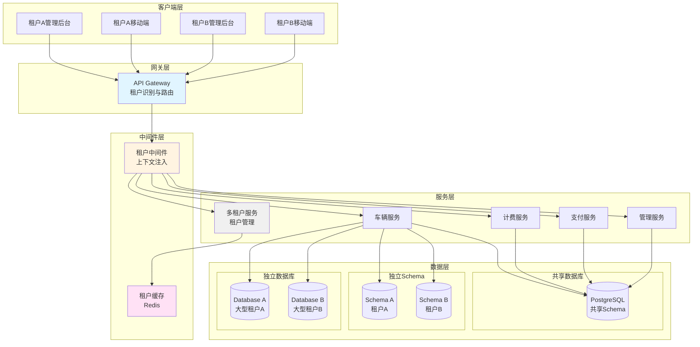

# 多租户架构：SaaS 化停车场管理系统设计

## 引言

随着云计算技术的普及和 SaaS 模式的成熟，越来越多的企业选择将传统的本地部署软件转型为 SaaS 服务。停车场管理系统作为城市交通基础设施的重要组成部分，同样面临着 SaaS 化的需求。物业管理公司、停车场运营商希望通过云端平台统一管理多个停车场，降低 IT 运维成本，提高管理效率。然而，SaaS 化停车场管理系统面临着数据隔离、租户识别、权限控制、配额管理等多重技术挑战。

多租户架构是 SaaS 应用的核心技术基础，它允许在单一应用实例中为多个租户提供服务，同时保证租户之间的数据隔离和资源隔离。本文将以 Smart Park 智慧停车系统为例，深入探讨多租户架构的设计与实现。我们将从隔离策略选择、租户上下文管理、数据权限控制、配额计费等核心维度展开讨论，并结合实际的 Go 语言代码实现，为架构师和后端开发者提供可落地的技术方案。

本文的目标读者是正在设计或实现 SaaS 化系统的架构师和后端开发者。通过阅读本文，您将了解多租户架构的核心设计原则、不同隔离策略的优劣对比、租户上下文的传递机制、数据权限控制的实现方案，以及配额管理和计费模型的设计思路。

## 一、多租户隔离策略

### 1.1 隔离策略概述

多租户架构的核心挑战是如何在共享资源和数据隔离之间取得平衡。根据隔离程度的不同，多租户架构主要有三种隔离策略：

**逻辑隔离（共享数据库 + 共享 Schema）**：所有租户共享同一个数据库和 Schema，通过 tenant_id 字段区分不同租户的数据。这是成本最低、实现最简单的方案，但隔离性最弱。

**Schema 隔离（共享数据库 + 独立 Schema）**：所有租户共享同一个数据库实例，但每个租户拥有独立的 Schema。隔离性优于逻辑隔离，但管理复杂度有所增加。

**物理隔离（独立数据库）**：每个租户拥有独立的数据库实例。隔离性最强，安全性最高，但成本最高，管理最复杂。

以下是三种隔离策略的对比分析：

| 隔离策略 | 成本 | 隔离性 | 安全性 | 性能 | 管理复杂度 | 适用场景 |
|---------|------|--------|--------|------|-----------|---------|
| 逻辑隔离 | 低 | 弱 | 低 | 中 | 低 | 中小型租户，成本敏感型应用 |
| Schema 隔离 | 中 | 中 | 中 | 良 | 中 | 中型租户，需要一定隔离性 |
| 物理隔离 | 高 | 强 | 高 | 优 | 高 | 大型企业，严格合规要求 |

在 Smart Park 项目中，我们实现了灵活的隔离策略支持：

```go
type IsolationLevel int

const (
    IsolationLevelShared IsolationLevel = iota
    IsolationLevelSchema
    IsolationLevelDatabase
)

type TenantIsolation struct {
    level IsolationLevel
}

func NewTenantIsolation(level IsolationLevel) *TenantIsolation {
    return &TenantIsolation{level: level}
}

func (ti *TenantIsolation) GetTableName(tenantID uuid.UUID, baseTable string) string {
    switch ti.level {
    case IsolationLevelSchema:
        return fmt.Sprintf("tenant_%s.%s", tenantID.String(), baseTable)
    case IsolationLevelDatabase:
        return baseTable
    default:
        return baseTable
    }
}

func (ti *TenantIsolation) GetConnectionString(baseConnStr string, tenantID uuid.UUID) string {
    switch ti.level {
    case IsolationLevelDatabase:
        return fmt.Sprintf("%s_tenant_%s", baseConnStr, tenantID.String())
    default:
        return baseConnStr
    }
}
```

### 1.2 隔离策略选择依据

选择合适的隔离策略需要综合考虑以下因素：

**租户规模**：大型企业客户通常要求更高的隔离性，可能选择独立数据库方案；中小型客户对成本敏感，适合共享数据库方案。在 Smart Park 项目中，我们根据租户的停车场数量和车流量进行分级：小型租户（1-5 个停车场）使用逻辑隔离，中型租户（5-20 个停车场）使用 Schema 隔离，大型租户（20+ 个停车场）使用独立数据库。

**安全要求**：金融、政府等行业对数据安全要求极高，必须采用物理隔离；一般商业应用可以采用逻辑隔离。在停车场管理场景中，涉及车辆信息、支付记录等敏感数据，需要根据租户的安全要求选择合适的隔离策略。

**性能要求**：共享数据库方案容易受到"吵闹邻居"问题的影响，某个租户的高负载可能影响其他租户的性能。对于高负载租户，建议使用独立数据库或 Schema 隔离，避免影响其他租户的性能。

**成本预算**：独立数据库方案需要更多的硬件资源和运维成本，适合高价值客户。在 Smart Park 项目中，我们采用分级定价策略：基础版使用逻辑隔离，专业版使用 Schema 隔离，企业版使用独立数据库。

**合规要求**：某些行业法规要求数据必须物理隔离，如医疗、金融等行业。例如，欧盟的 GDPR 法规要求对个人数据进行充分保护，可能需要采用更高级别的隔离策略。

在 Smart Park 项目中，我们采用混合策略：默认使用逻辑隔离，对于大型企业客户提供 Schema 隔离或独立数据库方案。这种策略既保证了成本效益，又满足了不同客户的需求。

### 1.3 多租户架构图

以下是 Smart Park 多租户架构的整体设计：



从架构图中可以看出，多租户架构的核心在于租户识别和上下文传递。客户端请求首先到达 API Gateway，Gateway 通过域名、Header 或 Token 识别租户身份，然后将租户信息传递给租户中间件。中间件将租户信息注入到请求上下文中，后续的服务调用都可以从上下文中获取租户信息。数据层根据租户的隔离级别选择不同的存储方案，实现数据的物理或逻辑隔离。

## 二、租户上下文管理

### 2.1 租户识别方式

租户识别是多租户架构的第一步，需要在请求到达业务逻辑之前识别出当前请求属于哪个租户。常见的租户识别方式包括：

**域名识别**：每个租户拥有独立的子域名，如 `tenant-a.smartpark.com`。这种方式直观易用，用户体验好，但需要配置 DNS 解析和 SSL 证书。

**HTTP Header 识别**：在 HTTP 请求头中携带租户标识，如 `X-Tenant-Id: tenant-a`。这种方式灵活方便，适合 API 调用场景，但安全性较低。

**Token 识别**：在 JWT Token 或 Session 中携带租户信息。这种方式安全性高，适合用户登录场景，但需要用户先登录。

**URL 路径识别**：在 URL 路径中包含租户标识，如 `/api/v1/tenant-a/devices`。这种方式清晰明了，便于调试和日志分析。

在 Smart Park 项目中，我们实现了多种租户识别方式，通过策略模式支持灵活切换：

```go
type TenantResolver interface {
    Resolve(ctx context.Context, req interface{}) (*TenantInfo, error)
}

type HeaderTenantResolver struct {
    HeaderName string
    Repo       TenantRepo
}

func (r *HeaderTenantResolver) Resolve(ctx context.Context, req interface{}) (*TenantInfo, error) {
    if tr, ok := transport.FromServerContext(ctx); ok {
        header := tr.RequestHeader()
        tenantCode := header.Get(r.HeaderName)
        if tenantCode == "" {
            return nil, ErrTenantNotFound
        }
        return r.Repo.GetTenantByCode(ctx, tenantCode)
    }
    return nil, ErrTenantNotFound
}

type DomainTenantResolver struct {
    Repo TenantRepo
}

func (r *DomainTenantResolver) Resolve(ctx context.Context, req interface{}) (*TenantInfo, error) {
    if tr, ok := transport.FromServerContext(ctx); ok {
        if ht, ok := tr.(*http.Transport); ok {
            host := ht.Request().Host
            parts := strings.Split(host, ".")
            if len(parts) > 2 {
                tenantCode := parts[0]
                return r.Repo.GetTenantByCode(ctx, tenantCode)
            }
        }
    }
    return nil, ErrTenantNotFound
}
```

在实际应用中，我们建议组合使用多种识别方式。例如，对于用户登录后的请求，使用 Token 识别；对于 API 调用，使用 Header 识别；对于 Web 访问，使用域名识别。

### 2.2 上下文传递机制

识别出租户后，需要将租户信息注入到请求上下文中，以便后续的业务逻辑使用。在 Go 语言中，我们使用 `context.Context` 来传递租户信息：

```go
type ctxKeyTenant struct{}

var tenantCtxKey = ctxKeyTenant{}

type TenantInfo struct {
    ID     uuid.UUID
    Code   string
    Name   string
    Config TenantConfig
}

func ContextWithTenant(ctx context.Context, tenant *TenantInfo) context.Context {
    return context.WithValue(ctx, tenantCtxKey, tenant)
}

func TenantFromContext(ctx context.Context) (*TenantInfo, bool) {
    tenant, ok := ctx.Value(tenantCtxKey).(*TenantInfo)
    return tenant, ok
}

func GetTenantID(ctx context.Context) *uuid.UUID {
    tenant, ok := TenantFromContext(ctx)
    if !ok || tenant == nil {
        return nil
    }
    return &tenant.ID
}
```

需要注意的是，Context 的键应该使用自定义类型（如 ctxKeyTenant），避免与其他包的键冲突。值类型应该明确指定（如 *TenantInfo），避免类型断言失败。

### 2.3 租户中间件实现

中间件是租户上下文注入的关键环节。在 Kratos 框架中，我们实现了租户中间件，在请求处理前自动识别租户并注入上下文：

```go
func Middleware(resolver TenantResolver) middleware.Middleware {
    return func(handler middleware.Handler) middleware.Handler {
        return func(ctx context.Context, req interface{}) (interface{}, error) {
            tenant, err := resolver.Resolve(ctx, req)
            if err != nil {
                if IsPublicEndpoint(ctx) {
                    return handler(ctx, req)
                }
                return nil, err
            }

            if tenant == nil {
                return nil, ErrTenantInvalid
            }

            ctx = ContextWithTenant(ctx, tenant)
            return handler(ctx, req)
        }
    }
}

func IsPublicEndpoint(ctx context.Context) bool {
    if tr, ok := transport.FromServerContext(ctx); ok {
        path := tr.Operation()
        publicPaths := []string{
            "/api/v1/public/",
            "/api/v1/auth/",
            "/api/v1/health",
        }
        for _, p := range publicPaths {
            if strings.HasPrefix(path, p) {
                return true
            }
        }
    }
    return false
}

func RequireTenant() middleware.Middleware {
    return func(handler middleware.Handler) middleware.Handler {
        return func(ctx context.Context, req interface{}) (interface{}, error) {
            _, ok := TenantFromContext(ctx)
            if !ok {
                return nil, ErrTenantNotFound
            }
            return handler(ctx, req)
        }
    }
}
```

### 2.4 租户信息缓存

为了提高性能，避免每次请求都查询数据库获取租户信息，我们使用 Redis 缓存租户信息：

```go
type CachedTenantResolver struct {
    repo  TenantRepo
    cache *redis.Client
    ttl   time.Duration
}

func (r *CachedTenantResolver) Resolve(ctx context.Context, req interface{}) (*TenantInfo, error) {
    tenantCode := r.extractTenantCode(ctx, req)
    if tenantCode == "" {
        return nil, ErrTenantNotFound
    }

    cacheKey := fmt.Sprintf("tenant:%s", tenantCode)
    cached, err := r.cache.Get(ctx, cacheKey).Result()
    if err == nil {
        var tenant TenantInfo
        if json.Unmarshal([]byte(cached), &tenant) == nil {
            return &tenant, nil
        }
    }

    tenant, err := r.repo.GetTenantByCode(ctx, tenantCode)
    if err != nil {
        return nil, err
    }

    if data, err := json.Marshal(tenant); err == nil {
        r.cache.Set(ctx, cacheKey, data, r.ttl)
    }

    return tenant, nil
}
```

缓存设计需要考虑缓存键设计、缓存过期时间、缓存更新策略和缓存穿透保护等问题。

## 三、数据权限控制

### 3.1 行级安全策略

数据权限控制是多租户架构的核心安全要求。在共享数据库方案中，必须确保租户只能访问自己的数据，避免数据泄露。我们采用多层防护机制，从应用层、数据库层、API 层等多个维度进行防护。

在应用层，我们通过数据过滤中间件自动为所有查询添加租户过滤条件：

```go
func AddTenantFilter(ctx context.Context, query string) string {
    tenantID := GetTenantID(ctx)
    if tenantID == nil {
        return query
    }
    return fmt.Sprintf("%s AND tenant_id = '%s'", query, tenantID.String())
}
```

在数据库层，我们可以利用 PostgreSQL 的 RLS（Row-Level Security）特性实现更严格的安全控制：

```sql
CREATE POLICY tenant_isolation_policy ON parking_records
    USING (tenant_id = current_setting('app.current_tenant')::uuid);

ALTER TABLE parking_records ENABLE ROW LEVEL SECURITY;
```

RLS 是 PostgreSQL 提供的行级安全机制，可以在数据库层面强制执行数据隔离策略，即使应用层出现漏洞，也无法访问其他租户的数据。

### 3.2 数据过滤中间件

在 ORM 层面，我们使用 Ent 框架的 Hook 机制自动添加租户过滤：

```go
func TenantHook() ent.Hook {
    return func(next ent.Mutator) ent.Mutator {
        return ent.MutateFunc(func(ctx context.Context, m ent.Mutation) (ent.Value, error) {
            tenantID, ok := GetTenantID(ctx)
            if !ok {
                return nil, ErrTenantNotFound
            }

            if m.Op().Is(ent.OpCreate) {
                m.SetField("tenant_id", tenantID)
            }

            if m.Op().Is(ent.OpUpdate | ent.OpDelete | ent.OpQuery) {
                m.Where(func(s *sql.Selector) {
                    s.Where(sql.EQ("tenant_id", tenantID))
                })
            }

            return next.Mutate(ctx, m)
        })
    }
}
```

通过 Hook 机制，我们可以确保所有的数据库操作都自动添加租户过滤，无需在每个业务逻辑中手动添加。这大大降低了开发复杂度，也减少了人为错误的可能性。

### 3.3 权限校验机制

除了数据隔离，还需要对租户的功能权限进行校验。每个租户拥有不同的功能特性集，系统需要根据租户配置动态启用或禁用功能：

```go
func (t *Tenant) HasFeature(feature string) bool {
    if t == nil || t.Config.Features == nil {
        return false
    }
    for _, f := range t.Config.Features {
        if f == feature {
            return true
        }
    }
    return false
}

func (uc *TenantUseCase) CheckFeature(ctx context.Context, tenantID uuid.UUID, feature string) error {
    tenant, err := uc.repo.GetByID(ctx, tenantID)
    if err != nil {
        return err
    }

    if !tenant.HasFeature(feature) {
        return ErrFeatureNotAvailable
    }

    return nil
}
```

在 API 层面，我们可以通过中间件或拦截器来校验功能权限：

```go
func FeatureGuard(feature string) middleware.Middleware {
    return func(handler middleware.Handler) middleware.Handler {
        return func(ctx context.Context, req interface{}) (interface{}, error) {
            tenant, ok := TenantFromContext(ctx)
            if !ok {
                return nil, ErrTenantNotFound
            }

            if !tenant.HasFeature(feature) {
                return nil, ErrFeatureNotAvailable
            }

            return handler(ctx, req)
        }
    }
}
```

### 3.4 数据隔离验证

为了确保数据隔离的有效性，我们需要建立完善的验证机制：

**自动化测试**：编写测试用例验证租户数据隔离，模拟不同租户的请求，确保无法访问其他租户的数据。测试用例应该覆盖所有 API 端点和数据库操作。

**审计日志**：记录所有数据访问操作，包括租户 ID、用户 ID、操作类型、时间戳等信息，便于事后审计。审计日志应该存储在独立的存储系统中，避免被篡改。

**数据脱敏**：对于敏感数据，在日志和调试信息中进行脱敏处理，避免泄露租户数据。

**定期审查**：定期审查数据库访问日志，检查是否存在异常的数据访问模式。

## 四、租户配额和计费

### 4.1 配额管理

SaaS 平台需要为不同级别的租户提供差异化的资源配额。配额管理是 SaaS 商业模式的重要组成部分，通过限制资源使用，可以实现分级定价和成本控制。在 Smart Park 项目中，我们定义了以下配额维度：

**停车场数量**：限制租户可以创建的停车场数量，这是最基础的配额维度。

**设备数量**：限制租户可以接入的设备数量，包括车牌识别摄像头、道闸、地感等。设备数量直接影响系统的负载和成本。

**用户数量**：限制租户可以创建的用户数量，包括管理员、操作员、收费员等。

**存储配额**：限制租户可以使用的存储空间，包括车辆照片、停车记录、日志等。

**功能特性**：限制租户可以使用的功能特性，如车位预约、会员管理、数据分析等。

```go
type TenantConfig struct {
    MaxParkingLots int
    MaxDevices     int
    MaxUsers       int
    StorageQuota   int64
    Features       []string
    CustomDomain   string
    Timezone       string
    Currency       string
    Language       string
}

func DefaultTenantConfig() TenantConfig {
    return TenantConfig{
        MaxParkingLots: 1,
        MaxDevices:     10,
        MaxUsers:       50,
        StorageQuota:   1024 * 1024 * 100,
        Features:       []string{"basic"},
        Timezone:       "Asia/Shanghai",
        Currency:       "CNY",
        Language:       "zh-CN",
    }
}
```

配额校验逻辑：

```go
func (uc *TenantUseCase) CheckQuota(ctx context.Context, tenantID uuid.UUID, resourceType string, currentCount int) error {
    tenant, err := uc.repo.GetByID(ctx, tenantID)
    if err != nil {
        return err
    }

    var limit int
    switch resourceType {
    case "parking_lots":
        limit = tenant.Config.MaxParkingLots
    case "devices":
        limit = tenant.Config.MaxDevices
    case "users":
        limit = tenant.Config.MaxUsers
    default:
        return nil
    }

    if currentCount >= limit {
        return ErrQuotaExceeded
    }

    return nil
}
```

### 4.2 使用量统计

为了实现精确的计费，需要实时统计租户的资源使用量。我们使用 Redis 计数器来统计实时数据：

```go
type UsageStats struct {
    ParkingLots    int
    Devices        int
    Users          int
    StorageUsed    int64
    APICalls       int64
    VehicleRecords int64
}

func (s *UsageService) IncrementAPICalls(ctx context.Context, tenantID uuid.UUID) error {
    key := fmt.Sprintf("usage:%s:api_calls:%s", tenantID, time.Now().Format("2006-01-02"))
    return s.redis.Incr(ctx, key).Err()
}

func (s *UsageService) GetUsageStats(ctx context.Context, tenantID uuid.UUID) (*UsageStats, error) {
    stats := &UsageStats{}
    
    parkingLots, err := s.parkingLotRepo.CountByTenant(ctx, tenantID)
    if err != nil {
        return nil, err
    }
    stats.ParkingLots = parkingLots

    devices, err := s.deviceRepo.CountByTenant(ctx, tenantID)
    if err != nil {
        return nil, err
    }
    stats.Devices = devices

    users, err := s.userRepo.CountByTenant(ctx, tenantID)
    if err != nil {
        return nil, err
    }
    stats.Users = users

    return stats, nil
}
```

使用量统计需要考虑实时性、准确性、持久化和性能等问题。

### 4.3 计费模型设计

SaaS 计费模型通常包括以下几种：

**订阅制**：按月或按年收取固定费用，根据套餐提供不同的配额和功能。这是最常见的计费模式，适合大多数 SaaS 应用。

**按量计费**：根据实际使用量计费，如 API 调用次数、存储空间、车辆记录数等。这种模式适合使用量波动较大的场景。

**混合模式**：基础订阅 + 超额按量计费，这是最常见的模式。用户支付固定的基础费用，获得一定的配额，超出部分按量计费。

在 Smart Park 项目中，我们采用混合计费模式：

```go
type BillingPlan struct {
    ID              uuid.UUID
    Name            string
    Price           float64
    BillingCycle    string
    IncludedQuota   TenantConfig
    OveragePricing  map[string]float64
}

type TenantSubscription struct {
    TenantID    uuid.UUID
    PlanID      uuid.UUID
    Status      string
    StartedAt   time.Time
    ExpiredAt   time.Time
    AutoRenew   bool
}

func (s *BillingService) CalculateMonthlyBill(ctx context.Context, tenantID uuid.UUID) (*MonthlyBill, error) {
    subscription, err := s.subscriptionRepo.GetByTenant(ctx, tenantID)
    if err != nil {
        return nil, err
    }

    plan, err := s.planRepo.GetByID(ctx, subscription.PlanID)
    if err != nil {
        return nil, err
    }

    usage, err := s.usageService.GetUsageStats(ctx, tenantID)
    if err != nil {
        return nil, err
    }

    bill := &MonthlyBill{
        BaseCharge: plan.Price,
        Overages:   make(map[string]float64),
    }

    if usage.Devices > plan.IncludedQuota.MaxDevices {
        extra := usage.Devices - plan.IncludedQuota.MaxDevices
        bill.Overages["devices"] = float64(extra) * plan.OveragePricing["device"]
    }

    if usage.StorageUsed > plan.IncludedQuota.StorageQuota {
        extraGB := float64(usage.StorageUsed-plan.IncludedQuota.StorageQuota) / (1024 * 1024 * 1024)
        bill.Overages["storage"] = extraGB * plan.OveragePricing["storage_gb"]
    }

    bill.Total = bill.BaseCharge
    for _, amount := range bill.Overages {
        bill.Total += amount
    }

    return bill, nil
}
```

### 4.4 账单生成

每月自动生成账单并发送给租户：

```go
func (s *BillingService) GenerateMonthlyBills(ctx context.Context) error {
    tenants, _, err := s.tenantRepo.List(ctx, 1, 1000)
    if err != nil {
        return err
    }

    for _, tenant := range tenants {
        bill, err := s.CalculateMonthlyBill(ctx, tenant.ID)
        if err != nil {
            log.Errorf("Failed to calculate bill for tenant %s: %v", tenant.ID, err)
            continue
        }

        invoice := &Invoice{
            ID:          uuid.New(),
            TenantID:    tenant.ID,
            Amount:      bill.Total,
            Currency:    tenant.Config.Currency,
            Status:      "pending",
            DueDate:     time.Now().AddDate(0, 0, 15),
            CreatedAt:   time.Now(),
        }

        if err := s.invoiceRepo.Create(ctx, invoice); err != nil {
            log.Errorf("Failed to create invoice for tenant %s: %v", tenant.ID, err)
            continue
        }

        s.notificationService.SendInvoiceNotification(ctx, tenant.ID, invoice)
    }

    return nil
}
```

账单生成需要考虑准确性、及时性、透明性和可追溯性等问题。

## 五、最佳实践

### 5.1 多租户架构最佳实践

**租户标识唯一性**：确保租户标识全局唯一，避免租户之间的混淆。建议使用 UUID 或具有业务含义的唯一编码。

**租户上下文传递**：在所有服务调用中传递租户上下文，包括同步调用和异步调用。确保租户信息不会丢失。

**数据隔离验证**：建立完善的数据隔离测试机制，包括单元测试、集成测试和渗透测试，确保租户数据的安全性。

**配额软限制**：在达到配额限制前提前预警，给租户升级套餐的机会，避免突然中断服务影响用户体验。

**租户自助服务**：提供租户自助管理界面，允许租户查看使用量、升级套餐、管理用户等，降低运维成本。

### 5.2 常见问题和解决方案

**问题 1：租户数据泄露**

解决方案：采用多层防护机制，包括应用层过滤、数据库层 RLS、API 层权限校验。定期进行安全审计和渗透测试，及时发现和修复安全漏洞。

**问题 2：吵闹邻居问题**

解决方案：实施资源配额限制和速率限制，防止单个租户占用过多资源。对于高负载租户，建议采用独立数据库方案。

**问题 3：租户迁移困难**

解决方案：设计时考虑租户迁移需求，提供数据导出导入工具。对于共享数据库方案，可以通过修改 tenant_id 实现租户数据迁移。

**问题 4：跨租户数据分析**

解决方案：对于平台运营方需要跨租户数据分析的场景，建立独立的数据仓库，通过 ETL 定期同步数据，避免直接访问生产数据库。

### 5.3 性能优化建议

**租户信息缓存**：使用 Redis 缓存租户配置信息，减少数据库查询。设置合理的过期时间，确保配置更新的及时性。

**数据库连接池**：对于独立数据库方案，为每个租户维护独立的连接池，避免连接池污染。对于共享数据库方案，使用统一的连接池，但需要设置合理的连接数限制。

**索引优化**：为 tenant_id 字段创建索引，确保查询性能。对于复合查询，创建包含 tenant_id 的复合索引。

**分区表**：对于大型租户，考虑使用 PostgreSQL 的表分区功能，按租户 ID 或时间进行分区，提高查询性能。

**异步处理**：对于计费、统计等耗时操作，采用异步处理方式，避免阻塞主业务流程。

## 总结

多租户架构是 SaaS 化停车场管理系统的核心技术基础。本文从隔离策略选择、租户上下文管理、数据权限控制、配额计费等维度，详细阐述了多租户架构的设计与实现。通过 Smart Park 项目的实践经验，我们展示了如何使用 Go 语言和 Kratos 框架实现一个灵活、安全、可扩展的多租户系统。

多租户架构的设计需要在资源共享和数据隔离之间取得平衡。共享数据库方案成本最低，适合中小型租户；独立数据库方案隔离性最强，适合大型企业客户。租户上下文管理是多租户架构的基础，需要通过中间件自动注入租户信息，确保上下文在服务调用链中正确传递。数据权限控制是多租户安全的核心，需要从应用层、数据库层、API 层多个维度进行防护。配额管理和计费模型是 SaaS 商业模式的基础，需要精确统计使用量，灵活支持不同的计费策略。

随着云原生技术的发展，多租户架构也在不断演进。未来，我们可以探索基于 Kubernetes 的多租户隔离方案，利用命名空间和资源配额实现更细粒度的资源隔离。同时，Serverless 架构为多租户应用提供了新的可能性，可以实现按需计费和自动扩缩容。数据安全和隐私保护也是未来的重点方向，需要引入数据加密、数据脱敏、审计追踪等安全机制。

多租户架构的设计和实现是一个持续优化的过程，需要根据业务需求和技术发展不断调整。希望本文的实践经验能够为您的 SaaS 项目提供参考和启发。

## 参考资料

1. Microsoft Azure. "Multi-tenant SaaS database tenancy patterns." https://docs.microsoft.com/en-us/azure/azure-saas/database/tenancy-design-patterns

2. AWS. "SaaS Architecture on AWS." https://aws.amazon.com/saas/

3. Go-kratos. "A Go microservices framework." https://github.com/go-kratos/kratos

4. Ent. "An entity framework for Go." https://entgo.io/

5. PostgreSQL. "Row Security Policies." https://www.postgresql.org/docs/current/ddl-rowsecurity.html
