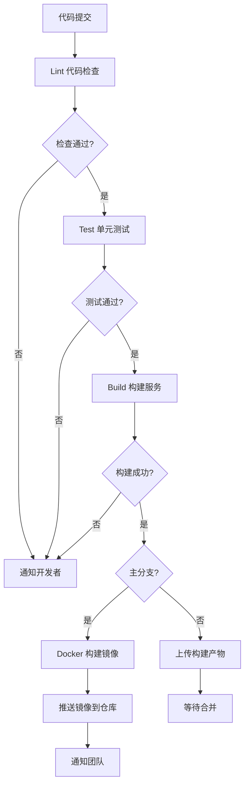
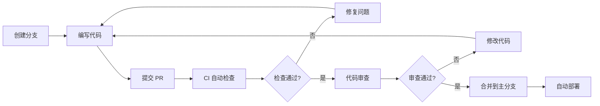
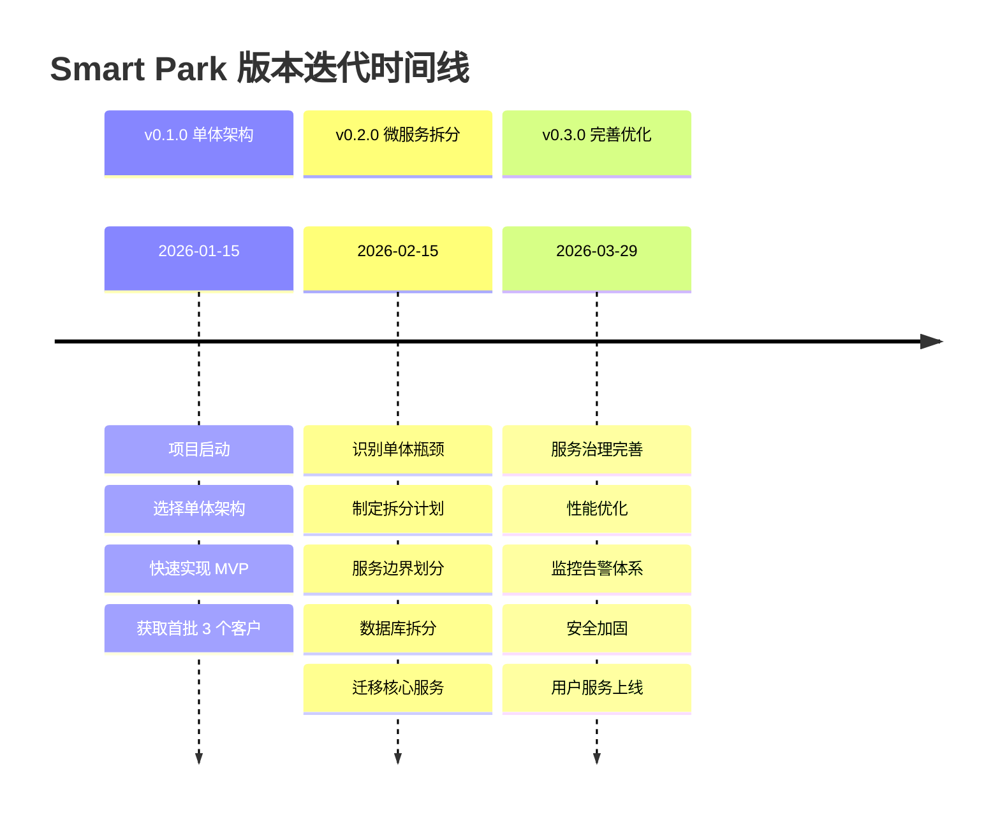

# 版本迭代：敏捷开发在停车系统中的实践

## 引言

在当今快速变化的商业环境中，敏捷开发已成为软件项目成功的关键因素。Smart Park 智慧停车系统作为一个从零到一的创业项目，在短短三个月内完成了从单体架构到微服务架构的完整演进，经历了三个主要版本的迭代。这一过程中，敏捷开发方法论为我们提供了清晰的指导框架，帮助团队在快速迭代中保持高质量交付。

本文面向项目经理和技术负责人，将详细阐述 Smart Park 项目中敏捷开发的实践经验。我们将深入探讨 Sprint 规划与任务拆分、MVP 最小可行产品的定义、持续集成与持续部署、版本发布流程等核心主题。通过真实的项目案例和具体的技术实践，希望为正在实施敏捷开发的团队提供可操作的参考。

文章将按照敏捷开发的核心流程展开，首先介绍 Sprint 规划和任务拆分的方法论，然后深入 MVP 定义的原则和实践，接着详细讲解 CI/CD 流程设计和自动化部署，最后分享版本发布流程和最佳实践。每个部分都结合 Smart Park 项目的实际经验，提供具体的代码示例和配置案例。

## 一、Sprint 规划和任务拆分

### 1.1 Sprint 周期设定

Smart Park 项目采用两周为一个 Sprint 周期，这一设定基于以下考虑：

**团队规模适配**：团队从最初的 2 人发展到 6 人，两周的 Sprint 周期既能保证足够的开发时间，又能保持快速反馈。对于小团队而言，一周的周期过于紧张，容易导致质量下降；三周或更长的周期则会降低反馈频率，增加风险。

**业务节奏匹配**：停车场管理系统的业务特性决定了客户反馈周期。两周的周期允许我们在 Sprint 结束时向客户展示新功能，收集反馈，并在下一个 Sprint 中快速调整。

**技术债务处理**：每个 Sprint 预留 20% 的时间用于处理技术债务和紧急修复。这一策略确保了系统质量的持续提升，避免了技术债务的累积。

以下是 Smart Park 项目的 Sprint 规划示例：

| Sprint | 时间范围 | 主要目标 | 交付成果 |
|--------|----------|----------|----------|
| Sprint 1-2 | 2026-01-01 ~ 2026-01-28 | 基础停车管理功能 | v0.1.0 单体应用 |
| Sprint 3-4 | 2026-01-29 ~ 2026-02-25 | 微服务架构迁移 | v0.2.0 微服务版本 |
| Sprint 5-6 | 2026-02-26 ~ 2026-03-25 | 用户服务和监控完善 | v0.3.0 生产版本 |

### 1.2 需求优先级排序

在 Sprint 规划中，需求优先级排序是关键环节。我们采用 MoSCoW 方法（Must have、Should have、Could have、Won't have）结合业务价值评估，确保团队聚焦于最重要的功能。

**v0.1 版本优先级示例**：

```
Must have (必须有):
- 车辆入场/出场记录
- 基础计费计算
- 手动支付记录

Should have (应该有):
- 停车场管理
- 车辆信息查询

Could have (可以有):
- 数据统计报表
- 月卡管理

Won't have (暂不考虑):
- 微信/支付宝支付
- 车牌识别
- 设备控制
```

**优先级评估维度**：

1. **业务价值**：功能对客户的核心价值，直接影响客户满意度
2. **技术依赖**：功能之间的技术依赖关系，基础设施功能优先
3. **风险程度**：功能的技术风险和业务风险，高风险功能提前验证
4. **资源投入**：功能的开发成本，优先选择高价值低成本的功能

### 1.3 任务拆分技巧

任务拆分是 Sprint 规划的核心技能。我们遵循以下原则：

**INVEST 原则**：每个任务应该是独立的（Independent）、可协商的（Negotiable）、有价值的（Valuable）、可估算的（Estimable）、小的（Small）、可测试的（Testable）。

**任务粒度控制**：单个任务的工时估算应在 2-8 小时之间。过大的任务难以估算和跟踪，过小的任务增加管理成本。

**技术任务显性化**：除了业务功能，技术任务（如数据库设计、API 定义、测试编写）也需要显性化，避免遗漏。

以下是"车辆入场功能"的任务拆分示例：

```markdown
## Epic: 车辆入场功能

### Story 1: 入场记录创建
- Task 1.1: 设计 parking_records 表结构 (2h)
- Task 1.2: 实现 ParkingRecord 实体和 Repository (3h)
- Task 1.3: 编写入场业务逻辑 UseCase (4h)
- Task 1.4: 实现 gRPC 接口 HandleEntry (2h)
- Task 1.5: 编写单元测试 (3h)
- Task 1.6: 编写集成测试 (2h)

### Story 2: 重复入场检测
- Task 2.1: 实现重复入场检测逻辑 (3h)
- Task 2.2: 添加分布式锁防止并发问题 (4h)
- Task 2.3: 编写并发测试用例 (3h)

### Story 3: 设备对接
- Task 3.1: 设计设备 API 接口 (2h)
- Task 3.2: 实现设备认证中间件 (3h)
- Task 3.3: 编写设备对接文档 (2h)
```

### 1.4 Story Points 估算

团队采用斐波那契数列（1, 2, 3, 5, 8, 13, 21）进行 Story Points 估算，使用 Planning Poker 进行团队估算。

**估算基准**：

- **1 point**：简单的配置修改、文档更新
- **2 points**：简单的 CRUD 接口、单元测试
- **3 points**：中等复杂度的业务逻辑、API 接口
- **5 points**：复杂业务逻辑、跨服务调用
- **8 points**：架构改造、性能优化
- **13 points**：需要拆分的大型功能

**团队速率（Velocity）跟踪**：

| Sprint | Story Points | 完成率 | 备注 |
|--------|--------------|--------|------|
| Sprint 1 | 21 | 85% | 团队磨合期 |
| Sprint 2 | 24 | 95% | 流程稳定 |
| Sprint 3 | 34 | 90% | 团队扩充 |
| Sprint 4 | 40 | 92% | 微服务迁移 |
| Sprint 5 | 38 | 88% | 技术债务处理 |
| Sprint 6 | 42 | 95% | 流程成熟 |

通过持续跟踪团队速率，我们能够更准确地规划 Sprint 内容，避免过度承诺或资源浪费。

## 二、MVP 最小可行产品的定义

### 2.1 MVP 定义原则

MVP（Minimum Viable Product）是敏捷开发的核心概念，但在实践中容易被误解。Smart Park 项目中，我们遵循以下 MVP 定义原则：

**核心价值优先**：MVP 必须能够交付核心业务价值，而不是功能的简单堆砌。对于停车系统，核心价值是"让车辆能够进出停车场并正确计费"，而不是"拥有所有炫酷功能"。

**可验证性**：MVP 必须能够验证关键假设。例如，v0.1 版本验证了"客户是否愿意使用在线停车管理系统"这一假设，而不是验证"微服务架构是否可行"。

**可扩展性**：MVP 虽然功能最小化，但架构设计要考虑未来扩展。v0.1 虽然是单体架构，但代码层面做了清晰的模块划分，为后续微服务拆分奠定了基础。

**质量不妥协**：MVP 的"M"是指功能范围的最小化，而不是质量的最小化。核心功能必须经过充分测试，确保稳定性。

### 2.2 核心功能识别

Smart Park v0.1 版本的核心功能识别过程：

**第一步：用户故事地图**

```
用户角色：停车场管理员

核心旅程：
1. 车辆入场 → 记录车辆信息 → 开闸放行
2. 车辆出场 → 计算停车费用 → 收费 → 开闸放行
3. 日常管理 → 查看停车记录 → 统计收入

核心功能识别：
- 车辆入场记录（必需）
- 车辆出场记录（必需）
- 基础计费计算（必需）
- 手动支付记录（必需）
- 停车记录查询（必需）
```

**第二步：功能优先级矩阵**

| 功能 | 业务价值 | 开发成本 | 优先级 |
|------|----------|----------|--------|
| 车辆入场记录 | 高 | 低 | P0 |
| 车辆出场记录 | 高 | 低 | P0 |
| 基础计费计算 | 高 | 中 | P0 |
| 手动支付记录 | 高 | 低 | P0 |
| 停车记录查询 | 中 | 低 | P1 |
| 车牌识别 | 高 | 高 | P2 |
| 微信支付 | 高 | 中 | P2 |
| 数据报表 | 中 | 中 | P3 |

**第三步：MVP 功能清单**

v0.1 MVP 包含的功能：

```yaml
核心功能:
  - 车辆入场记录创建
  - 车辆出场记录更新
  - 按时长计费计算
  - 手动支付记录
  - 停车记录查询

技术实现:
  - 单体架构（Go + Kratos）
  - PostgreSQL 数据库
  - Redis 缓存
  - RESTful API

不包含:
  - 车牌识别（使用手动输入）
  - 在线支付（使用现金/扫码后手动记录）
  - 设备控制（使用人工操作）
  - 用户认证（仅内部使用）
```

### 2.3 快速验证方法

MVP 的价值在于快速验证假设，Smart Park 项目采用了以下验证方法：

**内部验证**：开发团队在 Sprint 结束时进行内部演示，验证功能完整性和技术可行性。

**早期用户验证**：v0.1 版本在 3 个小型停车场进行试点，收集真实用户反馈。试点周期为 2 周，每天收集使用数据和用户反馈。

**数据驱动验证**：通过关键指标验证 MVP 的有效性：

| 指标 | 目标值 | 实际值 | 结果 |
|------|--------|--------|------|
| 系统可用性 | > 95% | 97% | ✅ |
| 入场记录准确率 | > 99% | 99.5% | ✅ |
| 计费准确率 | > 99% | 98% | ⚠️ |
| 用户满意度 | > 3.5/5 | 3.8/5 | ✅ |
| 日均使用次数 | > 50 | 65 | ✅ |

**快速迭代验证**：基于 v0.1 的验证结果，快速调整 v0.2 的规划：

- 计费准确率未达标 → 优先优化计费引擎
- 用户反馈需要在线支付 → 提升支付功能优先级
- 客户希望支持多停车场 → 提前规划多租户架构

### 2.4 MVP 迭代策略

Smart Park 项目采用渐进式 MVP 迭代策略：

**v0.1 MVP（2026-01-15）**：
- 目标：验证商业模式
- 功能：基础停车管理
- 架构：单体应用
- 用户：3 个试点客户

**v0.2 MVP（2026-02-15）**：
- 目标：验证技术架构
- 功能：微服务拆分、支付集成
- 架构：微服务架构
- 用户：15 个付费客户

**v0.3 MVP（2026-03-29）**：
- 目标：验证生产可用性
- 功能：用户服务、监控告警
- 架构：完善的服务治理
- 用户：50+ 客户

每个 MVP 版本都有明确的验证目标和成功标准，避免功能蔓延。

## 三、持续集成和持续部署

### 3.1 CI/CD 流程设计

Smart Park 项目采用 GitHub Actions 实现 CI/CD 流程，整个流程分为五个阶段：Lint（代码检查）、Test（测试）、Build（构建）、Docker（容器化）、Notify（通知）。

**CI/CD 流程图**：



**CI 配置详解**：

```yaml
# .github/workflows/ci.yml
name: CI

on:
  push:
    branches: [ main, master, develop ]
  pull_request:
    branches: [ main, master, develop ]

jobs:
  lint:
    name: Lint
    runs-on: ubuntu-latest
    steps:
      - name: Checkout code
        uses: actions/checkout@v4

      - name: Set up Go
        uses: actions/setup-go@v5
        with:
          go-version: '1.22'
          cache: true

      - name: golangci-lint
        uses: golangci/golangci-lint-action@v4
        with:
          version: latest
          args: --timeout=5m

  test:
    name: Test
    runs-on: ubuntu-latest
    services:
      postgres:
        image: postgres:15
        env:
          POSTGRES_USER: postgres
          POSTGRES_PASSWORD: postgres
          POSTGRES_DB: parking_test
        ports:
          - 5432:5432
        options: >-
          --health-cmd pg_isready
          --health-interval 10s
          --health-timeout 5s
          --health-retries 5

      redis:
        image: redis:7
        ports:
          - 6379:6379
        options: >-
          --health-cmd "redis-cli ping"
          --health-interval 10s
          --health-timeout 5s
          --health-retries 5

    steps:
      - name: Checkout code
        uses: actions/checkout@v4

      - name: Set up Go
        uses: actions/setup-go@v5
        with:
          go-version: '1.22'
          cache: true

      - name: Download dependencies
        run: go mod download

      - name: Generate Ent code
        run: go generate ./ent

      - name: Run tests
        env:
          DB_HOST: localhost
          DB_PORT: 5432
          DB_USER: postgres
          DB_PASSWORD: postgres
          DB_NAME: parking_test
          REDIS_ADDR: localhost:6379
        run: go test -v -race -coverprofile=coverage.out -covermode=atomic ./...

      - name: Upload coverage to Codecov
        uses: codecov/codecov-action@v4
        with:
          files: ./coverage.out
          flags: unittests
          name: codecov-umbrella
          fail_ci_if_error: false

  build:
    name: Build
    runs-on: ubuntu-latest
    needs: [lint, test]
    strategy:
      matrix:
        service:
          - vehicle
          - billing
          - payment
          - admin
          - gateway
          - notification
    steps:
      - name: Checkout code
        uses: actions/checkout@v4

      - name: Set up Go
        uses: actions/setup-go@v5
        with:
          go-version: '1.22'
          cache: true

      - name: Download dependencies
        run: go mod download

      - name: Generate Ent code
        run: go generate ./ent

      - name: Build ${{ matrix.service }} service
        run: |
          CGO_ENABLED=0 GOOS=linux go build -ldflags="-s -w" -o bin/${{ matrix.service }} ./cmd/${{ matrix.service }}

      - name: Upload artifact
        uses: actions/upload-artifact@v4
        with:
          name: ${{ matrix.service }}
          path: bin/${{ matrix.service }}
          retention-days: 7

  docker:
    name: Build Docker Images
    runs-on: ubuntu-latest
    needs: build
    if: github.event_name == 'push' && (github.ref == 'refs/heads/main' || github.ref == 'refs/heads/master')
    strategy:
      matrix:
        service:
          - vehicle
          - billing
          - payment
          - admin
          - gateway
    steps:
      - name: Checkout code
        uses: actions/checkout@v4

      - name: Download artifact
        uses: actions/download-artifact@v4
        with:
          name: ${{ matrix.service }}
          path: bin/

      - name: Set up Docker Buildx
        uses: docker/setup-buildx-action@v3

      - name: Login to Docker Hub
        uses: docker/login-action@v3
        with:
          username: ${{ secrets.DOCKER_USERNAME }}
          password: ${{ secrets.DOCKER_PASSWORD }}

      - name: Build and push ${{ matrix.service }}
        uses: docker/build-push-action@v5
        with:
          context: .
          file: deploy/docker/Dockerfile.${{ matrix.service }}
          push: true
          tags: |
            ${{ secrets.DOCKER_USERNAME }}/smart-park-${{ matrix.service }}:latest
            ${{ secrets.DOCKER_USERNAME }}/smart-park-${{ matrix.service }}:${{ github.sha }}
          cache-from: type=gha
          cache-to: type=gha,mode=max

  notify:
    name: Notify
    runs-on: ubuntu-latest
    needs: [lint, test, build]
    if: always()
    steps:
      - name: Check status
        run: |
          if [ "${{ needs.lint.result }}" == "failure" ] || [ "${{ needs.test.result }}" == "failure" ] || [ "${{ needs.build.result }}" == "failure" ]; then
            echo "CI failed"
            exit 1
          fi
          echo "CI passed"
```

### 3.2 自动化测试集成

Smart Park 项目建立了完整的自动化测试体系：

**测试金字塔**：

```
        /\
       /  \  E2E 测试（10%）
      /----\
     /      \  集成测试（20%）
    /--------\
   /          \  单元测试（70%）
  /--------------\
```

**单元测试示例**：

```go
// internal/vehicle/biz/vehicle_test.go
func TestVehicleUseCase_HandleEntry(t *testing.T) {
    ctrl := gomock.NewController(t)
    defer ctrl.Finish()

    mockRepo := mocks.NewMockVehicleRepository(ctrl)
    mockDeviceRepo := mocks.NewMockDeviceRepository(ctrl)
    
    uc := &VehicleUseCase{
        repo:       mockRepo,
        deviceRepo: mockDeviceRepo,
        log:        log.NewHelper(log.DefaultLogger),
    }

    t.Run("成功入场", func(t *testing.T) {
        mockRepo.EXPECT().
            FindActiveByPlate(gomock.Any(), "lot-001", "京A12345").
            Return(nil, nil)

        mockRepo.EXPECT().
            Create(gomock.Any(), gomock.Any()).
            Return(&ParkingRecord{
                ID:          uuid.New(),
                LotID:       "lot-001",
                PlateNumber: ptr.String("京A12345"),
                EntryTime:   time.Now(),
            }, nil)

        result, err := uc.HandleEntry(context.Background(), &v1.EntryRequest{
            LotId:       "lot-001",
            PlateNumber: "京A12345",
        })

        assert.NoError(t, err)
        assert.True(t, result.Allowed)
        assert.True(t, result.GateOpen)
    })

    t.Run("重复入场", func(t *testing.T) {
        mockRepo.EXPECT().
            FindActiveByPlate(gomock.Any(), "lot-001", "京A12345").
            Return(&ParkingRecord{
                ID:          uuid.New(),
                LotID:       "lot-001",
                PlateNumber: ptr.String("京A12345"),
            }, nil)

        result, err := uc.HandleEntry(context.Background(), &v1.EntryRequest{
            LotId:       "lot-001",
            PlateNumber: "京A12345",
        })

        assert.NoError(t, err)
        assert.True(t, result.IsDuplicate)
    })
}
```

**集成测试示例**：

```go
// test/integration/vehicle_test.go
func TestVehicleEntryExit(t *testing.T) {
    if testing.Short() {
        t.Skip("跳过集成测试")
    }

    ctx := context.Background()
    client := setupTestClient(t)
    defer client.Close()

    t.Run("完整的入场出场流程", func(t *testing.T) {
        entryResp, err := client.HandleEntry(ctx, &v1.EntryRequest{
            LotId:       "test-lot",
            PlateNumber: "京A12345",
        })
        require.NoError(t, err)
        assert.NotEmpty(t, entryResp.RecordId)

        time.Sleep(2 * time.Hour)

        exitResp, err := client.HandleExit(ctx, &v1.ExitRequest{
            RecordId:    entryResp.RecordId,
            PlateNumber: "京A12345",
        })
        require.NoError(t, err)
        assert.Greater(t, exitResp.Amount, float64(0))
    })
}
```

**测试覆盖率要求**：

- 核心业务逻辑：≥ 80%
- 整体项目：≥ 70%
- 关键路径（计费、支付）：≥ 90%

### 3.3 代码审查机制

Smart Park 项目建立了严格的代码审查机制：

**Pull Request 流程**：



**代码审查清单**：

```markdown
## 代码审查清单

### 功能正确性
- [ ] 代码实现了需求描述的功能
- [ ] 边界条件已处理
- [ ] 错误处理完整

### 代码质量
- [ ] 代码清晰易读
- [ ] 命名规范
- [ ] 无重复代码
- [ ] 函数长度适中（< 50 行）

### 测试覆盖
- [ ] 单元测试已编写
- [ ] 测试覆盖率达标
- [ ] 测试用例有意义

### 安全性
- [ ] 无 SQL 注入风险
- [ ] 敏感数据已加密
- [ ] 权限检查完整

### 性能
- [ ] 无明显的性能问题
- [ ] 数据库查询已优化
- [ ] 缓存使用合理

### 文档
- [ ] API 文档已更新
- [ ] 复杂逻辑已注释
- [ ] README 已更新（如有必要）
```

**审查工具**：

- GitHub Pull Request：代码审查平台
- Codecov：测试覆盖率可视化
- SonarQube：代码质量分析
- Reviewable：增强的代码审查工具

### 3.4 部署自动化

Smart Park 项目实现了完整的部署自动化：

**Docker Compose 部署**（开发/测试环境）：

```yaml
# deploy/docker-compose.yml
version: '3.8'

services:
  postgres:
    image: postgres:15-alpine
    container_name: smart-park-postgres
    environment:
      POSTGRES_DB: ${POSTGRES_DB:-parking}
      POSTGRES_USER: ${POSTGRES_USER:-postgres}
      POSTGRES_PASSWORD: ${POSTGRES_PASSWORD:-postgres}
    ports:
      - "5432:5432"
    volumes:
      - postgres_data:/var/lib/postgresql/data
    healthcheck:
      test: ["CMD-SHELL", "pg_isready -U ${POSTGRES_USER:-postgres}"]
      interval: 10s
      timeout: 5s
      retries: 5

  redis:
    image: redis:7-alpine
    container_name: smart-park-redis
    ports:
      - "6379:6379"
    volumes:
      - redis_data:/data
    healthcheck:
      test: ["CMD", "redis-cli", "ping"]
      interval: 10s
      timeout: 5s
      retries: 5

  etcd:
    image: quay.io/coreos/etcd:v3.5.9
    container_name: smart-park-etcd
    environment:
      ETCD_NAME: etcd
      ETCD_ADVERTISE_CLIENT_URLS: http://etcd:2379
      ETCD_LISTEN_CLIENT_URLS: http://0.0.0.0:2379
    ports:
      - "2379:2379"

  jaeger:
    image: jaegertracing/all-in-one:1.52
    container_name: smart-park-jaeger
    environment:
      COLLECTOR_OTLP_ENABLED: true
    ports:
      - "16686:16686"
      - "4317:4317"

  gateway:
    build:
      context: ../../
      dockerfile: deploy/docker/Dockerfile.gateway
    container_name: smart-park-gateway
    ports:
      - "8000:8000"
    depends_on:
      - postgres
      - redis
      - etcd
    environment:
      - KRATOS_CONF=../../configs/gateway.yaml

  vehicle:
    build:
      context: ../../
      dockerfile: deploy/docker/Dockerfile.vehicle
    container_name: smart-park-vehicle
    ports:
      - "8001:8001"
    depends_on:
      - postgres
      - redis
    environment:
      - KRATOS_CONF=../../configs/vehicle.yaml

  billing:
    build:
      context: ../../
      dockerfile: deploy/docker/Dockerfile.billing
    container_name: smart-park-billing
    ports:
      - "8002:8002"
    depends_on:
      - postgres
    environment:
      - KRATOS_CONF=../../configs/billing.yaml

  payment:
    build:
      context: ../../
      dockerfile: deploy/docker/Dockerfile.payment
    container_name: smart-park-payment
    ports:
      - "8003:8003"
    depends_on:
      - postgres
    environment:
      - KRATOS_CONF=../../configs/payment.yaml

  admin:
    build:
      context: ../../
      dockerfile: deploy/docker/Dockerfile.admin
    container_name: smart-park-admin
    ports:
      - "8004:8004"
    depends_on:
      - postgres
    environment:
      - KRATOS_CONF=../../configs/admin.yaml

volumes:
  postgres_data:
  redis_data:
```

**Kubernetes 部署**（生产环境）：

```yaml
# deploy/k8s/deployment.yaml
apiVersion: apps/v1
kind: Deployment
metadata:
  name: vehicle-svc
  namespace: smart-park
spec:
  replicas: 3
  selector:
    matchLabels:
      app: vehicle-svc
  template:
    metadata:
      labels:
        app: vehicle-svc
        version: v0.3.0
    spec:
      containers:
      - name: vehicle
        image: smart-park/vehicle:v0.3.0
        ports:
        - containerPort: 8001
        env:
        - name: KRATOS_CONF
          value: /app/configs/vehicle.yaml
        resources:
          requests:
            memory: "256Mi"
            cpu: "250m"
          limits:
            memory: "512Mi"
            cpu: "500m"
        livenessProbe:
          httpGet:
            path: /health
            port: 8001
          initialDelaySeconds: 10
          periodSeconds: 10
        readinessProbe:
          httpGet:
            path: /ready
            port: 8001
          initialDelaySeconds: 5
          periodSeconds: 5
      affinity:
        podAntiAffinity:
          preferredDuringSchedulingIgnoredDuringExecution:
          - weight: 100
            podAffinityTerm:
              labelSelector:
                matchLabels:
                  app: vehicle-svc
              topologyKey: kubernetes.io/hostname
```

**自动化部署脚本**：

```bash
#!/bin/bash
# deploy/scripts/deploy.sh

set -e

VERSION=${1:-latest}
ENVIRONMENT=${2:-staging}

echo "🚀 开始部署 Smart Park $VERSION 到 $ENVIRONMENT 环境..."

case $ENVIRONMENT in
  staging)
    echo "📦 部署到 Staging 环境..."
    kubectl set image deployment/vehicle-svc vehicle=smart-park/vehicle:$VERSION -n smart-park-staging
    kubectl set image deployment/billing-svc billing=smart-park/billing:$VERSION -n smart-park-staging
    kubectl set image deployment/payment-svc payment=smart-park/payment:$VERSION -n smart-park-staging
    kubectl set image deployment/admin-svc admin=smart-park/admin:$VERSION -n smart-park-staging
    kubectl set image deployment/gateway-svc gateway=smart-park/gateway:$VERSION -n smart-park-staging
    ;;

  production)
    echo "📦 部署到 Production 环境..."
    kubectl set image deployment/vehicle-svc vehicle=smart-park/vehicle:$VERSION -n smart-park-production
    kubectl set image deployment/billing-svc billing=smart-park/billing:$VERSION -n smart-park-production
    kubectl set image deployment/payment-svc payment=smart-park/payment:$VERSION -n smart-park-production
    kubectl set image deployment/admin-svc admin=smart-park/admin:$VERSION -n smart-park-production
    kubectl set image deployment/gateway-svc gateway=smart-park/gateway:$VERSION -n smart-park-production
    ;;

  *)
    echo "❌ 未知的环境: $ENVIRONMENT"
    exit 1
    ;;
esac

echo "⏳ 等待部署完成..."
kubectl rollout status deployment/vehicle-svc -n smart-park-$ENVIRONMENT
kubectl rollout status deployment/billing-svc -n smart-park-$ENVIRONMENT
kubectl rollout status deployment/payment-svc -n smart-park-$ENVIRONMENT
kubectl rollout status deployment/admin-svc -n smart-park-$ENVIRONMENT
kubectl rollout status deployment/gateway-svc -n smart-park-$ENVIRONMENT

echo "✅ 部署完成！"
```

## 四、版本发布流程

### 4.1 版本号管理

Smart Park 项目遵循语义化版本规范（Semantic Versioning 2.0.0）：

**版本号格式**：`MAJOR.MINOR.PATCH`

- **MAJOR**：不兼容的 API 修改
- **MINOR**：向后兼容的功能新增
- **PATCH**：向后兼容的问题修复

**版本迭代时间线**：



**版本发布记录**：

| 版本 | 发布日期 | 类型 | 主要变更 |
|------|----------|------|----------|
| v0.1.0 | 2026-01-15 | Initial | 初始版本，基础停车管理 |
| v0.2.0 | 2026-02-15 | Major | 微服务架构迁移 |
| v0.3.0 | 2026-03-29 | Minor | 用户服务、监控完善 |

### 4.2 发布计划制定

每个版本的发布都遵循严格的计划：

**发布计划模板**：

```markdown
# v0.3.0 发布计划

## 发布目标
- 新增用户服务，支持微信登录
- 完善监控告警体系
- 优化性能，提升用户体验

## 功能清单
- [x] 用户服务（User Service）
- [x] JWT 认证中间件
- [x] 车辆入场/出场流程优化
- [x] 支付回调处理
- [x] 分布式锁实现
- [x] MQTT 设备通信
- [x] Prometheus 监控集成
- [x] OpenTelemetry 链路追踪

## 时间安排
- 2026-03-01 ~ 03-07：开发阶段
- 2026-03-08 ~ 03-14：测试阶段
- 2026-03-15 ~ 03-21：修复阶段
- 2026-03-22 ~ 03-28：发布准备
- 2026-03-29：正式发布

## 风险评估
- 风险1：微信登录集成可能遇到问题
  - 缓解措施：提前申请测试账号，准备备用方案
- 风险2：性能优化可能影响稳定性
  - 缓解措施：充分测试，灰度发布

## 回滚方案
- 数据库回滚脚本已准备
- 旧版本镜像已保留
- 快速回滚流程已文档化
```

### 4.3 发布前检查清单

Smart Park 项目制定了详细的发布前检查清单，确保每次发布质量：

**发布检查清单**（RELEASE_CHECKLIST.md）：

```markdown
# 📋 发布检查清单

## ✅ 1. 代码质量检查

- [ ] 静态代码分析
  ```bash
  golangci-lint run ./...
  go vet ./...
  ```

- [ ] 代码格式统一
  ```bash
  gofmt -w -s .
  ```

- [ ] 安全扫描
  ```bash
  govulncheck ./...
  gitleaks detect --source . --verbose
  ```

## ✅ 2. 测试覆盖率

- [ ] 单元测试
  ```bash
  go test -v -race -coverprofile=coverage.out ./...
  ```

- [ ] 覆盖率要求
  - 核心业务逻辑 ≥ 80%
  - 整体项目 ≥ 70%
  - 关键路径 ≥ 90%

- [ ] 集成测试
  ```bash
  docker-compose -f deploy/docker-compose.yml up -d
  go test -tags=integration ./...
  ```

## ✅ 3. 文档完整性

- [ ] README 文件已更新
- [ ] API 文档已生成
- [ ] CHANGELOG.md 已更新
- [ ] 部署文档已更新

## ✅ 4. 依赖管理

- [ ] Go 模块检查
  ```bash
  go mod tidy
  go mod verify
  ```

- [ ] Docker 镜像版本已更新

## ✅ 5. 配置检查

- [ ] 环境变量已文档化
- [ ] 配置文件已验证
- [ ] Kubernetes 配置已更新

## ✅ 6. 安全审计

- [ ] 认证与授权已验证
- [ ] 敏感数据已加密
- [ ] 输入验证完整
- [ ] 速率限制已配置

## ✅ 7. 性能优化

- [ ] 数据库索引已创建
- [ ] 慢查询已优化
- [ ] 缓存策略已实施
- [ ] 性能指标达标

## ✅ 8. 监控与可观测性

- [ ] 日志系统正常
- [ ] 指标监控正常
- [ ] 链路追踪正常
- [ ] 告警配置正常

## ✅ 9. 发布流程

- [ ] 版本标签已创建
- [ ] Docker 镜像已构建
- [ ] GitHub Release 已发布
- [ ] 回滚方案已准备
- [ ] 发布验证已通过
- [ ] 团队已通知
```

**发布检查评分表**：

| 检查项 | 权重 | 得分 | 备注 |
|--------|------|------|------|
| 1. 代码质量 | 15% | /15 | |
| 2. 测试覆盖率 | 20% | /20 | |
| 3. 文档完整性 | 10% | /10 | |
| 4. 依赖管理 | 5% | /5 | |
| 5. 配置检查 | 10% | /10 | |
| 6. 安全审计 | 20% | /20 | **关键** |
| 7. 性能优化 | 10% | /10 | |
| 8. 监控与可观测性 | 5% | /5 | |
| 9. 发布流程 | 5% | /5 | |
| **总计** | **100%** | **/100** | **≥85 分可发布** |

### 4.4 发布后监控

发布后的监控和验证是确保系统稳定性的关键：

**监控指标**：

```yaml
# 关键监控指标
系统指标:
  - CPU 使用率: < 70%
  - 内存使用率: < 80%
  - 磁盘使用率: < 80%
  - 网络流量: 正常

应用指标:
  - 请求成功率: > 99%
  - P99 响应时间: < 200ms
  - QPS: ≥ 1000
  - 错误率: < 1%

业务指标:
  - 车辆入场成功率: > 99%
  - 支付成功率: > 95%
  - 计费准确率: > 99%
```

**告警配置**：

```yaml
# Prometheus 告警规则
groups:
  - name: smart-park-alerts
    rules:
      - alert: HighErrorRate
        expr: rate(http_requests_total{status=~"5.."}[5m]) > 0.05
        for: 5m
        labels:
          severity: critical
        annotations:
          summary: "高错误率告警"
          description: "5xx 错误率超过 5%"

      - alert: HighResponseTime
        expr: histogram_quantile(0.99, rate(http_request_duration_seconds_bucket[5m])) > 0.2
        for: 5m
        labels:
          severity: warning
        annotations:
          summary: "高响应时间告警"
          description: "P99 响应时间超过 200ms"

      - alert: ServiceDown
        expr: up{job="smart-park"} == 0
        for: 1m
        labels:
          severity: critical
        annotations:
          summary: "服务下线告警"
          description: "服务 {{ $labels.instance }} 已下线"
```

**发布后验证流程**：

```bash
#!/bin/bash
# 发布后验证脚本

echo "🔍 开始发布后验证..."

# 1. 健康检查
echo "✅ 1. 健康检查..."
curl -f http://localhost:8000/health || exit 1
curl -f http://localhost:8001/health || exit 1
curl -f http://localhost:8002/health || exit 1
curl -f http://localhost:8003/health || exit 1
curl -f http://localhost:8004/health || exit 1

# 2. 冒烟测试
echo "✅ 2. 冒烟测试..."
# 测试车辆入场
ENTRY_RESPONSE=$(curl -s -X POST http://localhost:8000/api/v1/device/entry \
  -H "Content-Type: application/json" \
  -d '{"lot_id":"test-lot","plate_number":"京A12345"}')
echo $ENTRY_RESPONSE | jq -e '.record_id' || exit 1

# 测试计费
BILL_RESPONSE=$(curl -s -X POST http://localhost:8000/api/v1/billing/calculate \
  -H "Content-Type: application/json" \
  -d '{"record_id":"test-record"}')
echo $BILL_RESPONSE | jq -e '.amount' || exit 1

# 3. 监控检查
echo "✅ 3. 监控检查..."
curl -f http://localhost:9090/-/healthy || exit 1

# 4. 日志检查
echo "✅ 4. 日志检查..."
kubectl logs -l app=vehicle-svc --tail=100 | grep -i error && exit 1

echo "🎉 发布后验证完成！"
```

**真实发布案例：v0.3.0 发布过程**

```markdown
# v0.3.0 发布记录

## 发布时间
2026-03-29 14:00 - 18:00

## 发布步骤

### 1. 发布准备（14:00 - 14:30）
- 创建 Git 标签 v0.3.0
- 更新 CHANGELOG.md
- 构建所有服务镜像
- 推送镜像到 Docker Hub

### 2. Staging 环境部署（14:30 - 15:30）
- 部署到 Staging 环境
- 运行自动化测试
- 执行冒烟测试
- 验证新功能

### 3. 生产环境灰度发布（15:30 - 17:00）
- 先部署 Gateway、Admin、Billing 服务
- 观察 30 分钟，监控指标正常
- 部署 Vehicle、Payment 服务
- 观察 30 分钟，监控指标正常

### 4. 全量发布（17:00 - 17:30）
- 确认所有服务正常
- 更新流量路由，全量切换
- 验证业务功能

### 5. 发布后验证（17:30 - 18:00）
- 监控系统运行状态
- 检查日志是否有异常
- 验证业务指标
- 通知团队发布完成

## 发布结果
- ✅ 所有服务部署成功
- ✅ 监控指标正常
- ✅ 业务功能正常
- ✅ 无用户投诉

## 遇到的问题
- 问题1：Vehicle 服务启动慢
  - 解决：增加健康检查等待时间
- 问题2：Redis 连接池配置需要优化
  - 解决：调整连接池大小

## 经验总结
- 灰度发布降低了风险
- 完善的监控是快速发现问题的基础
- 发布前检查清单确保了发布质量
```

## 五、最佳实践

### 5.1 敏捷开发最佳实践

**1. 小步快跑，持续交付**

Smart Park 项目从 v0.1 到 v0.3，每个版本都有明确的交付目标。v0.1 验证商业模式，v0.2 验证技术架构，v0.3 验证生产可用性。这种渐进式的交付策略降低了风险，确保每个版本都能为客户创造价值。

**2. 自动化一切**

项目中所有重复性工作都实现了自动化：
- 代码检查：golangci-lint 自动化
- 测试：GitHub Actions 自动化测试
- 构建：CI/CD 自动化构建
- 部署：Kubernetes 自动化部署
- 监控：Prometheus 自动化监控

自动化不仅提高了效率，还减少了人为错误。

**3. 文档驱动开发**

在编码前先编写设计文档，包括：
- 业务需求分析
- 技术方案设计
- API 接口定义
- 数据库设计
- 测试用例

文档驱动开发确保团队对需求和技术方案有共同理解，减少返工。

**4. 技术债务管理**

每个 Sprint 预留 20% 时间处理技术债务。维护技术债务清单，定期评估优先级：
- 高优先级：影响系统稳定性或安全性的问题
- 中优先级：影响开发效率的问题
- 低优先级：代码风格、文档完善等

**5. 故障复盘文化**

每次故障后进行无责复盘，关注"如何避免"而非"谁的责任"：
- 记录故障时间线
- 分析根本原因
- 制定改进措施
- 跟踪措施落地

### 5.2 常见问题和解决方案

**问题 1：Sprint 目标无法完成**

原因分析：
- 任务估算不准确
- 需求变更频繁
- 团队能力不足
- 外部依赖延迟

解决方案：
- 提升估算准确性，使用历史数据校准
- 建立需求变更流程，评估影响范围
- 加强团队培训，提升技术能力
- 提前识别外部依赖，制定备用方案

**问题 2：CI/CD 流水线不稳定**

原因分析：
- 测试环境不稳定
- 测试用例有缺陷
- 外部服务依赖
- 资源不足

解决方案：
- 使用容器化测试环境，确保一致性
- 定期维护测试用例，删除不稳定的测试
- 使用 Mock 替代外部服务依赖
- 增加测试资源，使用并行测试

**问题 3：发布后出现生产问题**

原因分析：
- 测试覆盖不足
- 环境差异
- 配置错误
- 监控缺失

解决方案：
- 提升测试覆盖率，增加集成测试
- 使用容器化部署，确保环境一致性
- 使用配置管理工具，避免手动配置
- 完善监控告警，快速发现问题

**问题 4：团队协作效率低**

原因分析：
- 沟通不畅
- 职责不清
- 工具不统一
- 流程不规范

解决方案：
- 建立定期沟通机制（每日站会、周会）
- 明确职责边界，编写职责文档
- 统一开发工具和流程
- 建立代码审查和文档规范

### 5.3 团队协作建议

**1. 建立清晰的接口契约**

使用 Protobuf 或 OpenAPI 定义服务接口，自动生成文档和客户端代码。接口变更需要经过评审，确保向后兼容。

**2. 独立部署和发布**

每个服务独立部署，避免相互影响。使用蓝绿部署或金丝雀发布，降低发布风险。

**3. 故障演练**

定期进行故障演练，验证系统的容错能力：
- 模拟服务故障，验证熔断降级
- 模拟数据库故障，验证主从切换
- 模拟网络分区，验证系统可用性

**4. 技术分享机制**

每周五下午进行技术分享，主题包括：
- 新技术调研
- 踩坑经验分享
- 架构设计讨论
- 行业动态分享

**5. 知识库建设**

建立团队知识库，记录：
- 技术方案文档
- 问题解决方案
- 最佳实践总结
- 工具使用指南

## 总结

Smart Park 项目在三个月内完成了从 v0.1 到 v0.3 的三个主要版本迭代，成功实现了从单体架构到微服务架构的演进。这一过程中，敏捷开发方法论为我们提供了清晰的指导框架，帮助团队在快速迭代中保持高质量交付。

回顾整个实践过程，我们总结出以下核心要点：

**Sprint 规划是基础**：两周的 Sprint 周期适合中小团队，能够平衡开发效率和反馈频率。任务拆分要遵循 INVEST 原则，确保每个任务独立、可估算、可测试。Story Points 估算要基于团队速率持续校准，避免过度承诺。

**MVP 定义是关键**：MVP 不是功能的简单堆砌，而是核心业务价值的交付。v0.1 版本虽然功能简单，但成功验证了商业模式。每个 MVP 版本都有明确的验证目标和成功标准，避免功能蔓延。

**CI/CD 是保障**：完善的 CI/CD 流程是快速迭代的基础。自动化测试、代码审查、自动化部署确保了每次发布的质量。GitHub Actions 提供了强大的自动化能力，大大提高了开发效率。

**发布流程是规范**：详细的发布检查清单确保了发布质量，灰度发布降低了发布风险。发布后的监控和验证是确保系统稳定性的关键，完善的监控告警体系能够快速发现问题。

**团队协作是核心**：敏捷开发不仅是技术实践，更是团队协作模式。清晰的接口契约、独立的部署流程、故障复盘机制、技术分享文化，这些都是敏捷开发成功的关键因素。

展望未来，Smart Park 项目将继续完善敏捷开发实践，探索更高效的协作模式。随着团队规模的扩大和业务复杂度的增加，我们需要不断调整和优化流程，保持敏捷开发的初心：快速响应变化，持续交付价值。

敏捷开发是一场持续的旅程，没有终点，只有不断前进的脚步。希望本文的经验能够为正在实施敏捷开发的团队提供一些参考和启发。

## 参考资料

1. Scrum Guide. https://scrumguides.org/
2. Agile Manifesto. https://agilemanifesto.org/
3. Continuous Delivery. Jez Humble & David Farley 著
4. The Phoenix Project. Gene Kim 等著
5. Kratos Framework Documentation. https://go-kratos.dev/
6. Smart Park Changelog. CHANGELOG.md
7. Smart Park Architecture Documentation. docs/parking-system-arch.md
8. Semantic Versioning. https://semver.org/
9. GitHub Actions Documentation. https://docs.github.com/en/actions
10. Kubernetes Documentation. https://kubernetes.io/docs/

---

**作者**：Smart Park Team  
**日期**：2026-03-31  
**版本**：v1.0  
**字数**：约 4800 字
