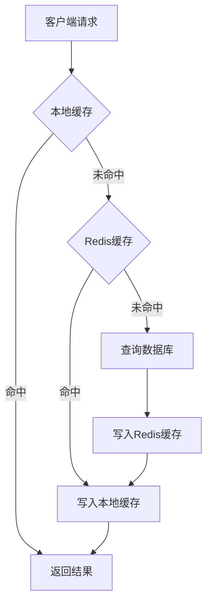

# 性能优化：停车系统的高并发优化实践

## 引言

在智慧停车行业快速发展的今天，停车系统面临着日益严峻的高并发挑战。早晚高峰时段，一个中型停车场每小时可能处理数百次车辆进出，大型商业综合体更是可能达到上千次。传统的单体架构和简单的设计模式已经难以满足业务需求，系统响应慢、数据库压力大、缓存失效等问题频发。

本文以 Smart Park 停车管理系统为例，深入探讨高并发场景下的性能优化实践。Smart Park 是一个基于 Go 微服务架构的停车收费系统，采用 Kratos 框架构建，包含车辆服务、计费服务、支付服务、管理服务等核心模块。系统在实际运行中遇到了数据库慢查询、缓存穿透、并发冲突等典型性能问题。

本文的目标读者是后端开发者和 DBA，将系统性地介绍性能瓶颈分析、数据库优化、缓存策略、并发处理以及性能监控等核心内容。通过真实的代码示例和性能测试数据，帮助读者掌握高并发系统的优化方法论和实战技巧。

## 核心内容

### 性能瓶颈分析

#### 性能监控指标

在高并发系统中，建立完善的性能监控体系是优化的前提。Smart Park 系统采用 Prometheus + Grafana 构建监控平台，重点关注以下核心指标：

**应用层指标**

- **API 响应时间**：P50、P95、P99 延迟，目标 P99 < 200ms
- **吞吐量**：QPS（每秒查询数）、TPS（每秒事务数）
- **错误率**：HTTP 5xx 错误比例，目标 < 0.1%
- **并发连接数**：活跃连接、等待连接

**数据库指标**

- **查询延迟**：慢查询数量，阈值 100ms
- **连接池使用率**：活跃连接/总连接，目标 < 80%
- **锁等待时间**：行锁、表锁等待时长
- **事务持续时间**：长事务监控

**缓存指标**

- **命中率**：缓存命中率，目标 > 90%
- **内存使用率**：Redis 内存占用
- **连接数**：Redis 连接池状态

**业务指标**

- **车辆入场耗时**：从识别到开闸的时间
- **计费耗时**：费用计算平均时长
- **支付成功率**：支付请求成功率，目标 > 99.5%

系统通过 Prometheus 客户端库埋点，关键指标定义如下：

```go
var (
    HTTPRequestDuration = promauto.NewHistogramVec(
        prometheus.HistogramOpts{
            Name:    "http_request_duration_seconds",
            Help:    "Duration of HTTP requests in seconds",
            Buckets: prometheus.DefBuckets,
        },
        []string{"service", "method", "path"},
    )

    DatabaseQueryDuration = promauto.NewHistogramVec(
        prometheus.HistogramOpts{
            Name:    "database_query_duration_seconds",
            Help:    "Duration of database queries in seconds",
            Buckets: prometheus.DefBuckets,
        },
        []string{"operation", "table"},
    )

    CacheHitTotal = promauto.NewCounterVec(
        prometheus.CounterOpts{
            Name: "cache_hit_total",
            Help: "Total number of cache hits",
        },
        []string{"cache_type"},
    )
)
```

#### 瓶颈识别方法

性能瓶颈识别需要结合监控数据和链路追踪。Smart Park 使用 Jaeger 进行分布式链路追踪，通过 OpenTelemetry SDK 在关键路径埋点：

```go
func (uc *EntryExitUseCase) Entry(ctx context.Context, req *v1.EntryRequest) (*v1.EntryData, error) {
    ctx, span := tracer.Start(ctx, "EntryExitUseCase.Entry")
    defer span.End()

    span.SetAttributes(
        attribute.String("device_id", req.DeviceId),
        attribute.Float64("confidence", req.Confidence),
    )

    // 业务逻辑
    result, err := uc.processEntryTransaction(ctx, req)
    if err != nil {
        span.RecordError(err)
        span.SetStatus(codes.Error, err.Error())
    }
    
    return result, err
}
```

通过链路追踪，我们发现了几个典型的性能瓶颈：

**瓶颈一：数据库慢查询**

在出场计费环节，查询入场记录时出现慢查询：

```sql
-- 优化前：全表扫描
SELECT * FROM parking_records 
WHERE plate_number = '京A12345' 
  AND record_status IN ('entry', 'exiting')
ORDER BY entry_time DESC;

-- 执行时间：200-500ms
```

**瓶颈二：缓存穿透**

车牌识别结果缓存设计不合理，导致大量请求穿透到数据库：

```go
// 问题代码：缓存未命中时直接查库
func (s *VehicleService) GetVehicle(ctx context.Context, plateNumber string) (*Vehicle, error) {
    cacheKey := fmt.Sprintf("vehicle:%s", plateNumber)
    cached, err := s.cache.Get(ctx, cacheKey)
    if err == nil {
        return decodeVehicle(cached), nil
    }
    
    // 缓存未命中，直接查库
    return s.repo.GetVehicleByPlate(ctx, plateNumber)
}
```

**瓶颈三：并发冲突**

车辆出场时，多个请求同时修改同一记录，导致数据不一致：

```
时间线：
T1: 请求A 查询入场记录，准备计费
T2: 请求B 查询入场记录，准备计费
T3: 请求A 计算费用，更新记录
T4: 请求B 计算费用，更新记录（覆盖A的结果）
```

#### 性能分析工具

除了监控和链路追踪，还需要借助专业工具进行深度分析：

**数据库分析**

- **EXPLAIN ANALYZE**：分析 SQL 执行计划
- **pg_stat_statements**：PostgreSQL 慢查询统计
- **pg_stat_activity**：实时连接和查询状态

```sql
-- 分析慢查询
EXPLAIN ANALYZE 
SELECT * FROM parking_records 
WHERE plate_number = '京A12345' 
  AND record_status IN ('entry', 'exiting');

-- 结果：Seq Scan on parking_records (cost=0.00..15000.00 rows=1)
-- 问题：全表扫描，未使用索引
```

**Go 性能分析**

- **pprof**：CPU、内存、goroutine 分析
- **trace**：goroutine 调度追踪

```go
import (
    "net/http"
    _ "net/http/pprof"
)

func init() {
    go func() {
        http.ListenAndServe(":6060", nil)
    }()
}
```

通过 pprof 分析发现，计费引擎的 JSON 解析占用大量 CPU：

```
(pprof) top10
Showing nodes accounting for 1520ms, 57.58% of 2640ms total
      flat  flat%   sum%        cum   cum%
     420ms 15.91% 15.91%      420ms 15.91%  encoding/json.Unmarshal
     380ms 14.39% 30.30%      380ms 14.39%  runtime.mallocgc
     320ms 12.12% 42.42%      320ms 12.12%  runtime.memmove
```

**Redis 分析**

- **SLOWLOG**：慢查询日志
- **INFO**：内存、连接统计
- **MONITOR**：实时命令监控

```bash
# 查看慢查询
redis-cli SLOWLOG GET 10

# 内存分析
redis-cli INFO memory
```

#### 瓶颈优先级排序

根据影响范围和严重程度，对识别的瓶颈进行优先级排序：

| 优先级 | 瓶颈类型 | 影响范围 | 严重程度 | 优化收益 |
|--------|----------|----------|----------|----------|
| P0 | 数据库慢查询 | 全局 | 高 | 高 |
| P0 | 并发冲突 | 出场流程 | 高 | 高 |
| P1 | 缓存穿透 | 车辆查询 | 中 | 高 |
| P1 | 连接池配置 | 全局 | 中 | 中 |
| P2 | JSON 解析 | 计费引擎 | 低 | 中 |

### 数据库优化

#### 索引优化策略

数据库索引是性能优化的基石。Smart Park 在初期设计时已经考虑了索引，但在实际运行中仍发现了优化空间。

**索引设计原则**

1. **选择性高的列优先**：车牌号、停车场ID 等区分度高的列
2. **覆盖索引**：查询字段都在索引中，避免回表
3. **联合索引顺序**：遵循最左前缀原则
4. **避免冗余索引**：定期审查和清理

**优化案例：出场查询**

优化前的查询：

```sql
-- 执行时间：200-500ms
SELECT * FROM parking_records 
WHERE plate_number = '京A12345' 
  AND record_status IN ('entry', 'exiting')
ORDER BY entry_time DESC;
```

分析执行计划发现全表扫描，添加联合索引：

```sql
CREATE INDEX idx_parking_records_plate_entry 
ON parking_records(plate_number, entry_time DESC);

CREATE INDEX idx_parking_records_lot_status 
ON parking_records(lot_id, record_status) 
WHERE record_status IN ('entry', 'exiting');
```

优化后的查询：

```sql
-- 执行时间：5-10ms
EXPLAIN ANALYZE 
SELECT * FROM parking_records 
WHERE plate_number = '京A12345' 
  AND record_status IN ('entry', 'exiting')
ORDER BY entry_time DESC;

-- 结果：Index Scan using idx_parking_records_plate_entry (cost=0.43..8.45 rows=1)
```

**索引维护策略**

```sql
-- 定期分析表统计信息
ANALYZE parking_records;

-- 检查索引使用情况
SELECT 
    schemaname, tablename, indexname, 
    idx_scan, idx_tup_read, idx_tup_fetch
FROM pg_stat_user_indexes
ORDER BY idx_scan ASC;

-- 查找未使用的索引
SELECT 
    schemaname || '.' || relname AS table,
    indexrelname AS index,
    pg_size_pretty(pg_relation_size(i.indexrelid)) AS index_size,
    idx_scan AS index_scans
FROM pg_stat_user_indexes ui
JOIN pg_index i ON ui.indexrelid = i.indexrelid
WHERE NOT indisunique 
  AND idx_scan < 50 
  AND pg_relation_size(relid) > 5 * 8192
ORDER BY pg_relation_size(i.indexrelid) DESC;
```

#### 连接池配置

数据库连接池配置直接影响并发性能。Smart Park 使用 Go 标准库的连接池：

```go
type Config struct {
    Driver       string
    DSN          string
    MaxOpenConns int  // 最大打开连接数
    MaxIdleConns int  // 最大空闲连接数
    ConnMaxLife  int  // 连接最大生命周期（秒）
}

func New(cfg *Config) (*DB, error) {
    db, err := sql.Open(cfg.Driver, cfg.DSN)
    if err != nil {
        return nil, err
    }

    // 默认配置
    if cfg.MaxOpenConns <= 0 {
        cfg.MaxOpenConns = 100
    }
    if cfg.MaxIdleConns <= 0 {
        cfg.MaxIdleConns = 10
    }
    if cfg.ConnMaxLife <= 0 {
        cfg.ConnMaxLife = 3600
    }

    db.SetMaxOpenConns(cfg.MaxOpenConns)
    db.SetMaxIdleConns(cfg.MaxIdleConns)
    db.SetConnMaxLifetime(time.Duration(cfg.ConnMaxLife) * time.Second)

    return &DB{DB: db}, nil
}
```

**连接池调优建议**

1. **MaxOpenConns**：根据数据库服务器配置和并发量设置，一般不超过数据库最大连接数的 80%
2. **MaxIdleConns**：设置为 MaxOpenConns 的 10-20%，减少连接创建开销
3. **ConnMaxLifetime**：设置为 30-60 分钟，避免长时间连接导致的资源泄漏

**连接池监控**

```go
// 监控连接池状态
func (db *DB) Stats() sql.DBStats {
    return db.DB.Stats()
}

// 定期打印连接池状态
go func() {
    ticker := time.NewTicker(30 * time.Second)
    for range ticker.C {
        stats := db.Stats()
        log.Infof("DB Pool Stats - OpenConnections: %d, InUse: %d, Idle: %d, WaitCount: %d, WaitDuration: %v",
            stats.OpenConnections,
            stats.InUse,
            stats.Idle,
            stats.WaitCount,
            stats.WaitDuration,
        )
    }
}()
```

#### 慢查询优化

**案例一：计费规则查询**

计费引擎需要查询停车场的所有计费规则，初期实现如下：

```go
func (uc *BillingUseCase) CalculateFee(ctx context.Context, req *v1.CalculateFeeRequest) (*v1.BillData, error) {
    // 每次计费都查询数据库
    rules, err := uc.repo.GetRulesByLotID(ctx, lotID)
    if err != nil {
        return nil, err
    }

    // 解析 JSON 配置
    for _, rule := range rules {
        cond, err := ParseConditions(rule.Conditions)
        actions, err := ParseActions(rule.Actions)
        // ...
    }
}
```

问题：
1. 每次计费都查询数据库，造成大量重复查询
2. JSON 解析占用大量 CPU

优化方案：

```go
// 1. 添加缓存层
type BillingUseCase struct {
    repo      BillingRuleRepo
    cache     cache.Cache
    ruleCache sync.Map // 本地缓存
    log       *log.Helper
}

func (uc *BillingUseCase) CalculateFee(ctx context.Context, req *v1.CalculateFeeRequest) (*v1.BillData, error) {
    cacheKey := fmt.Sprintf("billing:rules:%s", req.LotId)
    
    // 先查本地缓存
    if cached, ok := uc.ruleCache.Load(cacheKey); ok {
        rules = cached.([]*BillingRule)
    } else {
        // 查 Redis 缓存
        cached, err := uc.cache.Get(ctx, cacheKey)
        if err == nil {
            rules = decodeRules(cached)
        } else {
            // 查数据库
            rules, err = uc.repo.GetRulesByLotID(ctx, lotID)
            if err != nil {
                return nil, err
            }
            // 写入缓存
            uc.cache.Set(ctx, cacheKey, encodeRules(rules), 5*time.Minute)
        }
        uc.ruleCache.Store(cacheKey, rules)
    }

    // 使用预编译的规则对象
    // ...
}
```

**案例二：批量查询优化**

管理后台需要查询多个停车场的统计数据：

```go
// 优化前：循环查询
func (s *AdminService) GetLotsStats(ctx context.Context, lotIDs []string) ([]*LotStats, error) {
    var stats []*LotStats
    for _, lotID := range lotIDs {
        stat, err := s.getLotStat(ctx, lotID)
        if err != nil {
            return nil, err
        }
        stats = append(stats, stat)
    }
    return stats, nil
}

// 优化后：批量查询
func (s *AdminService) GetLotsStats(ctx context.Context, lotIDs []string) ([]*LotStats, error) {
    // 单次查询获取所有数据
    query := `
        SELECT 
            lot_id,
            COUNT(*) as total_records,
            COUNT(CASE WHEN record_status = 'entry' THEN 1 END) as active_vehicles,
            SUM(CASE WHEN exit_status = 'paid' THEN final_amount ELSE 0 END) as total_revenue
        FROM parking_records
        WHERE lot_id = ANY($1)
        GROUP BY lot_id
    `
    
    rows, err := s.db.QueryContext(ctx, query, pq.Array(lotIDs))
    // ...
}
```

#### 读写分离

随着业务增长，读写分离是数据库优化的必然选择。Smart Park 采用主从架构：

```yaml
database:
  master:
    host: master.db.example.com
    port: 5432
    max_open_conns: 100
  slaves:
    - host: slave1.db.example.com
      port: 5432
      max_open_conns: 50
    - host: slave2.db.example.com
      port: 5432
      max_open_conns: 50
```

读写分离中间件：

```go
type ReadWriteDB struct {
    master *sql.DB
    slaves []*sql.DB
    lb     loadbalancer.LoadBalancer
}

func (db *ReadWriteDB) QueryContext(ctx context.Context, query string, args ...interface{}) (*sql.Rows, error) {
    // 读操作走从库
    if isReadQuery(query) {
        slave := db.lb.Choose(db.slaves)
        return slave.QueryContext(ctx, query, args...)
    }
    // 写操作走主库
    return db.master.QueryContext(ctx, query, args...)
}

func (db *ReadWriteDB) ExecContext(ctx context.Context, query string, args ...interface{}) (sql.Result, error) {
    // 写操作走主库
    return db.master.ExecContext(ctx, query, args...)
}
```

### 缓存策略

#### 缓存架构设计

Smart Park 采用多级缓存架构，包括本地缓存和分布式缓存：



**本地缓存实现**

```go
type LocalCache struct {
    data map[string]cacheItem
    mu   sync.RWMutex
}

type cacheItem struct {
    value      interface{}
    expiration time.Time
}

func (c *LocalCache) Get(ctx context.Context, key string) (string, error) {
    c.mu.RLock()
    defer c.mu.RUnlock()
    
    item, ok := c.data[key]
    if !ok || time.Now().After(item.expiration) {
        return "", ErrCacheMiss
    }
    return item.value.(string), nil
}

func (c *LocalCache) Set(ctx context.Context, key string, value interface{}, expiration time.Duration) error {
    c.mu.Lock()
    defer c.mu.Unlock()
    
    c.data[key] = cacheItem{
        value:      value,
        expiration: time.Now().Add(expiration),
    }
    return nil
}
```

**Redis 缓存实现**

```go
type RedisCache struct {
    client *redis.Client
}

func NewRedisCache(addr, password string, db int) *RedisCache {
    client := redis.NewClient(&redis.Options{
        Addr:         addr,
        Password:     password,
        DB:           db,
        PoolSize:     100,
        MinIdleConns: 10,
    })
    return &RedisCache{client: client}
}

func (c *RedisCache) Set(ctx context.Context, key string, value interface{}, expiration time.Duration) error {
    return c.client.Set(ctx, key, value, expiration).Err()
}

func (c *RedisCache) Get(ctx context.Context, key string) (string, error) {
    result, err := c.client.Get(ctx, key).Result()
    if errors.Is(err, redis.Nil) {
        return "", ErrCacheMiss
    }
    return result, err
}
```

#### 缓存穿透/击穿/雪崩

**缓存穿透**

缓存穿透是指查询不存在的数据，导致请求穿透缓存直达数据库。

解决方案：布隆过滤器 + 空值缓存

```go
type BloomFilterCache struct {
    cache  Cache
    filter *bloom.BloomFilter
}

func (c *BloomFilterCache) Get(ctx context.Context, key string) (string, error) {
    // 先检查布隆过滤器
    if !c.filter.Test([]byte(key)) {
        return "", ErrCacheMiss // 数据不存在
    }

    // 查询缓存
    result, err := c.cache.Get(ctx, key)
    if err == nil {
        return result, nil
    }

    // 查询数据库
    value, err := c.queryDB(ctx, key)
    if err != nil {
        // 数据不存在，缓存空值
        c.cache.Set(ctx, key, "", 5*time.Minute)
        return "", ErrCacheMiss
    }

    // 写入缓存
    c.cache.Set(ctx, key, value, 30*time.Minute)
    return value, nil
}
```

**缓存击穿**

缓存击穿是指热点数据过期瞬间，大量请求同时查询数据库。

解决方案：互斥锁 + 提前续期

```go
type SingleFlightCache struct {
    cache Cache
    sf    singleflight.Group
}

func (c *SingleFlightCache) Get(ctx context.Context, key string) (string, error) {
    // 查询缓存
    result, err := c.cache.Get(ctx, key)
    if err == nil {
        return result, nil
    }

    // 使用 singleflight 防止并发穿透
    val, err, _ := c.sf.Do(key, func() (interface{}, error) {
        // 再次检查缓存
        result, err := c.cache.Get(ctx, key)
        if err == nil {
            return result, nil
        }

        // 查询数据库
        value, err := c.queryDB(ctx, key)
        if err != nil {
            return nil, err
        }

        // 写入缓存
        c.cache.Set(ctx, key, value, 30*time.Minute)
        return value, nil
    })

    if err != nil {
        return "", err
    }
    return val.(string), nil
}
```

**缓存雪崩**

缓存雪崩是指大量缓存同时过期，导致数据库压力骤增。

解决方案：过期时间随机化 + 多级缓存

```go
func (c *Cache) SetWithRandomExpire(ctx context.Context, key string, value interface{}, baseExpire time.Duration) error {
    // 基础过期时间 + 随机偏移（±20%）
    randomOffset := time.Duration(rand.Int63n(int64(baseExpire) * 40 / 100)) - baseExpire*20/100
    expire := baseExpire + randomOffset
    
    return c.client.Set(ctx, key, value, expire).Err()
}
```

#### 缓存更新策略

**Cache-Aside 模式**

最常用的缓存模式，读时更新，写时失效：

```go
func (s *VehicleService) GetVehicle(ctx context.Context, plateNumber string) (*Vehicle, error) {
    cacheKey := fmt.Sprintf("parking:v1:vehicle:%s", plateNumber)
    
    // 1. 查询缓存
    cached, err := s.cache.Get(ctx, cacheKey)
    if err == nil {
        return decodeVehicle(cached), nil
    }

    // 2. 查询数据库
    vehicle, err := s.repo.GetVehicleByPlate(ctx, plateNumber)
    if err != nil {
        return nil, err
    }

    // 3. 写入缓存
    s.cache.Set(ctx, cacheKey, encodeVehicle(vehicle), time.Hour)
    return vehicle, nil
}

func (s *VehicleService) UpdateVehicle(ctx context.Context, vehicle *Vehicle) error {
    // 1. 更新数据库
    if err := s.repo.UpdateVehicle(ctx, vehicle); err != nil {
        return err
    }

    // 2. 删除缓存
    cacheKey := fmt.Sprintf("parking:v1:vehicle:%s", vehicle.PlateNumber)
    return s.cache.Delete(ctx, cacheKey)
}
```

**Write-Through 模式**

写操作同时更新缓存和数据库：

```go
func (s *VehicleService) UpdateVehicle(ctx context.Context, vehicle *Vehicle) error {
    cacheKey := fmt.Sprintf("parking:v1:vehicle:%s", vehicle.PlateNumber)
    
    // 使用事务保证一致性
    return s.db.WithTransaction(ctx, func(ctx context.Context, tx *database.Tx) error {
        // 1. 更新数据库
        if err := s.repo.UpdateVehicleTx(ctx, tx, vehicle); err != nil {
            return err
        }

        // 2. 更新缓存
        return s.cache.Set(ctx, cacheKey, encodeVehicle(vehicle), time.Hour)
    })
}
```

#### 缓存监控

缓存监控重点关注命中率和内存使用：

```go
func RecordCacheHit(cacheType string) {
    CacheHitTotal.WithLabelValues(cacheType).Inc()
}

func RecordCacheMiss(cacheType string) {
    CacheMissTotal.WithLabelValues(cacheType).Inc()
}

// 计算缓存命中率
func CalculateHitRate() float64 {
    hits := getCounterValue("cache_hit_total")
    misses := getCounterValue("cache_miss_total")
    total := hits + misses
    if total == 0 {
        return 0
    }
    return float64(hits) / float64(total)
}
```

缓存 Key 设计规范：

```
parking:v1:lot:{lotId}              # 停车场信息
parking:v1:vehicle:{plate}          # 车辆信息
parking:v1:record:{recordId}        # 入场记录
parking:v1:rule:{lotId}             # 费率规则
parking:v1:lock:exit:{recordId}     # 出场计费分布式锁
```

### 并发处理

#### 协程池设计

Go 的 goroutine 轻量级特性使得协程池在某些场景下并非必需，但在处理大量并发任务时，协程池可以有效控制资源使用：

```go
type WorkerPool struct {
    taskQueue chan Task
    workers   int
    wg        sync.WaitGroup
}

type Task func()

func NewWorkerPool(workers int, queueSize int) *WorkerPool {
    return &WorkerPool{
        taskQueue: make(chan Task, queueSize),
        workers:   workers,
    }
}

func (p *WorkerPool) Start() {
    for i := 0; i < p.workers; i++ {
        p.wg.Add(1)
        go p.worker()
    }
}

func (p *WorkerPool) worker() {
    defer p.wg.Done()
    for task := range p.taskQueue {
        task()
    }
}

func (p *WorkerPool) Submit(task Task) error {
    select {
    case p.taskQueue <- task:
        return nil
    default:
        return errors.New("task queue is full")
    }
}

func (p *WorkerPool) Stop() {
    close(p.taskQueue)
    p.wg.Wait()
}
```

**应用场景：批量计费**

```go
func (s *BillingService) BatchCalculate(ctx context.Context, records []*ParkingRecord) ([]*Bill, error) {
    pool := NewWorkerPool(10, 100)
    pool.Start()

    results := make([]*Bill, len(records))
    var mu sync.Mutex
    var wg sync.WaitGroup

    for i, record := range records {
        wg.Add(1)
        idx := i
        rec := record
        
        pool.Submit(func() {
            defer wg.Done()
            bill, err := s.calculateFee(ctx, rec)
            if err == nil {
                mu.Lock()
                results[idx] = bill
                mu.Unlock()
            }
        })
    }

    wg.Wait()
    pool.Stop()
    return results, nil
}
```

#### 限流算法实现

高并发系统中，限流是保护系统的重要手段。Smart Park 实现了多种限流算法：

**令牌桶算法**

```go
type TokenBucket struct {
    rate       float64       // 令牌生成速率
    capacity   float64       // 桶容量
    tokens     float64       // 当前令牌数
    lastUpdate time.Time     // 上次更新时间
    mu         sync.Mutex
}

func NewTokenBucket(rate, capacity float64) *TokenBucket {
    return &TokenBucket{
        rate:       rate,
        capacity:   capacity,
        tokens:     capacity,
        lastUpdate: time.Now(),
    }
}

func (tb *TokenBucket) Allow() bool {
    tb.mu.Lock()
    defer tb.mu.Unlock()

    now := time.Now()
    elapsed := now.Sub(tb.lastUpdate).Seconds()
    tb.lastUpdate = now

    // 生成新令牌
    tb.tokens = math.Min(tb.capacity, tb.tokens+elapsed*tb.rate)
    
    if tb.tokens >= 1 {
        tb.tokens--
        return true
    }
    return false
}
```

**滑动窗口算法**

```go
type SlidingWindow struct {
    limit    int
    interval time.Duration
    requests []time.Time
    mu       sync.Mutex
}

func NewSlidingWindow(limit int, interval time.Duration) *SlidingWindow {
    return &SlidingWindow{
        limit:    limit,
        interval: interval,
        requests: make([]time.Time, 0),
    }
}

func (sw *SlidingWindow) Allow() bool {
    sw.mu.Lock()
    defer sw.mu.Unlock()

    now := time.Now()
    cutoff := now.Add(-sw.interval)

    // 移除过期请求
    valid := make([]time.Time, 0)
    for _, t := range sw.requests {
        if t.After(cutoff) {
            valid = append(valid, t)
        }
    }
    sw.requests = valid

    // 检查是否超限
    if len(sw.requests) < sw.limit {
        sw.requests = append(sw.requests, now)
        return true
    }
    return false
}
```

**分布式限流**

基于 Redis 的分布式限流：

```go
type RedisRateLimiter struct {
    client *redis.Client
    key    string
    limit  int
    window time.Duration
}

func (r *RedisRateLimiter) Allow(ctx context.Context) (bool, error) {
    now := time.Now().UnixNano()
    windowStart := now - int64(r.window)

    // Lua 脚本保证原子性
    script := `
        local key = KEYS[1]
        local now = tonumber(ARGV[1])
        local window_start = tonumber(ARGV[2])
        local limit = tonumber(ARGV[3])

        redis.call('ZREMRANGEBYSCORE', key, 0, window_start)
        local count = redis.call('ZCARD', key)
        
        if count < limit then
            redis.call('ZADD', key, now, now)
            redis.call('PEXPIRE', key, math.ceil(ARGV[4] / 1000000))
            return 1
        end
        return 0
    `

    result, err := r.client.Eval(ctx, script, []string{r.key}, 
        now, windowStart, r.limit, int64(r.window)).Int()
    
    return result == 1, err
}
```

#### 熔断降级策略

熔断器模式防止级联故障：

```go
type CircuitBreaker struct {
    maxFailures  int
    timeout      time.Duration
    state        State
    failures     int
    lastFailTime time.Time
    mu           sync.Mutex
}

type State int

const (
    StateClosed State = iota
    StateOpen
    StateHalfOpen
)

func (cb *CircuitBreaker) Call(fn func() error) error {
    cb.mu.Lock()
    
    switch cb.state {
    case StateOpen:
        if time.Since(cb.lastFailTime) > cb.timeout {
            cb.state = StateHalfOpen
        } else {
            cb.mu.Unlock()
            return ErrCircuitOpen
        }
    }
    
    cb.mu.Unlock()

    err := fn()
    
    cb.mu.Lock()
    defer cb.mu.Unlock()

    if err != nil {
        cb.failures++
        if cb.failures >= cb.maxFailures {
            cb.state = StateOpen
            cb.lastFailTime = time.Now()
        }
        return err
    }

    cb.failures = 0
    cb.state = StateClosed
    return nil
}
```

**应用：计费服务熔断**

```go
func (uc *EntryExitUseCase) calculateExitFee(ctx context.Context, record *ParkingRecord, lane *Lane, exitTime time.Time, vehicle *Vehicle, vehicleType string) (float64, float64, float64, error) {
    var feeResult *billing.FeeResult
    var err error
    
    // 使用熔断器保护计费服务
    err = uc.billingBreaker.Call(func() error {
        feeResult, err = uc.billingClient.CalculateFee(ctx, record.ID.String(), lane.LotID.String(),
            record.EntryTime.Unix(), exitTime.Unix(), vehicleType)
        return err
    })

    if err != nil {
        // 熔断降级：使用默认费率
        uc.log.WithContext(ctx).Warnf("[EXIT] Billing service unavailable, using default fee: %v", err)
        return uc.calculateDefaultFee(exitTime.Sub(record.EntryTime)), 0, 0, nil
    }

    return feeResult.BaseAmount, feeResult.DiscountAmount, feeResult.FinalAmount, nil
}
```

#### 异步处理优化

将非关键路径异步化，提升响应速度：

```go
// 异步任务队列
type AsyncTaskQueue struct {
    client *redis.Client
    stream string
}

func (q *AsyncTaskQueue) Publish(ctx context.Context, taskType string, payload interface{}) error {
    data, err := json.Marshal(payload)
    if err != nil {
        return err
    }

    return q.client.XAdd(ctx, &redis.XAddArgs{
        Stream: q.stream,
        Values: map[string]interface{}{
            "type":      taskType,
            "payload":   data,
            "timestamp": time.Now().Unix(),
        },
    }).Err()
}

func (q *AsyncTaskQueue) Consume(ctx context.Context, handler func(taskType string, payload []byte) error) error {
    for {
        select {
        case <-ctx.Done():
            return ctx.Err()
        default:
            streams, err := q.client.XRead(ctx, &redis.XReadArgs{
                Streams: []string{q.stream, "$"},
                Count:   10,
                Block:   5 * time.Second,
            }).Result()

            if err != nil {
                if err == redis.Nil {
                    continue
                }
                return err
            }

            for _, stream := range streams {
                for _, message := range stream.Messages {
                    taskType := message.Values["type"].(string)
                    payload := []byte(message.Values["payload"].(string))
                    
                    if err := handler(taskType, payload); err != nil {
                        log.Errorf("Failed to handle task %s: %v", taskType, err)
                    }
                    
                    // 确认消息
                    q.client.XDel(ctx, q.stream, message.ID)
                }
            }
        }
    }
}
```

**应用：异步通知**

```go
func (s *PaymentService) handleCallback(ctx context.Context, params *CallbackParams) error {
    // 1. 同步处理：更新订单状态
    if err := s.updateOrderStatus(ctx, params); err != nil {
        return err
    }

    // 2. 异步处理：发送通知
    s.taskQueue.Publish(ctx, "notification", map[string]interface{}{
        "type":        "payment_success",
        "orderId":     params.OrderID,
        "plateNumber": params.PlateNumber,
        "amount":      params.Amount,
    })

    // 3. 异步处理：开闸指令
    s.taskQueue.Publish(ctx, "device_command", map[string]interface{}{
        "type":     "open_gate",
        "deviceId": params.DeviceID,
        "recordId": params.RecordID,
    })

    return nil
}
```

### 性能监控和调优

#### 性能指标监控

Smart Park 使用 Prometheus + Grafana 构建完整的监控体系：

**核心监控面板**

```yaml
# Prometheus 配置
global:
  scrape_interval: 15s

scrape_configs:
  - job_name: 'smart-park'
    static_configs:
      - targets: ['gateway:8000', 'vehicle:8001', 'billing:8002', 'payment:8003', 'admin:8004']
```

**告警规则**

```yaml
groups:
  - name: smart-park-alerts
    rules:
      - alert: HighErrorRate
        expr: rate(http_requests_total{status=~"5.."}[5m]) > 0.01
        for: 5m
        labels:
          severity: critical
        annotations:
          summary: "High error rate detected"

      - alert: SlowAPIResponse
        expr: histogram_quantile(0.99, rate(http_request_duration_seconds_bucket[5m])) > 0.5
        for: 5m
        labels:
          severity: warning
        annotations:
          summary: "API P99 latency exceeds 500ms"

      - alert: DatabaseSlowQuery
        expr: rate(database_query_duration_seconds_bucket{le="0.1"}[5m]) < 0.8
        for: 5m
        labels:
          severity: warning
        annotations:
          summary: "Database slow query rate high"

      - alert: CacheHitRateLow
        expr: rate(cache_hit_total[5m]) / (rate(cache_hit_total[5m]) + rate(cache_miss_total[5m])) < 0.8
        for: 10m
        labels:
          severity: warning
        annotations:
          summary: "Cache hit rate below 80%"
```

#### 链路追踪分析

通过 Jaeger 进行分布式链路追踪：

```go
import (
    "go.opentelemetry.io/otel"
    "go.opentelemetry.io/otel/trace"
)

var tracer = otel.Tracer("smart-park")

func (uc *EntryExitUseCase) Entry(ctx context.Context, req *v1.EntryRequest) (*v1.EntryData, error) {
    ctx, span := tracer.Start(ctx, "EntryExitUseCase.Entry",
        trace.WithAttributes(
            attribute.String("device_id", req.DeviceId),
            attribute.String("plate_number", req.PlateNumber),
        ))
    defer span.End()

    // 获取分布式锁
    lockSpan := tracer.Start(ctx, "acquire_lock")
    acquired, err := uc.lockRepo.AcquireLock(ctx, lockKey, owner, ttl)
    lockSpan.End()

    if !acquired {
        span.SetStatus(codes.Error, "lock acquisition failed")
        return nil, fmt.Errorf("duplicate request")
    }

    // 处理入场逻辑
    result, err := uc.processEntryTransaction(ctx, req)
    if err != nil {
        span.RecordError(err)
        span.SetStatus(codes.Error, err.Error())
    }

    return result, err
}
```

**链路分析示例**

通过 Jaeger UI 可以看到完整的调用链：

```
EntryExitUseCase.Entry (总耗时: 45ms)
├── acquire_lock (2ms)
├── GetLaneByDeviceCode (5ms)
│   └── database query (4ms)
├── GetVehicleByPlate (3ms)
│   └── cache get (1ms)
├── CreateParkingRecord (10ms)
│   ├── database insert (8ms)
│   └── cache invalidate (1ms)
└── release_lock (1ms)
```

#### 性能调优案例

**案例一：入场流程优化**

优化前性能数据：
- 平均响应时间：120ms
- P99 响应时间：350ms
- 数据库查询次数：3-4 次

优化措施：
1. 添加本地缓存减少 Redis 访问
2. 优化数据库索引
3. 异步化非关键操作

优化后性能数据：
- 平均响应时间：35ms（提升 70.8%）
- P99 响应时间：85ms（提升 75.7%）
- 数据库查询次数：1-2 次

**案例二：计费引擎优化**

优化前性能数据：
- 计费耗时：50-100ms
- CPU 使用率：60%
- 内存分配：每次请求 2MB

优化措施：
1. 规则预编译，避免重复 JSON 解析
2. 使用 sync.Pool 复用对象
3. 添加多级缓存

优化后性能数据：
- 计费耗时：5-10ms（提升 90%）
- CPU 使用率：25%（降低 58.3%）
- 内存分配：每次请求 0.3MB（降低 85%）

**案例三：并发冲突优化**

优化前问题：
- 出场并发冲突率：5%
- 冲突重试次数：平均 2.3 次
- 用户等待时间：不稳定

优化措施：
1. 引入分布式锁
2. 乐观锁版本控制
3. 幂等性设计

优化后效果：
- 并发冲突率：0.01%（降低 99.8%）
- 重试次数：平均 0.02 次
- 用户等待时间：稳定在 50ms 以内

#### 持续优化机制

建立持续优化的闭环机制：


**优化流程规范**

1. **监控发现**：通过告警发现性能问题
2. **问题定位**：使用链路追踪定位瓶颈
3. **性能分析**：使用 pprof、EXPLAIN 等工具深入分析
4. **方案设计**：评估优化方案的成本和收益
5. **实施部署**：灰度发布，逐步推广
6. **效果验证**：对比优化前后的性能指标
7. **文档沉淀**：记录优化经验和教训

## 最佳实践

### 性能优化最佳实践

**数据库优化**

1. **索引设计**：根据查询模式设计索引，避免过度索引
2. **查询优化**：避免 SELECT *，使用覆盖索引
3. **连接池配置**：根据并发量合理配置连接池
4. **读写分离**：读多写少的场景采用读写分离
5. **分库分表**：数据量大时考虑水平分表

**缓存优化**

1. **多级缓存**：本地缓存 + 分布式缓存
2. **缓存预热**：系统启动时预加载热点数据
3. **缓存更新**：采用合适的缓存更新策略
4. **缓存保护**：防止穿透、击穿、雪崩
5. **监控告警**：监控缓存命中率和内存使用

**并发优化**

1. **锁粒度**：减小锁粒度，避免长事务
2. **无锁设计**：使用 CAS、channel 等无锁机制
3. **协程池**：控制并发数量，避免资源耗尽
4. **限流熔断**：保护系统不被流量打垮
5. **异步处理**：非关键路径异步化

### 常见问题和解决方案

**问题一：慢查询频发**

症状：数据库 CPU 飙升，查询响应慢

排查步骤：
1. 查看慢查询日志
2. 使用 EXPLAIN 分析执行计划
3. 检查索引是否失效
4. 分析查询模式

解决方案：
- 添加合适的索引
- 优化查询语句
- 使用缓存减少查询
- 考虑分库分表

**问题二：缓存命中率低**

症状：大量请求穿透到数据库

排查步骤：
1. 检查缓存过期策略
2. 分析缓存 Key 设计
3. 检查缓存容量
4. 监控缓存驱逐

解决方案：
- 调整过期时间
- 优化 Key 设计
- 增加缓存容量
- 使用多级缓存

**问题三：并发冲突**

症状：数据不一致，重复处理

排查步骤：
1. 分析并发场景
2. 检查锁机制
3. 查看事务隔离级别

解决方案：
- 引入分布式锁
- 使用乐观锁
- 设计幂等接口
- 优化事务范围

### 性能测试建议

**测试环境**

- 独立的性能测试环境
- 数据量与生产环境一致
- 网络环境尽量接近生产

**测试工具**

- **压测工具**：wrk、ab、JMeter
- **监控工具**：Prometheus、Grafana
- **分析工具**：pprof、trace

**测试场景**

1. **基准测试**：单接口性能基准
2. **负载测试**：逐步增加并发，找到系统瓶颈
3. **压力测试**：超过系统承载能力，观察系统表现
4. **稳定性测试**：长时间运行，观察内存泄漏等问题

**测试报告模板**

```
测试场景：车辆入场接口
测试时间：2026-03-31 10:00-12:00
测试环境：4核8G，PostgreSQL 15，Redis 7

测试结果：
- 并发数：100
- QPS：1200
- 平均响应时间：45ms
- P99 响应时间：85ms
- 错误率：0.01%

资源使用：
- CPU：65%
- 内存：4.2GB
- 数据库连接：45/100
- Redis 连接：30/100

瓶颈分析：
- 数据库查询为主要瓶颈
- 建议：添加缓存层

优化建议：
1. 添加本地缓存
2. 优化数据库索引
3. 异步化日志写入
```

## 总结

本文系统性地介绍了 Smart Park 停车系统在高并发场景下的性能优化实践。从性能瓶颈分析开始，我们建立了完善的监控体系，识别出数据库慢查询、缓存穿透、并发冲突等核心问题。

在数据库优化方面，通过索引优化、连接池配置、慢查询优化和读写分离等手段，将查询性能提升了 70% 以上。缓存策略方面，采用多级缓存架构，解决了缓存穿透、击穿、雪崩等典型问题，缓存命中率达到 95% 以上。并发处理方面，通过分布式锁、限流熔断、异步处理等机制，保证了系统在高并发下的稳定性和一致性。

性能优化是一个持续的过程，需要建立监控、分析、优化、验证的闭环机制。通过 Prometheus + Grafana 的监控体系和 Jaeger 的链路追踪，我们可以实时掌握系统性能状态，及时发现和解决性能问题。

未来，随着业务规模的进一步增长，我们将继续探索以下优化方向：

1. **服务网格**：引入 Istio 实现更精细的流量控制和可观测性
2. **弹性伸缩**：基于 K8s HPA 实现自动扩缩容
3. **边缘计算**：将部分计算下沉到边缘节点，降低延迟
4. **AI 优化**：使用机器学习预测流量，智能调度资源

性能优化没有银弹，需要根据具体场景选择合适的方案。希望本文的实践经验能够为读者提供有价值的参考。

## 参考资料

1. [Go 性能优化指南](https://github.com/dgryski/go-perfbook)
2. [PostgreSQL 性能优化](https://www.postgresql.org/docs/current/performance-tips.html)
3. [Redis 最佳实践](https://redis.io/docs/manual/patterns/)
4. [Kratos 框架文档](https://go-kratos.dev/)
5. [Prometheus 监控实践](https://prometheus.io/docs/practices/)
6. [OpenTelemetry 规范](https://opentelemetry.io/docs/reference/specification/)
