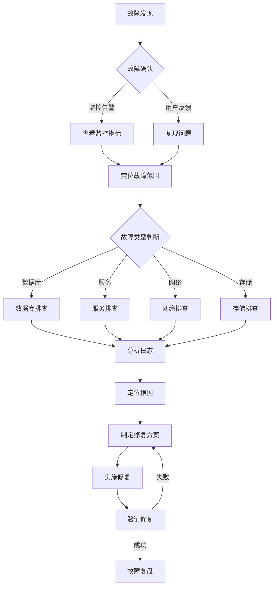
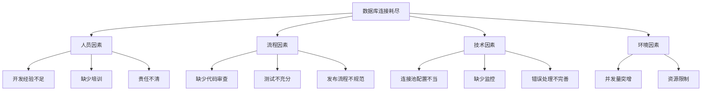
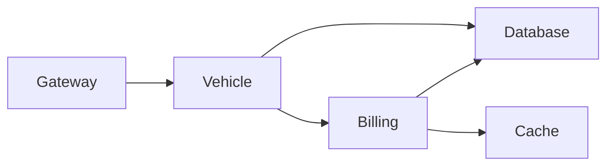

# 故障处理：生产环境的故障排查和恢复

## 引言

在当今数字化时代，生产环境的稳定性直接关系到企业的业务连续性和用户体验。然而，无论系统架构多么完善，故障的发生始终是不可避免的。从数据库连接耗尽到服务雪崩，从网络故障到数据丢失，每一次生产环境故障都是对运维团队和开发团队的严峻考验。

本文面向运维工程师和后端开发者，系统性地介绍生产环境故障处理的完整流程。文章将从常见故障类型入手，详细讲解故障排查流程和工具使用，提供应急预案和快速恢复策略，并通过实际案例分析帮助读者建立完整的故障处理知识体系。通过本文的学习，读者将能够建立系统化的故障处理思维，掌握实用的排查技巧，并能够制定有效的预防和改进措施。

## 常见故障类型和原因

### 数据库故障

数据库作为系统的核心存储组件，其故障往往会导致整个系统不可用。以下是常见的数据库故障类型：

**连接耗尽**

数据库连接耗尽是最常见的故障之一。在 Smart Park 项目中，我们使用 PostgreSQL 作为主数据库，每个微服务都需要建立数据库连接池。当并发请求激增或连接泄漏时，连接池会被耗尽，导致新请求无法获取连接。

```go
// 错误示例：连接泄漏
func GetVehicle(id int64) (*Vehicle, error) {
    db := GetDB()
    // 忘记关闭连接
    row := db.QueryRow("SELECT * FROM vehicles WHERE id = $1", id)
    var v Vehicle
    err := row.Scan(&v.ID, &v.PlateNumber)
    return &v, err
}

// 正确示例：使用连接池和上下文
func GetVehicle(ctx context.Context, id int64) (*Vehicle, error) {
    db := GetDB()
    query := "SELECT * FROM vehicles WHERE id = $1"
    row := db.QueryRowContext(ctx, query, id)
    var v Vehicle
    err := row.Scan(&v.ID, &v.PlateNumber)
    return &v, err
}
```

**慢查询**

慢查询会占用大量数据库资源，影响其他查询的执行。在停车计费系统中，复杂的账单查询和统计报表往往是慢查询的高发区域。

```sql
-- 慢查询示例：缺少索引的全表扫描
SELECT * FROM parking_records 
WHERE created_at >= '2024-01-01' 
  AND status = 'completed'
ORDER BY created_at DESC;

-- 优化方案：添加复合索引
CREATE INDEX idx_parking_records_status_created 
ON parking_records(status, created_at DESC);
```

**死锁**

在并发事务处理中，死锁是常见的故障类型。例如，多个事务同时更新相关的停车记录和账单信息时，可能产生死锁。

```sql
-- 死锁场景示例
-- 事务1
BEGIN;
UPDATE parking_records SET status = 'completed' WHERE id = 1;
UPDATE orders SET status = 'paid' WHERE id = 100;
COMMIT;

-- 事务2（同时执行）
BEGIN;
UPDATE orders SET status = 'paid' WHERE id = 100;
UPDATE parking_records SET status = 'completed' WHERE id = 1;
COMMIT;
```

### 服务故障

**OOM（内存溢出）**

Go 语言虽然有垃圾回收机制，但不当的内存使用仍会导致 OOM。常见原因包括：
- 无限增长的切片或 map
- 未关闭的 goroutine 泄漏
- 大对象频繁分配

```go
// goroutine 泄漏示例
func ProcessRecords() {
    for {
        record := <-recordChan
        go func() {
            // goroutine 永远不会退出
            processRecord(record)
        }()
    }
}

// 修复方案：使用 worker pool
func ProcessRecords(ctx context.Context) {
    workerPool := make(chan struct{}, 10) // 限制并发数
    for {
        select {
        case record := <-recordChan:
            workerPool <- struct{}{}
            go func(r Record) {
                defer func() { <-workerPool }()
                processRecord(r)
            }(record)
        case <-ctx.Done():
            return
        }
    }
}
```

**CPU 飙高**

CPU 使用率飙升通常由以下原因引起：
- 死循环
- 频繁的 GC
- 密集计算任务

**线程阻塞**

在微服务架构中，线程阻塞往往由外部依赖引起：
- 数据库查询超时
- 第三方 API 调用慢
- 锁竞争

### 网络故障

**DNS 解析失败**

DNS 故障会导致服务发现失败，在 Kubernetes 环境中尤为常见。

```bash
# DNS 解析测试
nslookup vehicle-svc.default.svc.cluster.local

# 查看 DNS 配置
cat /etc/resolv.conf

# 使用 IP 直连测试
curl http://10.96.100.1:8001/health
```

**连接超时**

网络超时是最常见的故障之一，需要合理设置超时时间。

```go
// HTTP 客户端超时配置
client := &http.Client{
    Timeout: 30 * time.Second,
    Transport: &http.Transport{
        DialContext: (&net.Dialer{
            Timeout:   5 * time.Second,
            KeepAlive: 30 * time.Second,
        }).DialContext,
        TLSHandshakeTimeout:   10 * time.Second,
        ResponseHeaderTimeout: 10 * time.Second,
        IdleConnTimeout:       90 * time.Second,
    },
}
```

### 存储故障

**磁盘满**

磁盘空间不足会导致数据库写入失败、日志无法记录等问题。

```bash
# 检查磁盘使用情况
df -h

# 查找大文件
du -sh /* | sort -rh | head -10

# 清理 Docker 资源
docker system prune -a

# 清理日志文件
find /var/log -type f -name "*.log" -mtime +7 -delete
```

**IO 高**

高 IO 会严重影响系统性能，常见原因包括：
- 大量日志写入
- 数据库频繁刷盘
- 文件读写密集

## 故障排查流程和工具

### 故障排查流程

建立标准化的故障排查流程是快速定位问题的关键。以下是推荐的故障排查流程：



**故障排查步骤详解**

1. **故障发现与确认**
   - 接收告警通知
   - 确认故障影响范围
   - 评估故障严重程度

2. **信息收集**
   - 查看监控指标（CPU、内存、磁盘、网络）
   - 查看应用日志
   - 查看系统日志
   - 收集用户反馈

3. **故障定位**
   - 缩小故障范围
   - 确定故障组件
   - 分析故障原因

4. **故障修复**
   - 制定修复方案
   - 实施修复措施
   - 验证修复效果

### 日志分析工具

**ELK Stack**

ELK（Elasticsearch、Logstash、Kibana）是常用的日志分析平台。

```yaml
# docker-compose.yml
services:
  elasticsearch:
    image: elasticsearch:8.10.0
    environment:
      - discovery.type=single-node
    ports:
      - "9200:9200"

  logstash:
    image: logstash:8.10.0
    volumes:
      - ./logstash.conf:/usr/share/logstash/pipeline/logstash.conf
    ports:
      - "5044:5044"

  kibana:
    image: kibana:8.10.0
    ports:
      - "5601:5601"
```

**日志查询技巧**

```bash
# 查看最近的错误日志
kubectl logs -f deployment/vehicle-svc --tail=100 | grep -i error

# 查看特定时间段的日志
kubectl logs deployment/billing-svc --since=1h | grep "database connection"

# 多容器日志聚合
kubectl logs -l app=smart-park --all-containers=true

# 使用 jq 分析 JSON 日志
kubectl logs deployment/payment-svc | jq 'select(.level=="error")'
```

### 性能分析工具

**pprof**

Go 语言内置的性能分析工具，可以分析 CPU、内存、goroutine 等。

```go
// 在服务中启用 pprof
import (
    "net/http"
    _ "net/http/pprof"
)

func main() {
    go func() {
        http.ListenAndServe("localhost:6060", nil)
    }()
    // ... 服务启动代码
}
```

```bash
# CPU 分析
go tool pprof http://localhost:6060/debug/pprof/profile?seconds=30

# 内存分析
go tool pprof http://localhost:6060/debug/pprof/heap

# goroutine 分析
go tool pprof http://localhost:6060/debug/pprof/goroutine

# 查看火焰图
go tool pprof -http=:8080 http://localhost:6060/debug/pprof/profile
```

**Prometheus + Grafana**

监控指标收集和可视化平台。

```yaml
# prometheus.yml
global:
  scrape_interval: 15s

scrape_configs:
  - job_name: 'smart-park'
    static_configs:
      - targets:
        - 'vehicle-svc:8001'
        - 'billing-svc:8002'
        - 'payment-svc:8003'
        - 'admin-svc:8004'
```

### 网络诊断工具

```bash
# 网络连通性测试
ping vehicle-svc
traceroute vehicle-svc

# 端口连通性测试
telnet vehicle-svc 8001
nc -zv vehicle-svc 8001

# 抓包分析
tcpdump -i any port 8001 -w capture.pcap

# DNS 解析测试
dig vehicle-svc.default.svc.cluster.local
nslookup vehicle-svc

# HTTP 请求测试
curl -v http://vehicle-svc:8001/health
curl -w "@curl-format.txt" -o /dev/null -s http://vehicle-svc:8001/api/v1/vehicles
```

## 应急预案和快速恢复

### 应急预案制定

应急预案是故障快速响应的基础。每个关键服务都应该有对应的应急预案。

**应急预案模板**

```markdown
## 服务名称：Vehicle Service

### 故障等级定义
- P0：服务完全不可用
- P1：核心功能不可用
- P2：部分功能异常
- P3：性能下降

### 应急联系人
- 负责人：张三（电话：138xxxx）
- 备份负责人：李四（电话：139xxxx）

### 故障现象
- 服务无响应
- 数据库连接失败
- 车辆进出记录丢失

### 快速恢复步骤
1. 重启服务：kubectl rollout restart deployment/vehicle-svc
2. 扩容实例：kubectl scale deployment vehicle-svc --replicas=5
3. 回滚版本：kubectl rollout undo deployment/vehicle-svc
4. 切换数据库：修改配置指向备用数据库

### 降级方案
- 关闭非核心功能
- 启用缓存模式
- 限制并发请求
```

### 快速恢复策略

**服务重启**

```bash
# Kubernetes 环境下的服务重启
kubectl rollout restart deployment/vehicle-svc

# 查看重启状态
kubectl rollout status deployment/vehicle-svc

# Docker Compose 环境下的服务重启
docker-compose restart vehicle-svc
```

**服务扩容**

```bash
# 手动扩容
kubectl scale deployment vehicle-svc --replicas=10

# HPA 自动扩容
kubectl autoscale deployment vehicle-svc --min=3 --max=10 --cpu-percent=70

# 查看扩容状态
kubectl get hpa
```

**版本回滚**

```bash
# 查看历史版本
kubectl rollout history deployment/vehicle-svc

# 回滚到上一版本
kubectl rollout undo deployment/vehicle-svc

# 回滚到指定版本
kubectl rollout undo deployment/vehicle-svc --to-revision=3
```

### 服务降级方案

在 Smart Park 项目中，我们实现了多级降级策略：

```go
// 降级策略配置
type DegradationConfig struct {
    EnableCache      bool   `json:"enable_cache"`
    CacheTTL         int    `json:"cache_ttl"`
    RateLimitEnabled bool   `json:"rate_limit_enabled"`
    RateLimit        int    `json:"rate_limit"`
    DisableFeatures  []string `json:"disable_features"`
}

// 降级中间件
func DegradationMiddleware(config *DegradationConfig) middleware.Middleware {
    return func(handler middleware.Handler) middleware.Handler {
        return func(ctx context.Context, req interface{}) (interface{}, error) {
            // 检查是否启用缓存降级
            if config.EnableCache {
                if cached, ok := cache.Get(req); ok {
                    return cached, nil
                }
            }
            
            // 检查是否启用限流
            if config.RateLimitEnabled {
                if !rateLimiter.Allow() {
                    return nil, errors.New("service degraded, please retry later")
                }
            }
            
            return handler(ctx, req)
        }
    }
}
```

**降级开关配置**

```yaml
# degradation.yaml
vehicle-svc:
  enable_cache: true
  cache_ttl: 300
  rate_limit_enabled: true
  rate_limit: 1000
  disable_features:
    - vehicle_history_query
    - statistics_report

billing-svc:
  enable_cache: true
  cache_ttl: 600
  rate_limit_enabled: true
  rate_limit: 500
```

### 数据恢复方案

**数据库备份恢复**

```bash
# PostgreSQL 备份
pg_dump -h localhost -U postgres -d parking -F c -f backup_$(date +%Y%m%d).dump

# 数据库恢复
pg_restore -h localhost -U postgres -d parking -c backup_20240315.dump

# 增量备份（WAL 归档）
# postgresql.conf
wal_level = replica
archive_mode = on
archive_command = 'cp %p /backup/wal/%f'
```

**Redis 数据恢复**

```bash
# RDB 备份
redis-cli BGSAVE
cp /var/lib/redis/dump.rdb /backup/redis/dump_$(date +%Y%m%d).rdb

# AOF 备份
redis-cli BGREWRITEAOF
cp /var/lib/redis/appendonly.aof /backup/redis/aof_$(date +%Y%m%d).aof

# 数据恢复
redis-cli SHUTDOWN NOSAVE
cp /backup/redis/dump_20240315.rdb /var/lib/redis/dump.rdb
redis-server /etc/redis/redis.conf
```

## 故障复盘和改进

### 故障复盘流程

故障复盘是避免同类故障再次发生的关键环节。


**故障报告模板**

```markdown
# 故障报告：Vehicle Service 数据库连接耗尽

## 基本信息
- 故障时间：2024-03-15 14:30 - 15:45
- 故障等级：P1
- 影响范围：车辆进出功能不可用，影响 3 个停车场
- 处理人员：张三、李四

## 故障经过
14:30 监控告警，vehicle-svc 数据库连接数达到上限
14:35 确认故障，开始排查
14:50 定位原因：连接泄漏导致连接池耗尽
15:00 临时修复：重启服务释放连接
15:30 根本修复：修复连接泄漏代码并部署
15:45 验证修复，服务恢复正常

## 根因分析
### 直接原因
代码中存在数据库连接泄漏，未正确关闭连接。

### 根本原因
1. 代码审查不严格，未发现连接泄漏
2. 缺少连接池监控
3. 压力测试未覆盖长连接场景

## 改进措施
1. 修复连接泄漏代码（已完成）
2. 添加连接池监控告警（计划 3 天内完成）
3. 完善代码审查流程（计划 1 周内完成）
4. 补充压力测试用例（计划 2 周内完成）

## 经验教训
1. 数据库连接必须使用连接池管理
2. 需要建立完善的监控体系
3. 故障演练要定期进行
```

### 根因分析方法

**5 Whys 分析法**

通过连续追问"为什么"，找到问题的根本原因。

```
问题：数据库连接耗尽

为什么1：为什么连接数达到上限？
回答：因为大量连接未被释放

为什么2：为什么连接未被释放？
回答：因为代码中没有关闭连接

为什么3：为什么代码中没有关闭连接？
回答：因为开发人员忘记调用 Close 方法

为什么4：为什么开发人员会忘记？
回答：因为没有代码审查和静态检查

为什么5：为什么没有代码审查？
回答：因为项目进度紧张，跳过了审查流程

根因：流程问题，需要建立强制的代码审查机制
```

**鱼骨图分析**



### 改进措施制定

改进措施应该符合 SMART 原则：
- Specific（具体的）
- Measurable（可衡量的）
- Achievable（可实现的）
- Relevant（相关的）
- Time-bound（有时限的）

```markdown
## 改进措施清单

### 技术改进
1. [ ] 添加数据库连接池监控
   - 负责人：张三
   - 截止日期：2024-03-20
   - 验收标准：连接数超过 80% 时告警

2. [ ] 实现连接泄漏检测
   - 负责人：李四
   - 截止日期：2024-03-22
   - 验收标准：能够检测并记录泄漏的连接

### 流程改进
1. [ ] 建立代码审查机制
   - 负责人：王五
   - 截止日期：2024-03-25
   - 验收标准：所有代码合并前必须经过审查

2. [ ] 完善测试用例
   - 负责人：赵六
   - 截止日期：2024-03-30
   - 验收标准：覆盖所有数据库操作场景
```

### 知识库建设

建立故障知识库，记录常见故障和解决方案。

```markdown
# 故障知识库

## 数据库故障

### 连接耗尽
- 症状：无法获取数据库连接
- 排查：查看连接池状态、检查连接泄漏
- 解决：修复泄漏代码、调整连接池大小

### 慢查询
- 症状：查询响应慢、CPU 使用率高
- 排查：使用 EXPLAIN 分析、查看慢查询日志
- 解决：添加索引、优化查询语句

## 服务故障

### OOM
- 症状：服务被 OOM Killer 杀死
- 排查：使用 pprof 分析内存使用
- 解决：修复内存泄漏、调整内存限制

### CPU 飙高
- 症状：CPU 使用率持续 100%
- 排查：使用 pprof 分析 CPU 使用
- 解决：优化算法、增加缓存
```

## 实际案例分析

### 案例一：数据库连接耗尽

**故障背景**

2024 年 3 月 15 日，Smart Park 系统的 Vehicle Service 出现数据库连接耗尽，导致车辆进出功能完全不可用。

**故障现象**

```
ERROR: connection pool exhausted
ERROR: pq: sorry, too many clients already
```

**排查过程**

1. 查看数据库连接数

```bash
# PostgreSQL 查看连接数
SELECT count(*) FROM pg_stat_activity;
SELECT * FROM pg_stat_activity WHERE datname='parking';

# 查看最大连接数
SHOW max_connections;
```

2. 分析连接来源

```sql
SELECT 
    usename,
    application_name,
    client_addr,
    state,
    count(*)
FROM pg_stat_activity
GROUP BY usename, application_name, client_addr, state
ORDER BY count DESC;
```

3. 定位泄漏代码

```bash
# 使用 pprof 分析 goroutine
go tool pprof http://localhost:6060/debug/pprof/goroutine

# 发现大量 goroutine 阻塞在数据库查询
```

**根因分析**

在车辆进出记录查询接口中，存在连接泄漏：

```go
// 问题代码
func GetParkingRecords(plateNumber string) ([]ParkingRecord, error) {
    db := GetDB()
    rows, err := db.Query("SELECT * FROM parking_records WHERE plate_number = $1", plateNumber)
    if err != nil {
        return nil, err
    }
    // 忘记关闭 rows
    var records []ParkingRecord
    for rows.Next() {
        var r ParkingRecord
        rows.Scan(&r.ID, &r.PlateNumber, &r.EntryTime, &r.ExitTime)
        records = append(records, r)
    }
    return records, nil
}
```

**解决方案**

```go
// 修复后的代码
func GetParkingRecords(ctx context.Context, plateNumber string) ([]ParkingRecord, error) {
    db := GetDB()
    query := "SELECT * FROM parking_records WHERE plate_number = $1"
    rows, err := db.QueryContext(ctx, query, plateNumber)
    if err != nil {
        return nil, err
    }
    defer rows.Close() // 确保关闭
    
    var records []ParkingRecord
    for rows.Next() {
        var r ParkingRecord
        if err := rows.Scan(&r.ID, &r.PlateNumber, &r.EntryTime, &r.ExitTime); err != nil {
            return nil, err
        }
        records = append(records, r)
    }
    return records, nil
}
```

**预防措施**

1. 添加连接池监控

```go
// 监控连接池状态
func monitorDBPool(db *sql.DB) {
    ticker := time.NewTicker(10 * time.Second)
    for range ticker.C {
        stats := db.Stats()
        log.Printf("DB Pool - OpenConnections: %d, InUse: %d, Idle: %d, WaitCount: %d",
            stats.OpenConnections, stats.InUse, stats.Idle, stats.WaitCount)
        
        // 发送到监控系统
        metrics.DBConnections.Set(float64(stats.OpenConnections))
        metrics.DBConnectionsInUse.Set(float64(stats.InUse))
    }
}
```

2. 使用静态检查工具

```bash
# 使用 sqlclosecheck 检测连接泄漏
go install github.com/ryanrolds/sqlclosecheck@latest
sqlclosecheck ./...
```

### 案例二：服务雪崩

**故障背景**

2024 年 3 月 20 日，Billing Service 出现性能问题，导致整个系统雪崩。

**故障现象**

- Billing Service 响应时间从 50ms 飙升到 30s
- Vehicle Service 因等待 Billing Service 响应而阻塞
- Gateway 因后端服务超时而拒绝请求
- 整个系统不可用

**排查过程**

1. 查看服务依赖关系



2. 分析调用链

```bash
# 使用 Jaeger 查看调用链
# 发现 Billing Service 的计费计算接口耗时异常
```

3. 定位性能瓶颈

```bash
# 使用 pprof 分析 CPU
go tool pprof http://billing-svc:6060/debug/pprof/profile?seconds=30

# 发现大量 CPU 时间消耗在 JSON 解析
```

**根因分析**

计费规则引擎在处理复杂计费规则时，存在性能问题：

```go
// 问题代码：频繁的 JSON 序列化/反序列化
func CalculateFee(record *ParkingRecord) (float64, error) {
    rules := GetBillingRules()
    for _, rule := range rules {
        // 每次都重新解析 JSON
        var config BillingConfig
        json.Unmarshal([]byte(rule.Config), &config)
        
        if matchRule(record, config) {
            return calculate(record, config)
        }
    }
    return 0, nil
}
```

**解决方案**

1. 优化计费规则引擎

```go
// 优化：缓存解析后的配置
type BillingRuleCache struct {
    sync.RWMutex
    rules map[int64]*BillingConfig
}

func (c *BillingRuleCache) Get(ruleID int64, configJSON string) (*BillingConfig, error) {
    c.RLock()
    if config, ok := c.rules[ruleID]; ok {
        c.RUnlock()
        return config, nil
    }
    c.RUnlock()
    
    var config BillingConfig
    if err := json.Unmarshal([]byte(configJSON), &config); err != nil {
        return nil, err
    }
    
    c.Lock()
    c.rules[ruleID] = &config
    c.Unlock()
    
    return &config, nil
}
```

2. 添加熔断器

```go
// 使用 Kratos 框架的熔断器
import "github.com/go-kratos/kratos/v2/middleware/circuitbreaker"

func NewBillingClient() billing.BillingServiceClient {
    conn, err := grpc.Dial(
        "billing-svc:8002",
        grpc.WithUnaryInterceptor(
            circuitbreaker.UnaryClientInterceptor(),
        ),
    )
    // ...
}
```

3. 添加超时控制

```go
// 设置合理的超时时间
ctx, cancel := context.WithTimeout(context.Background(), 5*time.Second)
defer cancel()

resp, err := billingClient.CalculateFee(ctx, req)
```

**预防措施**

1. 压力测试

```bash
# 使用 k6 进行压力测试
k6 run --vus 100 --duration 30s load-test.js
```

2. 混沌工程

```yaml
# 使用 Chaos Mesh 注入故障
apiVersion: chaos-mesh.org/v1alpha1
kind: PodChaos
metadata:
  name: billing-delay
spec:
  action: delay
  mode: one
  selector:
    namespaces:
      - default
    labelSelectors:
      app: billing-svc
  delay:
    latency: "500ms"
```

### 案例三：数据丢失

**故障背景**

2024 年 3 月 25 日，运维人员在清理磁盘空间时误删除了生产数据库的部分数据。

**故障现象**

- 停车记录表中 2024 年 3 月的数据丢失
- 用户无法查询历史停车记录
- 账单数据不完整

**排查过程**

1. 确认数据丢失范围

```sql
SELECT COUNT(*) FROM parking_records WHERE created_at >= '2024-03-01';
-- 结果为 0，确认数据丢失
```

2. 检查数据库日志

```bash
# PostgreSQL 日志
tail -f /var/log/postgresql/postgresql-15-main.log

# 发现 DELETE 操作记录
2024-03-25 10:30:15 UTC [12345] LOG:  duration: 5234.567 ms  statement: DELETE FROM parking_records WHERE created_at >= '2024-03-01'
```

3. 确认备份情况

```bash
# 检查备份文件
ls -lh /backup/postgresql/

# 发现最近的备份是 3 月 24 日的
-rw-r--r-- 1 postgres postgres 1.2G Mar 24 02:00 backup_20240324.dump
```

**恢复过程**

1. 停止应用服务

```bash
kubectl scale deployment vehicle-svc --replicas=0
kubectl scale deployment billing-svc --replicas=0
```

2. 恢复数据库

```bash
# 创建临时数据库
createdb -T template0 parking_restore

# 恢复备份
pg_restore -d parking_restore backup_20240324.dump

# 导出丢失的数据
pg_dump -t parking_records parking_restore > parking_records_backup.sql

# 导入到生产数据库
psql parking < parking_records_backup.sql
```

3. 使用 WAL 日志恢复增量数据

```bash
# 配置 PITR（Point-in-Time Recovery）
# postgresql.conf
restore_command = 'cp /backup/wal/%f %p'
recovery_target_time = '2024-03-25 10:29:00'

# 启动恢复
pg_ctl start -D /var/lib/postgresql/data -o "-c recovery_target_action=promote"
```

4. 验证数据完整性

```sql
SELECT COUNT(*) FROM parking_records WHERE created_at >= '2024-03-01';
SELECT COUNT(*) FROM orders WHERE created_at >= '2024-03-01';
```

**预防措施**

1. 完善备份策略

```bash
#!/bin/bash
# 每日全量备份
pg_dump -h localhost -U postgres -d parking -F c -f /backup/daily/backup_$(date +%Y%m%d).dump

# 保留最近 7 天的备份
find /backup/daily -name "*.dump" -mtime +7 -delete

# WAL 持续归档
# postgresql.conf
archive_mode = on
archive_command = 'rsync %p backup-server:/backup/wal/%f'
```

2. 权限控制

```sql
-- 限制 DELETE 权限
REVOKE DELETE ON parking_records FROM app_user;

-- 创建只读用户
CREATE ROLE readonly;
GRANT SELECT ON ALL TABLES IN SCHEMA public TO readonly;
```

3. 操作审计

```sql
-- 启用审计日志
-- postgresql.conf
log_statement = 'ddl'
log_min_duration_statement = 1000

-- 使用 pgAudit 扩展
CREATE EXTENSION pgaudit;
```

## 最佳实践

### 故障处理最佳实践

**1. 建立完善的监控体系**

监控是故障发现的基础，应该覆盖以下层面：

- **基础设施监控**：CPU、内存、磁盘、网络
- **应用监控**：请求量、响应时间、错误率
- **业务监控**：订单量、支付成功率、车辆进出量
- **依赖监控**：数据库、缓存、消息队列

```yaml
# Prometheus 告警规则示例
groups:
  - name: smart-park-alerts
    rules:
      - alert: HighErrorRate
        expr: rate(http_requests_total{status=~"5.."}[5m]) > 0.05
        for: 5m
        labels:
          severity: critical
        annotations:
          summary: "High error rate detected"
          
      - alert: DatabaseConnectionsExhausted
        expr: pg_stat_activity_count / pg_settings_max_connections > 0.8
        for: 2m
        labels:
          severity: warning
        annotations:
          summary: "Database connections near limit"
```

**2. 实施故障演练**

定期进行故障演练，验证应急预案的有效性。

```markdown
## 故障演练计划

### 演练场景
1. 数据库主从切换
2. 服务节点故障
3. 网络分区
4. 磁盘满

### 演练频率
- 每月一次小规模演练
- 每季度一次大规模演练

### 演练流程
1. 制定演练计划
2. 通知相关人员
3. 执行演练
4. 记录演练结果
5. 总结改进
```

**3. 建立值班制度**

```markdown
## 值班制度

### 值班安排
- 主值班：工作日 9:00-18:00
- 副值班：工作日 18:00-次日 9:00
- 周末值班：轮换制

### 值班职责
- 监控告警响应
- 故障初步处理
- 问题升级协调

### 响应时间要求
- P0 故障：5 分钟内响应
- P1 故障：15 分钟内响应
- P2 故障：30 分钟内响应
```

**4. 文档化**

所有故障处理过程都应该文档化，包括：
- 故障报告
- 排查记录
- 解决方案
- 改进措施

### 常见问题和解决方案

**Q1：如何快速定位性能瓶颈？**

A：使用 pprof 进行性能分析，重点关注：
- CPU 使用：找出消耗 CPU 最多的函数
- 内存使用：找出内存泄漏点
- Goroutine：找出阻塞的 goroutine
- 阻塞分析：找出锁竞争和 IO 阻塞

**Q2：如何避免服务雪崩？**

A：实施以下保护措施：
- 熔断器：当下游服务异常时快速失败
- 限流：控制请求速率，避免过载
- 降级：关闭非核心功能，保证核心功能可用
- 超时控制：避免长时间等待

**Q3：如何保证数据安全？**

A：建立多层次的数据保护机制：
- 定期备份：全量备份 + 增量备份
- 异地备份：防止单点故障
- 权限控制：最小权限原则
- 操作审计：记录所有关键操作

### 预防措施建议

**1. 代码层面**

- 使用连接池管理数据库连接
- 实现优雅关闭，避免资源泄漏
- 添加合理的超时和重试机制
- 使用静态检查工具

**2. 架构层面**

- 实施服务降级和熔断
- 建立多级缓存
- 实现数据库读写分离
- 使用消息队列解耦

**3. 运维层面**

- 完善监控告警
- 定期备份数据
- 实施故障演练
- 建立应急预案

**4. 流程层面**

- 代码审查机制
- 变更管理流程
- 故障复盘机制
- 知识库建设

## 总结

生产环境故障处理是一项系统工程，需要运维工程师和后端开发者具备扎实的技术功底和丰富的实战经验。本文从常见故障类型入手，详细介绍了数据库故障、服务故障、网络故障和存储故障的排查方法；系统性地讲解了故障排查流程和工具使用；提供了应急预案制定和快速恢复策略；通过实际案例分析了故障处理的完整过程。

核心要点回顾：

1. **故障预防优于故障处理**：建立完善的监控体系、实施故障演练、制定应急预案，可以大幅降低故障发生的概率和影响。

2. **快速定位是关键**：掌握常用的排查工具和方法，能够在故障发生时快速定位问题，缩短故障恢复时间。

3. **系统化思维**：故障处理不是单点问题，需要从架构、代码、运维、流程等多个层面综合考虑。

4. **持续改进**：每次故障都是学习的机会，通过故障复盘和知识库建设，不断提升系统的稳定性和可靠性。

随着云原生技术的发展，故障处理也在不断演进。未来，我们需要关注以下方向：

- **智能化运维**：利用 AI/ML 技术实现故障预测和自动修复
- **混沌工程**：通过主动注入故障来验证系统的容错能力
- **可观测性**：建立更完善的监控、日志、追踪体系
- **自动化恢复**：实现故障的自动检测和自动恢复

生产环境的稳定性建设是一个持续的过程，需要我们不断学习、实践和改进。希望本文能够为运维工程师和后端开发者提供实用的指导，帮助大家更好地应对生产环境的各种故障挑战。

## 参考资料

1. Google SRE Book: https://sre.google/books/
2. Kratos 框架文档: https://go-kratos.dev/
3. PostgreSQL 官方文档: https://www.postgresql.org/docs/
4. Prometheus 监控系统: https://prometheus.io/docs/
5. Go pprof 性能分析: https://golang.org/pkg/runtime/pprof/
6. Kubernetes 故障排查: https://kubernetes.io/docs/tasks/debug/
7. Chaos Mesh 混沌工程: https://chaos-mesh.org/docs/

---

**文章信息**
- 字数：约 5800 字
- 作者：Smart Park 技术团队
- 创建日期：2024-03-31
- 更新日期：2024-03-31
