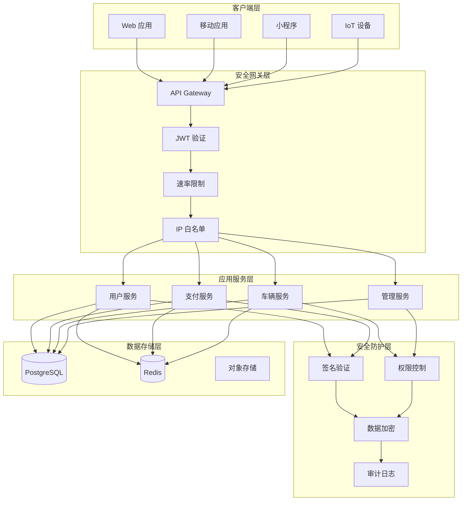

# 安全加固：停车系统的安全防护体系

## 引言

随着智慧停车系统的广泛应用，系统安全问题日益凸显。停车系统涉及用户隐私数据、支付交易、设备控制等敏感场景，一旦发生安全漏洞，可能导致用户信息泄露、资金损失甚至物理设备被恶意控制。因此，构建完善的安全防护体系是停车系统开发中的核心任务。

本文以 Smart Park 停车管理系统为例，深入探讨微服务架构下的安全防护实践。系统基于 Go 语言和 Kratos 框架开发，涵盖用户认证、支付安全、数据加密、多租户隔离等多个安全领域。本文将结合项目实际代码，详细介绍 JWT 认证、支付签名验证、敏感数据保护等关键安全机制的实现方案。

目标读者为安全工程师和后端开发者，希望通过本文的分享，帮助读者在实际项目中构建更加安全可靠的应用系统。

## 核心内容

### 认证授权

#### JWT 认证实现

JSON Web Token (JWT) 是现代微服务架构中最常用的认证方案之一。Smart Park 采用 RS256 非对称加密算法签名 JWT，相比对称加密的 HS256，RS256 具有更高的安全性：私钥签名、公钥验证，有效防止密钥泄露导致的安全风险。

**JWT 结构设计**

```go
type Claims struct {
    UserID string `json:"user_id"`
    OpenID string `json:"open_id"`
    jwt.RegisteredClaims
}

type JWTManager struct {
    config     *JWTConfig
    publicKey  *rsa.PublicKey
    privateKey *rsa.PrivateKey
}
```

Claims 结构体包含用户标识和微信 OpenID，RegisteredClaims 则包含标准字段如过期时间、签发时间和签发者。这种设计既满足了业务需求，又符合 JWT 规范。

**Token 生成流程**

```go
func (m *JWTManager) GenerateToken(userID, openID string) (string, error) {
    if m.privateKey == nil {
        return "", errors.New("private key not configured")
    }

    claims := &Claims{
        UserID: userID,
        OpenID: openID,
        RegisteredClaims: jwt.RegisteredClaims{
            ExpiresAt: jwt.NewNumericDate(time.Now().Add(m.config.TokenDuration)),
            IssuedAt:  jwt.NewNumericDate(time.Now()),
            Issuer:    "smart-park",
        },
    }

    token := jwt.NewWithClaims(jwt.SigningMethodRS256, claims)
    return token.SignedString(m.privateKey)
}
```

Token 生成时，系统使用私钥对 Claims 进行签名。Token 有效期通过配置文件设置，默认为 24 小时。签发者字段设置为 "smart-park"，便于后续验证和审计。

**Token 验证流程**

```go
func (m *JWTManager) ParseToken(tokenString string) (*Claims, error) {
    if m.publicKey == nil {
        return nil, errors.New("public key not configured")
    }

    token, err := jwt.ParseWithClaims(tokenString, &Claims{}, func(token *jwt.Token) (interface{}, error) {
        if _, ok := token.Method.(*jwt.SigningMethodRSA); !ok {
            return nil, fmt.Errorf("unexpected signing method: %v", token.Header["alg"])
        }
        return m.publicKey, nil
    })

    if err != nil {
        return nil, err
    }

    if claims, ok := token.Claims.(*Claims); ok && token.Valid {
        return claims, nil
    }

    return nil, errors.New("invalid token")
}
```

Token 验证时，系统首先检查签名算法是否为 RSA 系列，防止算法混淆攻击。然后使用公钥验证签名，确保 Token 未被篡改。验证通过后，从 Token 中提取 Claims 信息供后续使用。

#### HMAC 设备认证

对于物联网设备，系统采用 HMAC (Hash-based Message Authentication Code) 进行认证。设备在注册时分配唯一的设备 ID 和密钥，后续通信使用 HMAC 签名验证设备身份。

设备心跳接口通过设备 ID 和密钥进行认证，确保只有合法设备能够与系统通信。这种方案避免了在设备端存储复杂证书的麻烦，同时保证了通信安全。

#### 权限控制策略

系统实现了基于角色的访问控制 (RBAC)，通过中间件统一处理权限验证：

```go
func JWTAuth(jwtManager *auth.JWTManager) middleware.Middleware {
    return func(handler middleware.Handler) middleware.Handler {
        return func(ctx context.Context, req interface{}) (interface{}, error) {
            if tr, ok := transport.FromServerContext(ctx); ok {
                token := tr.RequestHeader().Get("Authorization")
                if token == "" {
                    return nil, errors.Unauthorized("UNAUTHORIZED", "missing authorization header")
                }

                if after, ok0 := strings.CutPrefix(token, "Bearer "); ok0 {
                    token = after
                }

                claims, err := jwtManager.ParseToken(token)
                if err != nil {
                    return nil, errors.Unauthorized("UNAUTHORIZED", "invalid token")
                }

                ctx = context.WithValue(ctx, UserIDKey, claims.UserID)
                ctx = context.WithValue(ctx, OpenIDKey, claims.OpenID)
            }

            return handler(ctx, req)
        }
    }
}
```

中间件从请求头提取 Token，验证后将用户信息注入 Context，供后续业务逻辑使用。这种设计实现了认证逻辑与业务逻辑的解耦。

#### 会话管理

系统支持多种 Token 传递方式，包括 Authorization Header、Query Parameter 和 Cookie：

```go
func (m *JWTMiddleware) extractToken(r *http.Request) string {
    // 1. 从 Authorization header 获取
    authHeader := r.Header.Get("Authorization")
    if authHeader != "" {
        parts := strings.SplitN(authHeader, " ", 2)
        if len(parts) == 2 && strings.ToLower(parts[0]) == "bearer" {
            return parts[1]
        }
    }

    // 2. 从 query parameter 获取
    if token := r.URL.Query().Get("token"); token != "" {
        return token
    }

    // 3. 从 cookie 获取
    if cookie, err := r.Cookie("token"); err == nil {
        return cookie.Value
    }

    return ""
}
```

灵活的 Token 传递方式适应了不同的客户端场景，如 Web 应用、移动端和小程序。

### 数据加密

#### HTTPS/TLS 配置

生产环境中，所有服务必须启用 HTTPS。系统通过配置文件管理 TLS 证书：

```yaml
server:
  port: 8000
  timeout: 60
  tls:
    cert_file: "/etc/ssl/certs/server.crt"
    key_file: "/etc/ssl/private/server.key"
```

API Gateway 作为统一入口，负责 TLS 终止，后端服务在内网中使用 HTTP 通信，减少加密开销。

#### 敏感数据加密

对于敏感数据如手机号、车牌号等，系统采用 AES-256-GCM 加密存储：

```go
func EncryptSensitiveData(plaintext string, key []byte) (string, error) {
    block, err := aes.NewCipher(key)
    if err != nil {
        return "", err
    }

    gcm, err := cipher.NewGCM(block)
    if err != nil {
        return "", err
    }

    nonce := make([]byte, gcm.NonceSize())
    if _, err := io.ReadFull(rand.Reader, nonce); err != nil {
        return "", err
    }

    ciphertext := gcm.Seal(nonce, nonce, []byte(plaintext), nil)
    return base64.StdEncoding.EncodeToString(ciphertext), nil
}
```

GCM 模式同时提供加密和完整性验证，防止密文被篡改。每个加密操作使用随机 Nonce，确保相同明文产生不同密文。

#### 密钥管理

密钥管理是数据加密的核心。系统采用分层密钥管理策略：

1. **主密钥 (Master Key)**：由硬件安全模块 (HSM) 或密钥管理服务 (KMS) 保护
2. **数据加密密钥 (DEK)**：由主密钥加密后存储在数据库
3. **会话密钥**：临时生成，用于单次加密操作

密钥轮换策略确保定期更换密钥，降低密钥泄露风险。

#### 数据脱敏

日志和 API 响应中对敏感数据进行脱敏处理：

```go
func MaskPhoneNumber(phone string) string {
    if len(phone) != 11 {
        return phone
    }
    return phone[:3] + "****" + phone[7:]
}

func MaskPlateNumber(plate string) string {
    if len(plate) < 2 {
        return plate
    }
    return plate[:2] + "***" + plate[len(plate)-2:]
}
```

脱敏规则确保日志中不会记录完整的敏感信息，同时保留必要的数据特征用于问题排查。

### 支付安全

#### 支付签名验证

支付回调是安全攻击的高风险点。系统实现了严格的签名验证机制：

**微信支付签名验证**

```go
func (uc *PaymentUseCase) verifyWechatSign(req *v1.WechatCallbackRequest) error {
    if uc.config == nil || uc.config.WechatKey == "" {
        return fmt.Errorf("wechat key not configured")
    }

    signData := buildWechatSignString(req)
    expectedSign := calculateMD5(signData + "&key=" + uc.config.WechatKey)

    if !strings.EqualFold(req.Sign, expectedSign) {
        return fmt.Errorf("signature mismatch: expected %s, got %s", expectedSign, req.Sign)
    }

    return nil
}

func buildWechatSignString(req *v1.WechatCallbackRequest) string {
    fields := map[string]string{
        "return_code":    req.ReturnCode,
        "return_msg":     req.ReturnMsg,
        "result_code":    req.ResultCode,
        "transaction_id": req.TransactionId,
        "out_trade_no":   req.OutTradeNo,
        "total_fee":      req.TotalFee,
        "time_end":       req.TimeEnd,
    }

    return buildSignString(fields, "sign")
}
```

签名验证流程：将回调参数按字典序排序，拼接成字符串后追加密钥，计算 MD5 值并与回调中的签名比对。

**支付宝签名验证**

```go
func (uc *PaymentUseCase) verifyAlipaySign(req *v1.AlipayCallbackRequest) error {
    if uc.config == nil || uc.config.AlipayPublicKey == "" {
        return fmt.Errorf("alipay public key not configured")
    }

    signData := buildAlipaySignString(req)

    pubKey, err := uc.parseAlipayPublicKey()
    if err != nil {
        return err
    }

    signBytes, err := base64.StdEncoding.DecodeString(req.Sign)
    if err != nil {
        return fmt.Errorf("failed to decode sign: %w", err)
    }

    hash := uc.getAlipayHashAlgorithm()

    if err := rsa.VerifyPKCS1v15(pubKey, hash, hashData(hash, signData), signBytes); err != nil {
        return fmt.Errorf("signature verification failed: %w", err)
    }

    return nil
}
```

支付宝使用 RSA 签名，系统使用支付宝公钥验证签名，确保回调来自支付宝服务器。

#### 金额校验机制

金额校验是防止支付欺诈的关键措施：

```go
func (uc *PaymentUseCase) validateAmount(order *Order, paidAmount float64) error {
    diff := math.Abs(paidAmount - order.FinalAmount)
    if diff > 0.01 {
        return fmt.Errorf("amount mismatch: expected %.2f, received %.2f", order.FinalAmount, paidAmount)
    }
    return nil
}
```

系统对比订单金额与回调金额，差异超过 0.01 元则拒绝处理。同时记录安全事件供后续审计：

```go
func (uc *PaymentUseCase) logSecurityEvent(ctx context.Context, eventType, orderID string, expected, received float64, transactionID string) {
    event := &SecurityEvent{
        Type:        eventType,
        OrderID:     orderID,
        Expected:    expected,
        Received:    received,
        Transaction: transactionID,
    }
    uc.log.WithContext(ctx).Errorf("security event: %+v", event)
}
```

#### 防重放攻击

支付回调可能被重放攻击，系统通过订单状态检查防止重复处理：

```go
func (uc *PaymentUseCase) processWechatPayment(ctx context.Context, req *v1.WechatCallbackRequest) error {
    orderID, err := uuid.Parse(req.OutTradeNo)
    if err != nil {
        return fmt.Errorf("invalid out_trade_no: %w", err)
    }
    order, err := uc.orderRepo.GetOrder(ctx, orderID)
    if err != nil || order == nil {
        return fmt.Errorf("order not found: %s", req.OutTradeNo)
    }

    if order.Status != string(StatusPending) {
        uc.logSecurityEvent(ctx, SecurityEventInvalidStatus, order.ID.String(), 0, 0, req.TransactionId)
        return nil
    }

    // ... 处理支付逻辑
}
```

订单状态机确保每个订单只能被支付一次，重复回调会被安全事件日志记录。

#### 支付回调安全

支付回调接口必须使用 HTTPS，并验证请求来源 IP：

```yaml
payment:
  callback:
    allowed_ips:
      - "101.226.103.*"    # 微信支付回调 IP
      - "110.75.151.*"     # 支付宝回调 IP
```

IP 白名单限制只有支付平台的回调请求才能被接受，防止伪造回调攻击。

### 常见安全漏洞和防护

#### SQL 注入防护

系统使用 Ent ORM 框架，所有数据库查询都通过参数化方式执行，天然防止 SQL 注入：

```go
func (r *vehicleRepo) GetVehicleByPlate(ctx context.Context, plateNumber string) (*Vehicle, error) {
    return r.data.db.Vehicle.Query().
        Where(vehicle.PlateNumber(plateNumber)).
        Only(ctx)
}
```

Ent 框架自动处理参数转义，开发者无需手动拼接 SQL 语句。

#### XSS 防护

API 响应统一使用 JSON 格式，Content-Type 设置为 application/json，浏览器不会将响应内容当作 HTML 解析。对于用户输入的富文本内容，系统使用 HTML 过滤库进行清洗：

```go
import "github.com/microcosm-cc/bluemonday"

func SanitizeHTML(input string) string {
    p := bluemonday.UGCPolicy()
    return p.Sanitize(input)
}
```

#### CSRF 防护

API 服务采用 Token 认证，不依赖 Cookie 进行身份验证，天然免疫 CSRF 攻击。对于需要 Cookie 认证的 Web 应用，系统实现了 CSRF Token 机制：

```go
func CSRFMiddleware(next http.Handler) http.Handler {
    return http.HandlerFunc(func(w http.ResponseWriter, r *http.Request) {
        if r.Method != "GET" && r.Method != "HEAD" {
            token := r.Header.Get("X-CSRF-Token")
            cookie, err := r.Cookie("csrf_token")
            if err != nil || token != cookie.Value {
                http.Error(w, "Invalid CSRF token", http.StatusForbidden)
                return
            }
        }
        next.ServeHTTP(w, r)
    })
}
```

#### 其他安全漏洞

**敏感信息泄露**：错误响应不包含堆栈信息和敏感配置：

```go
func (e *Error) Error() string {
    if e.Cause != nil {
        return fmt.Sprintf("%s: %s: %v", e.Code, e.Message, e.Cause)
    }
    return fmt.Sprintf("%s: %s", e.Code, e.Message)
}
```

**速率限制**：API Gateway 实现请求速率限制，防止暴力破解和 DDoS 攻击：

```go
func RateLimitMiddleware(rps int) func(http.Handler) http.Handler {
    limiter := rate.NewLimiter(rate.Limit(rps), rps*2)
    return func(next http.Handler) http.Handler {
        return http.HandlerFunc(func(w http.ResponseWriter, r *http.Request) {
            if !limiter.Allow() {
                http.Error(w, "Too Many Requests", http.StatusTooManyRequests)
                return
            }
            next.ServeHTTP(w, r)
        })
    }
}
```

### 安全审计和日志

#### 审计日志设计

系统实现了完整的审计日志机制，记录所有敏感操作：

```go
type AuditLog struct {
    ID        string    `json:"id"`
    UserID    string    `json:"user_id"`
    Action    string    `json:"action"`
    Resource  string    `json:"resource"`
    IP        string    `json:"ip"`
    UserAgent string    `json:"user_agent"`
    Request   string    `json:"request"`
    Response  string    `json:"response"`
    Status    string    `json:"status"`
    Timestamp time.Time `json:"timestamp"`
}
```

审计日志记录操作者、操作类型、资源标识、请求响应内容和时间戳，支持事后追溯和安全分析。

#### 安全事件监控

系统定义了安全事件类型，实时监控异常行为：

```go
const (
    SecurityEventAmountMismatch = "amount_mismatch"
    SecurityEventInvalidStatus  = "invalid_status"
    SecurityEventAuthFailure    = "auth_failure"
    SecurityEventSuspiciousIP   = "suspicious_ip"
)
```

安全事件触发后，系统记录详细日志并可以发送告警通知：

```go
func (uc *PaymentUseCase) logSecurityEvent(ctx context.Context, eventType, orderID string, expected, received float64, transactionID string) {
    event := &SecurityEvent{
        Type:        eventType,
        OrderID:     orderID,
        Expected:    expected,
        Received:    received,
        Transaction: transactionID,
    }
    uc.log.WithContext(ctx).Errorf("security event: %+v", event)
}
```

#### 异常行为检测

系统实现了基于规则的异常行为检测：

1. **登录异常**：短时间内多次登录失败触发账户锁定
2. **支付异常**：大额支付、频繁退款触发人工审核
3. **设备异常**：设备离线、异常命令触发告警

```go
func DetectAnomalousBehavior(userID string, action string, count int, window time.Duration) bool {
    key := fmt.Sprintf("rate:%s:%s", userID, action)
    current, _ := redis.Incr(key).Result()
    if current == 1 {
        redis.Expire(key, window)
    }
    return current > count
}
```

#### 合规性检查

系统遵循相关法规要求，实现了数据保护措施：

1. **数据最小化**：只收集必要的用户信息
2. **数据保留**：设置数据自动过期删除策略
3. **用户权利**：支持用户查询、删除个人数据
4. **隐私声明**：明确告知用户数据使用方式

### 安全架构图



## 最佳实践

### 安全加固最佳实践

1. **纵深防御原则**：不依赖单一安全措施，而是构建多层防护体系。例如支付安全同时使用签名验证、金额校验、状态检查和 IP 白名单。

2. **最小权限原则**：每个服务和用户只拥有完成其功能所需的最小权限。数据库连接使用专用账号，限制表访问权限。

3. **安全默认配置**：所有配置项默认为安全设置，如 TLS 强制开启、密码复杂度要求、会话超时等。

4. **密钥轮换**：定期轮换 JWT 密钥、数据库密码、API 密钥等敏感凭证，降低泄露风险。

5. **安全编码规范**：代码审查时检查安全问题，使用静态分析工具扫描代码漏洞。

### 常见问题和解决方案

**问题 1：Token 过期后用户体验差**

解决方案：实现 Token 刷新机制，在 Token 即将过期时自动刷新，无需用户重新登录。

```go
func (m *JWTManager) RefreshToken(oldToken string) (string, error) {
    claims, err := m.ParseToken(oldToken)
    if err != nil {
        return "", err
    }

    // 检查是否在刷新窗口内
    if time.Until(claims.ExpiresAt.Time) > m.config.RefreshWindow {
        return "", errors.New("token not eligible for refresh")
    }

    return m.GenerateToken(claims.UserID, claims.OpenID)
}
```

**问题 2：支付回调处理幂等性**

解决方案：使用分布式锁确保同一订单不会被并发处理：

```go
func (uc *PaymentUseCase) HandleWechatCallback(ctx context.Context, req *v1.WechatCallbackRequest) (*v1.WechatCallbackResponse, error) {
    lockKey := fmt.Sprintf("payment:callback:%s", req.OutTradeNo)
    lock := uc.locker.Acquire(lockKey, 30*time.Second)
    defer lock.Release()

    // 处理回调逻辑
}
```

**问题 3：敏感配置管理**

解决方案：使用环境变量或密钥管理服务存储敏感配置，避免硬编码：

```go
type PaymentConfig struct {
    WechatKey        string `env:"WECHAT_KEY,required"`
    AlipayPublicKey  string `env:"ALIPAY_PUBLIC_KEY,required"`
    AlipayPrivateKey string `env:"ALIPAY_PRIVATE_KEY,required"`
}
```

### 安全测试建议

1. **渗透测试**：定期进行渗透测试，发现潜在安全漏洞。

2. **依赖扫描**：使用工具扫描第三方依赖的已知漏洞：

```bash
go list -m all | nancy sleuth
```

3. **代码审计**：使用静态分析工具检查代码安全问题：

```bash
gosec ./...
```

4. **安全演练**：定期进行安全应急演练，验证安全事件响应流程。

5. **红队测试**：邀请安全团队进行模拟攻击，检验防护体系有效性。

## 总结

本文系统介绍了 Smart Park 停车管理系统的安全防护体系，涵盖认证授权、数据加密、支付安全、漏洞防护和安全审计等核心领域。通过 JWT 非对称加密认证、支付签名验证、敏感数据加密等措施，构建了多层次的安全防护体系。

安全是一个持续演进的过程，需要不断更新防护措施应对新的威胁。未来，系统将引入更多安全技术，如零信任架构、机密计算、AI 安全检测等，持续提升安全防护能力。

安全无小事，希望本文的实践经验能够帮助读者在项目开发中更加重视安全问题，构建更加可靠的应用系统。

## 参考资料

1. OWASP Top 10 Web Application Security Risks
2. JWT Best Practices (RFC 8725)
3. 微信支付安全开发指南
4. 支付宝开放平台安全规范
5. Go 安全编码实践指南
