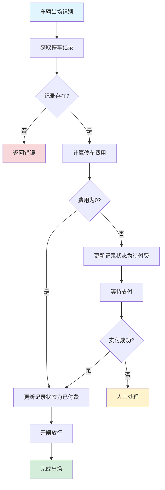
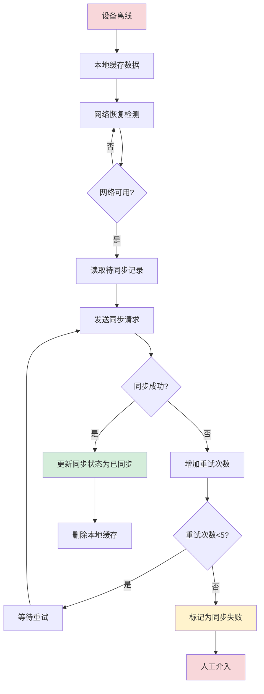
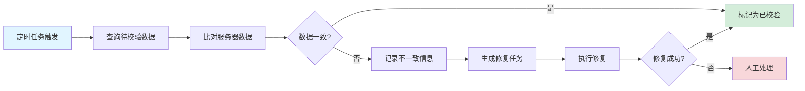

# 数据一致性：分布式事务和数据同步

## 引言

在微服务架构中，数据一致性是最具挑战性的问题之一。传统的单体应用通过数据库事务即可保证ACID特性，但在分布式系统中，数据分散在不同的服务中，跨服务的数据一致性需要更复杂的解决方案。Smart Park 智能停车场系统作为典型的微服务架构项目，涉及车辆进出场、计费、支付等多个业务流程，每个流程都可能涉及多个服务的数据更新，如何保证这些数据的一致性是系统设计的核心问题。

本文面向后端开发者和架构师，将深入探讨分布式系统中的数据一致性问题。文章将结合 Smart Park 项目的实际代码实现，分析分布式事务场景、最终一致性方案、消息队列应用、离线数据同步机制以及数据校验和修复策略。通过真实的生产级代码示例，帮助读者理解和掌握分布式数据一致性的设计与实现。

## 核心内容

### 分布式事务场景分析

#### 跨服务业务操作

在 Smart Park 系统中，车辆出场是一个典型的跨服务业务操作。当车辆离开停车场时，系统需要执行以下操作：

1. **Vehicle 服务**：更新停车记录状态，记录出场时间和车道信息
2. **Billing 服务**：计算停车费用，应用优惠规则
3. **Payment 服务**：创建支付订单，生成支付二维码
4. **Device 服务**：控制闸机开启，更新设备状态

这些操作分布在不同的服务中，任何一个服务的失败都可能导致数据不一致。例如，如果计费成功但闸机开启失败，车辆无法出场；如果闸机开启但计费失败，会导致费用损失。

以下是车辆出场流程的数据一致性处理代码：

```go
func (uc *EntryExitUseCase) Exit(ctx context.Context, req *v1.ExitRequest) (*v1.ExitData, error) {
    uc.logExitStart(req.DeviceId, req.PlateNumber, req.Confidence)

    if req.PlateNumber == "" {
        return nil, fmt.Errorf("plate number is required")
    }

    var result *v1.ExitData
    lockKey := lock.GenerateLockKey(LockTypeExit, req.PlateNumber)

    if err := uc.withDistributedLock(ctx, lockKey, func() error {
        return uc.vehicleRepo.WithTx(ctx, func(ctx context.Context) error {
            var err error
            result, err = uc.processExitTransaction(ctx, req)
            return err
        })
    }); err != nil {
        return nil, err
    }

    return result, nil
}
```

这段代码展示了如何通过分布式锁和数据库事务的组合来保证数据一致性。分布式锁防止并发操作导致的数据冲突，数据库事务保证单个服务内的原子性。

#### 支付和订单一致性

支付场景是另一个典型的分布式事务场景。当用户完成支付后，系统需要：

1. 更新支付订单状态为已支付
2. 更新停车记录状态为已付费
3. 通知闸机开启
4. 发送支付成功通知

如果支付成功但停车记录更新失败，会导致车辆无法出场；如果停车记录更新成功但闸机未收到通知，用户需要等待人工处理。

以下是支付订单创建的幂等性处理代码：

```go
func (uc *PaymentUseCase) CreatePayment(ctx context.Context, req *v1.CreatePaymentRequest) (*v1.PaymentData, error) {
    if err := uc.validateCreatePaymentRequest(req); err != nil {
        return nil, err
    }

    recordID, err := uuid.Parse(req.RecordId)
    if err != nil {
        return nil, fmt.Errorf("invalid record ID: %w", err)
    }

    if existingOrder, _ := uc.orderRepo.GetOrderByRecordID(ctx, recordID); existingOrder != nil {
        if existingOrder.Status == string(StatusPaid) {
            return uc.buildExistingPaymentResponse(existingOrder), nil
        }
    }

    order, err := uc.createOrder(ctx, recordID, req.Amount)
    if err != nil {
        return nil, err
    }

    payURL, qrCode, err := uc.generatePaymentURL(ctx, order, req)
    if err != nil {
        return nil, err
    }

    return &v1.PaymentData{
        OrderId:    order.ID.String(),
        Amount:     order.FinalAmount,
        PayUrl:     payURL,
        QrCode:     qrCode,
        ExpireTime: time.Now().Add(uc.bizConfig.OrderExpiration).Format(time.RFC3339),
    }, nil
}
```

通过检查已存在的订单状态，实现了支付创建的幂等性，避免重复扣费。

#### 库存和订单一致性

虽然停车场系统不涉及传统意义上的库存管理，但车位数量管理具有类似的特性。当车辆进场时，系统需要：

1. 检查车位是否充足
2. 更新车位占用数量
3. 创建停车记录

如果车位检查成功但记录创建失败，会导致车位数量不准确；如果记录创建成功但车位数量未更新，会导致车位管理混乱。

#### 数据同步场景

在停车场系统中，数据同步场景主要包括：

1. **离线数据同步**：设备离线时产生的开闸记录需要同步到服务器
2. **跨服务数据同步**：计费规则更新需要同步到 Vehicle 服务
3. **缓存数据同步**：车辆信息更新需要同步到 Redis 缓存

以下是离线数据同步的数据模型：

```go
type OfflineSyncRecord struct {
    ent.Schema
}

func (OfflineSyncRecord) Fields() []ent.Field {
    return []ent.Field{
        field.UUID("id", uuid.UUID{}).
            Default(uuid.New).
            StorageKey("id"),
        field.String("offline_id").
            MaxLen(64).
            Unique().
            NotEmpty().
            Comment("设备本地流水号"),
        field.UUID("record_id", uuid.UUID{}).
            Optional().
            Nillable().
            Comment("停车记录ID"),
        field.UUID("lot_id", uuid.UUID{}).
            Optional().
            Nillable().
            Comment("停车场ID"),
        field.String("device_id").
            MaxLen(64).
            NotEmpty().
            Comment("设备ID"),
        field.String("gate_id").
            MaxLen(64).
            NotEmpty().
            Comment("闸机ID"),
        field.Time("open_time").
            Comment("开闸时间"),
        field.Float("sync_amount").
            Optional().
            Comment("同步金额"),
        field.Enum("sync_status").
            Values("pending_sync", "synced", "sync_failed").
            Default("pending_sync").
            Comment("同步状态"),
        field.Text("sync_error").
            Optional().
            Comment("同步错误信息"),
        field.Int("retry_count").
            Default(0).
            Min(0).
            Comment("重试次数"),
        field.Time("synced_at").
            Optional().
            Nillable().
            Comment("同步完成时间"),
        field.Time("created_at").
            Default(time.Now).
            Immutable(),
    }
}
```

这个模型记录了离线数据的同步状态、重试次数和错误信息，为数据同步提供了完整的追踪机制。

### 最终一致性方案

#### 最终一致性理论

最终一致性是分布式系统中常用的一致性模型，它不要求系统在任意时刻都保持强一致性，而是保证在没有新更新的情况下，最终所有副本的数据会达到一致状态。CAP 理论指出，在分布式系统中，一致性（C）、可用性（A）和分区容错性（P）三者不可兼得，最终一致性是在可用性和分区容错性优先的情况下对一致性的妥协。

在 Smart Park 系统中，我们采用 BASE 理论（Basically Available, Soft state, Eventually consistent）作为设计指导：

1. **基本可用**：系统在出现故障时，允许损失部分可用性，如响应时间增加或功能降级
2. **软状态**：允许系统存在中间状态，该状态不会影响系统整体可用性
3. **最终一致**：系统中所有数据副本经过一定时间后，最终能够达到一致状态

#### 消息队列实现

消息队列是实现最终一致性的重要手段。Smart Park 系统使用 Redis Streams 作为消息队列，实现服务间的异步通信。

以下是 Redis Streams 的生产者实现：

```go
func (p *RedisProducer) Publish(ctx context.Context, topic string, msg *Message) error {
    _, err := p.client.XAdd(ctx, &redis.XAddArgs{
        Stream: topic,
        Values: map[string]interface{}{
            "id":        msg.ID,
            "key":       msg.Key,
            "body":      string(msg.Body),
            "headers":   msg.Headers,
            "timestamp": msg.Timestamp.Unix(),
        },
    }).Result()
    if err != nil {
        p.logger.Errorw("failed to publish message", "error", err, "topic", topic)
        return err
    }
    p.logger.Infow("message published", "topic", topic, "key", msg.Key)
    return nil
}
```

消费者实现：

```go
func (c *RedisConsumer) Subscribe(ctx context.Context, topic string, group string, handler func(msg *Message) error) error {
    _, err := c.client.XGroupCreateMkStream(ctx, topic, group, "$").Result()
    if err != nil && err.Error() != "BUSYGROUP Consumer Group name already exists" {
        c.logger.Errorw("failed to create consumer group", "error", err, "topic", topic, "group", group)
        return err
    }

    consumer := fmt.Sprintf("consumer-%d", time.Now().UnixNano())

    for {
        select {
        case <-ctx.Done():
            return ctx.Err()
        case <-c.stopCh:
            return nil
        default:
            streams, err := c.client.XReadGroup(ctx, &redis.XReadGroupArgs{
                Group:    group,
                Consumer: consumer,
                Streams:  []string{topic, ">"},
                Count:    10,
                Block:    5 * time.Second,
            }).Result()

            if err != nil {
                if err == redis.Nil {
                    continue
                }
                c.logger.Errorw("failed to read from stream", "error", err, "topic", topic)
                continue
            }

            for _, stream := range streams {
                for _, msg := range stream.Messages {
                    m := c.parseMessage(&msg, topic)
                    if err := handler(m); err != nil {
                        c.logger.Errorw("message handler failed", "error", err, "msgID", msg.ID)
                    } else {
                        c.client.XAck(ctx, topic, group, msg.ID)
                    }
                }
            }
        }
    }
}
```

通过消费者组机制，Redis Streams 实现了消息的可靠消费和负载均衡。

#### 补偿事务模式

补偿事务模式是处理分布式事务的重要方法。当主事务失败时，执行补偿事务来回滚已完成的操作。在 Smart Park 系统中，支付退款就是一个典型的补偿事务场景：

```go
func (uc *PaymentUseCase) processRefund(ctx context.Context, order *Order, refundID string) error {
    refundAmount := order.FinalAmount

    switch PayMethod(order.PayMethod) {
    case MethodWechat:
        if uc.wechatClient == nil {
            return fmt.Errorf("wechat client not configured")
        }
        uc.log.WithContext(ctx).Infof("Processing WeChat refund for order %s, amount: %.2f", order.ID, refundAmount)
        totalAmount := int64(order.FinalAmount * 100)
        refundAmount := int64(refundAmount * 100)
        if err := uc.wechatClient.Refund(ctx, order.ID.String(), refundID, totalAmount, refundAmount); err != nil {
            uc.log.WithContext(ctx).Errorf("WeChat refund failed: %v", err)
            return fmt.Errorf("wechat refund failed: %w", err)
        }
    case MethodAlipay:
        if uc.alipayClient == nil {
            return fmt.Errorf("alipay client not configured")
        }
        uc.log.WithContext(ctx).Infof("Processing Alipay refund for order %s, amount: %.2f", order.ID, refundAmount)
        if err := uc.alipayClient.Refund(ctx, order.ID.String(), refundID, refundAmount); err != nil {
            uc.log.WithContext(ctx).Errorf("Alipay refund failed: %v", err)
            return fmt.Errorf("alipay refund failed: %w", err)
        }
    default:
        return fmt.Errorf("unknown payment method: %s", order.PayMethod)
    }

    now := time.Now()
    order.Status = string(StatusRefunded)
    order.RefundedAt = &now
    order.RefundTransactionID = refundID
    return nil
}
```

补偿事务需要满足幂等性，即多次执行补偿操作的结果与执行一次相同。

#### Saga 模式

Saga 模式是一种管理分布式事务的模式，它将长事务拆分为多个本地事务，每个本地事务都有对应的补偿事务。Saga 模式有两种实现方式：

1. **编排式（Choreography）**：各个服务通过事件驱动的方式协调，没有中央协调器
2. **编排式（Orchestration）**：由一个协调器负责协调各个服务的执行和补偿

在 Smart Park 系统中，车辆出场流程可以看作一个 Saga：



### 消息队列在数据同步中的应用

#### Redis Streams 应用

Redis Streams 是 Redis 5.0 引入的数据结构，专门用于实现消息队列。相比传统的 List 结构，Streams 提供了更强大的功能：

1. **消费者组**：支持多个消费者协同处理消息，实现负载均衡
2. **消息确认**：消费者处理完消息后需要确认，未确认的消息可以被重新消费
3. **消息持久化**：消息持久化到磁盘，不会因为 Redis 重启而丢失
4. **消息 ID**：每条消息都有唯一的 ID，便于追踪和去重

以下是消息队列工厂的实现，支持多种消息队列适配器：

```go
type MQFactory struct {
    mu       sync.RWMutex
    adapters map[MQType]Adapter
}

func NewMQFactory() *MQFactory {
    return &MQFactory{
        adapters: make(map[MQType]Adapter),
    }
}

func (f *MQFactory) Register(mqType MQType, adapter Adapter) {
    f.mu.Lock()
    defer f.mu.Unlock()
    f.adapters[mqType] = adapter
}

func (f *MQFactory) GetAdapter(mqType MQType) (Adapter, error) {
    f.mu.RLock()
    defer f.mu.RUnlock()
    adapter, ok := f.adapters[mqType]
    if !ok {
        return nil, fmt.Errorf("mq adapter not registered: %s", mqType)
    }
    return adapter, nil
}

func CreateMQAdapter(cfg Config) (Adapter, error) {
    switch cfg.Type {
    case MQTypeRedis:
        return NewRedisAdapter(cfg.Redis), nil
    case MQTypeNATS:
        return NewNATSAdapter(cfg.NATS), nil
    case MQTypeRocketMQ:
        return NewRocketMQAdapter(cfg.RocketMQ), nil
    default:
        return nil, fmt.Errorf("unsupported MQ type: %s", cfg.Type)
    }
}
```

#### 消息可靠性保证

消息队列的可靠性保证包括三个方面：

1. **生产者确认**：生产者发送消息后，需要确认消息已成功写入队列
2. **消费者确认**：消费者处理消息后，需要确认消息已成功处理
3. **消息持久化**：消息需要持久化到磁盘，防止丢失

在 Redis Streams 中，消息确认通过 XACK 命令实现：

```go
for _, stream := range streams {
    for _, msg := range stream.Messages {
        m := c.parseMessage(&msg, topic)
        if err := handler(m); err != nil {
            c.logger.Errorw("message handler failed", "error", err, "msgID", msg.ID)
        } else {
            c.client.XAck(ctx, topic, group, msg.ID)
        }
    }
}
```

只有当消息处理成功后，才会发送确认。如果消费者处理失败，消息会保留在 Pending 列表中，可以被其他消费者重新消费。

#### 消费者幂等性

在分布式系统中，消息可能会被重复消费，因此消费者必须实现幂等性。幂等性是指多次执行同一操作的结果与执行一次相同。

实现幂等性的常见方法：

1. **唯一 ID**：每条消息都有唯一 ID，消费者记录已处理的消息 ID
2. **数据库唯一约束**：利用数据库的唯一约束防止重复插入
3. **乐观锁**：使用版本号或时间戳实现乐观锁

在 Smart Park 系统中，支付订单创建通过检查已存在订单实现幂等性：

```go
if existingOrder, _ := uc.orderRepo.GetOrderByRecordID(ctx, recordID); existingOrder != nil {
    if existingOrder.Status == string(StatusPaid) {
        return uc.buildExistingPaymentResponse(existingOrder), nil
    }
}
```

#### 死信队列处理

当消息处理失败且重试次数超过阈值时，消息应该被转移到死信队列（Dead Letter Queue），避免阻塞正常消息的处理。死信队列中的消息需要人工介入处理或定期重试。

以下是离线同步记录的重试机制：

```go
func (r *vehicleRepo) GetPendingSyncRecords(ctx context.Context, limit int) ([]*biz.OfflineSyncRecord, error) {
    records, err := r.data.db.OfflineSyncRecord.Query().
        Where(offlinesyncrecord.SyncStatusEQ(offlinesyncrecord.SyncStatusPendingSync)).
        Where(offlinesyncrecord.RetryCountLT(5)).
        Limit(limit).
        All(ctx)
    if err != nil {
        return nil, err
    }

    result := make([]*biz.OfflineSyncRecord, len(records))
    for i, rec := range records {
        result[i] = toBizOfflineSyncRecord(rec)
    }
    return result, nil
}
```

重试次数限制为 5 次，超过 5 次的记录不会被查询出来，相当于进入了死信队列。

### 离线数据同步机制

#### 离线数据缓存

在停车场系统中，设备可能因为网络故障而离线。离线期间，设备需要在本地缓存数据，待网络恢复后同步到服务器。离线数据主要包括：

1. **开闸记录**：设备离线时的开闸操作记录
2. **车牌识别记录**：设备离线时的车牌识别结果
3. **支付记录**：设备离线时的支付交易记录

以下是离线同步记录的创建：

```go
func (r *vehicleRepo) CreateOfflineSyncRecord(ctx context.Context, record *biz.OfflineSyncRecord) error {
    _, err := r.data.db.OfflineSyncRecord.Create().
        SetOfflineID(record.OfflineID).
        SetRecordID(record.RecordID).
        SetLotID(record.LotID).
        SetDeviceID(record.DeviceID).
        SetGateID(record.GateID).
        SetOpenTime(record.OpenTime).
        SetSyncAmount(record.SyncAmount).
        SetSyncStatus(offlinesyncrecord.SyncStatusPendingSync).
        SetRetryCount(0).
        Save(ctx)

    return err
}
```

#### 数据同步策略

离线数据同步策略需要考虑以下因素：

1. **同步时机**：网络恢复后立即同步，或定时批量同步
2. **同步顺序**：按时间顺序同步，或按优先级同步
3. **冲突处理**：服务器数据与离线数据冲突时的处理策略
4. **失败重试**：同步失败时的重试机制

以下是数据同步流程图：



#### 冲突检测和解决

离线数据同步时可能发生冲突，例如：

1. **时间冲突**：离线期间服务器数据已更新
2. **状态冲突**：离线数据与服务器数据状态不一致
3. **业务冲突**：离线操作与服务器操作冲突

冲突解决策略：

1. **最后写入胜出（LWW）**：以时间戳最新的数据为准
2. **业务规则优先**：根据业务规则决定哪个数据有效
3. **人工介入**：无法自动解决的冲突由人工处理

在 Smart Park 系统中，离线开闸记录同步时，会检查停车记录是否已存在：

```go
existingRecord, err := uc.vehicleRepo.GetEntryRecord(ctx, plateNumber)
if err != nil {
    return nil, fmt.Errorf("failed to check existing entry: %w", err)
}
if existingRecord != nil {
    uc.log.WithContext(ctx).Warnf("[ENTRY] Duplicate entry - PlateNumber: [REDACTED]")
    return &v1.EntryData{
        PlateNumber:    req.PlateNumber,
        Allowed:        false,
        GateOpen:       false,
        DisplayMessage: uc.config.Messages.DuplicateEntry,
    }, nil
}
```

如果记录已存在，则拒绝重复创建，避免数据冲突。

#### 数据一致性校验

数据一致性校验是保证数据质量的重要手段。定期校验可以发现数据不一致问题，及时修复。校验内容包括：

1. **记录完整性**：检查是否有丢失的记录
2. **状态一致性**：检查相关记录的状态是否一致
3. **金额一致性**：检查订单金额与支付金额是否一致
4. **时间一致性**：检查记录时间是否合理

以下是数据一致性检查流程：



### 数据校验和修复

#### 数据一致性检查

数据一致性检查需要定期执行，检查范围包括：

1. **跨服务数据一致性**：检查 Vehicle 服务和 Billing 服务的数据是否一致
2. **缓存与数据库一致性**：检查 Redis 缓存与数据库数据是否一致
3. **主从数据一致性**：检查数据库主从数据是否一致

检查方法：

1. **全量比对**：定期全量比对所有数据，发现不一致
2. **增量比对**：实时比对变更数据，及时发现不一致
3. **抽样比对**：随机抽样比对，降低检查成本

#### 数据修复策略

发现数据不一致后，需要根据不一致类型选择修复策略：

1. **自动修复**：根据业务规则自动修复数据
2. **半自动修复**：生成修复建议，人工确认后执行
3. **人工修复**：完全由人工处理

修复原则：

1. **优先保证业务正确性**：修复策略应优先保证业务逻辑正确
2. **保留修复记录**：记录修复操作，便于追溯
3. **可回滚**：修复操作应可回滚，避免造成更大问题

#### 自动化修复流程

自动化修复流程包括：

1. **发现问题**：通过数据校验发现不一致
2. **分析原因**：分析不一致产生的原因
3. **制定方案**：根据原因制定修复方案
4. **执行修复**：执行修复操作
5. **验证结果**：验证修复结果是否正确

以下是离线同步记录的更新操作：

```go
func (r *vehicleRepo) UpdateOfflineSyncRecord(ctx context.Context, record *biz.OfflineSyncRecord) error {
    update := r.data.db.OfflineSyncRecord.Update().
        Where(offlinesyncrecord.OfflineID(record.OfflineID)).
        SetSyncStatus(offlinesyncrecord.SyncStatus(record.SyncStatus)).
        SetSyncError(record.SyncError).
        SetRetryCount(record.RetryCount)

    if record.SyncedAt != nil {
        update.SetSyncedAt(*record.SyncedAt)
    }

    _, err := update.Save(ctx)
    return err
}
```

#### 人工干预机制

对于无法自动修复的数据不一致，需要人工干预。人工干预机制包括：

1. **告警通知**：发现问题时发送告警通知
2. **问题记录**：记录问题详情，便于分析
3. **修复工具**：提供修复工具，简化人工操作
4. **操作审计**：记录人工操作，便于追溯

## 最佳实践

### 数据一致性最佳实践

基于 Smart Park 项目的实践经验，总结以下数据一致性最佳实践：

**1. 优先使用最终一致性**

在分布式系统中，强一致性会严重影响系统性能和可用性。应优先考虑最终一致性，通过异步消息、补偿事务等手段保证数据最终一致。

**2. 合理使用分布式锁**

分布式锁用于防止并发操作导致的数据冲突，但不应过度使用。锁的粒度应尽可能小，锁的持有时间应尽可能短。以下是分布式锁的实现：

```go
func (uc *EntryExitUseCase) withDistributedLock(ctx context.Context, lockKey string, fn func() error) error {
    owner := lock.GenerateUniqueOwner()
    uc.log.WithContext(ctx).Debugf("[LOCK] Acquiring lock - Key: %s, Owner: %s", lockKey, owner)

    acquired, err := uc.lockRepo.AcquireLock(ctx, lockKey, owner, uc.config.LockTTL)
    if err != nil {
        uc.log.WithContext(ctx).Errorf("[LOCK] Failed to acquire lock: %v", err)
        return fmt.Errorf("failed to acquire lock: %w", err)
    }
    if !acquired {
        uc.log.WithContext(ctx).Warnf("[LOCK] Lock held by another process - Key: %s", lockKey)
        return fmt.Errorf("duplicate request in progress")
    }

    defer func() {
        if err := uc.lockRepo.ReleaseLock(ctx, lockKey, owner); err != nil {
            uc.log.WithContext(ctx).Warnf("[LOCK] Failed to release lock: %v", err)
        }
    }()

    return fn()
}
```

**3. 实现幂等性**

所有跨服务的操作都应实现幂等性，防止重复操作导致的数据不一致。幂等性可以通过唯一 ID、数据库约束、乐观锁等方式实现。

**4. 使用事务消息**

对于需要保证消息发送和数据库操作原子性的场景，应使用事务消息。事务消息确保消息发送和数据库操作要么都成功，要么都失败。

**5. 设计补偿机制**

对于无法通过事务保证一致性的操作，应设计补偿机制。补偿操作应满足幂等性，且能够正确处理各种异常情况。

### 常见问题和解决方案

**问题 1：消息丢失**

解决方案：
- 使用消息持久化，确保消息不会因系统故障而丢失
- 实现消息确认机制，只有处理成功的消息才会被确认
- 定期检查未确认消息，重新处理或转移至死信队列

**问题 2：消息重复**

解决方案：
- 实现消费者幂等性，重复消息不会导致数据不一致
- 使用唯一 ID 去重，记录已处理的消息 ID
- 使用数据库唯一约束，防止重复插入

**问题 3：分布式锁失效**

解决方案：
- 使用 Redis Lua 脚本保证锁操作的原子性
- 设置合理的锁过期时间，避免锁被意外释放
- 实现锁的自动续期，防止长时间操作导致锁过期

以下是 Redis 分布式锁的 Lua 脚本实现：

```go
var (
    releaseLockScript = redis.NewScript(`
        if redis.call("GET", KEYS[1]) == ARGV[1] then
            return redis.call("DEL", KEYS[1])
        else
            return 0
        end
    `)

    extendLockScript = redis.NewScript(`
        if redis.call("GET", KEYS[1]) == ARGV[1] then
            return redis.call("PEXPIRE", KEYS[1], ARGV[2])
        else
            return 0
        end
    `)
)
```

**问题 4：数据不一致难以发现**

解决方案：
- 实现定期数据校验，及时发现数据不一致
- 记录所有数据变更操作，便于追溯问题
- 建立监控告警机制，及时发现异常情况

### 数据治理建议

**1. 建立数据质量标准**

制定数据质量标准，包括数据完整性、准确性、一致性、及时性等维度。定期评估数据质量，持续改进。

**2. 实施数据生命周期管理**

对数据进行分类管理，制定数据保留策略。过期的数据应及时归档或删除，减少数据维护成本。

**3. 建立数据变更审计**

记录所有数据变更操作，包括操作人、操作时间、操作内容等。审计日志应独立存储，防止被篡改。

**4. 制定数据恢复预案**

制定数据恢复预案，包括数据备份策略、恢复流程、恢复测试等。定期演练数据恢复，确保预案可行。

## 总结

### 核心要点回顾

本文深入探讨了分布式系统中的数据一致性问题，结合 Smart Park 智能停车场系统的实际实现，总结了以下核心要点：

1. **分布式事务场景**：跨服务业务操作、支付和订单一致性、库存和订单一致性、数据同步场景都需要特别关注数据一致性
2. **最终一致性方案**：通过消息队列、补偿事务、Saga 模式等手段实现最终一致性，在保证系统可用性的同时确保数据最终一致
3. **消息队列应用**：Redis Streams 提供了可靠的消息队列实现，通过消费者组、消息确认、消息持久化等机制保证消息可靠性
4. **离线数据同步**：离线数据缓存、同步策略、冲突检测和解决是离线数据同步的关键环节
5. **数据校验和修复**：定期数据校验、自动修复流程、人工干预机制是保证数据质量的重要手段

### 未来展望

随着微服务架构的广泛应用，数据一致性问题将变得更加复杂。未来的发展方向包括：

1. **分布式事务框架**：Seata、DTM 等分布式事务框架提供了更完善的事务解决方案，值得深入研究和应用
2. **云原生技术**：Kubernetes、Service Mesh 等云原生技术为数据一致性提供了新的解决方案
3. **AI 辅助**：利用 AI 技术自动检测和修复数据不一致问题，提高数据治理效率

### 参考资料

1. Martin Kleppmann. "Designing Data-Intensive Applications". O'Reilly Media, 2017.
2. Eric Brewer. "CAP Twelve Years Later: How the 'Rules' Have Changed". Computer, 2012.
3. Redis Streams Documentation. https://redis.io/topics/streams-intro
4. Seata Documentation. https://seata.io/en-us/
5. Kratos Framework. https://github.com/go-kratos/kratos

通过本文的学习，希望读者能够深入理解分布式系统中的数据一致性问题，掌握实用的解决方案，在实际项目中设计出可靠的数据一致性保障机制。
